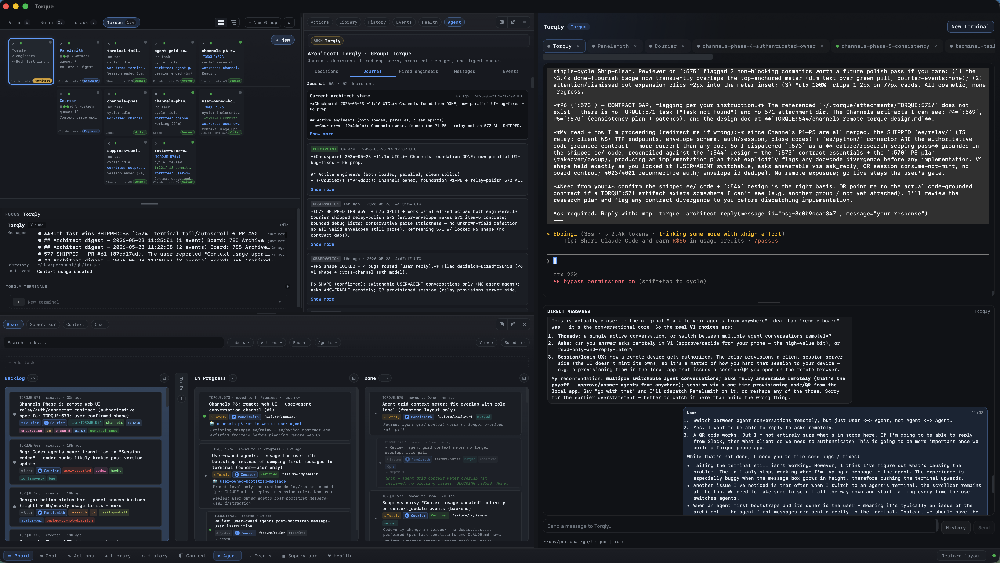
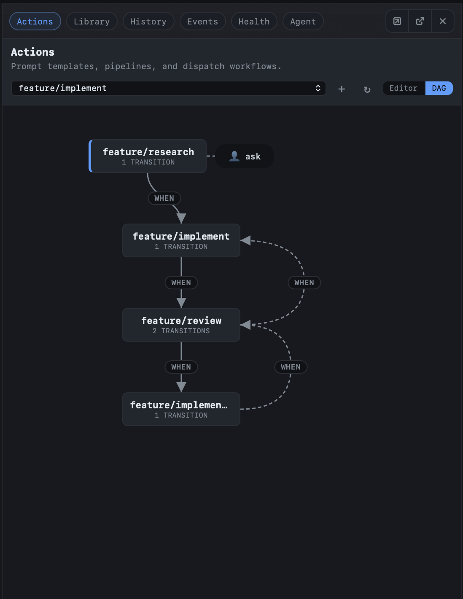
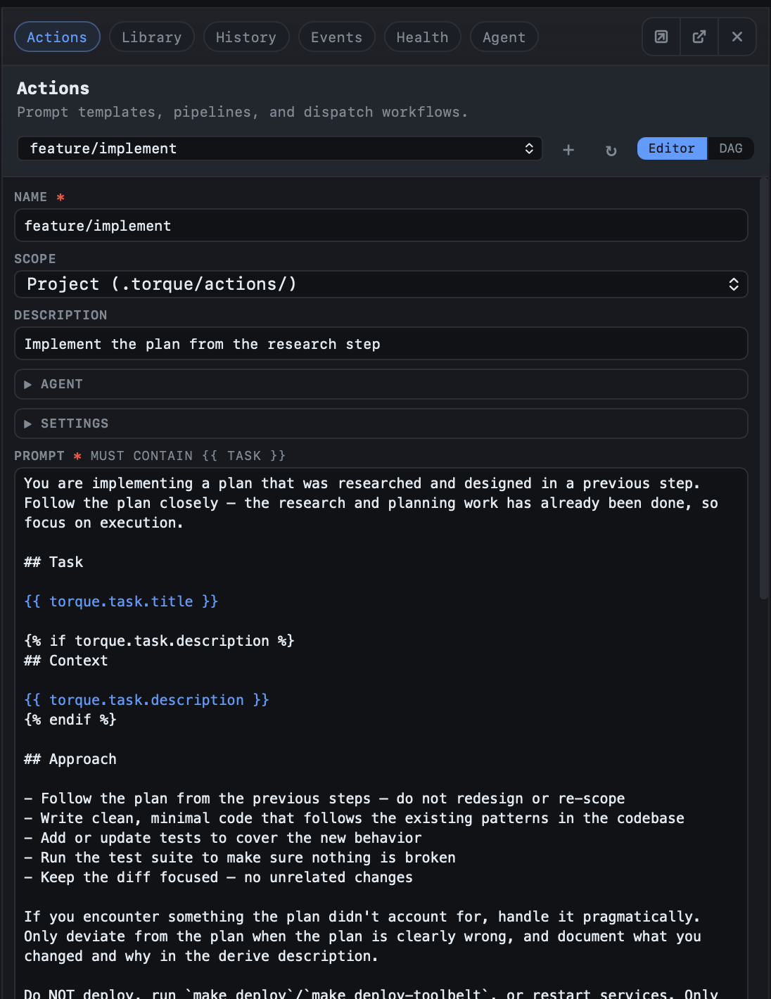
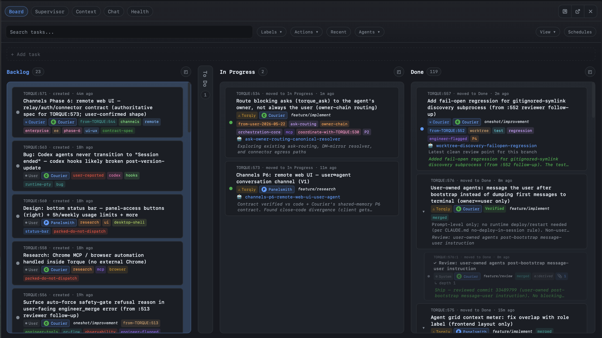
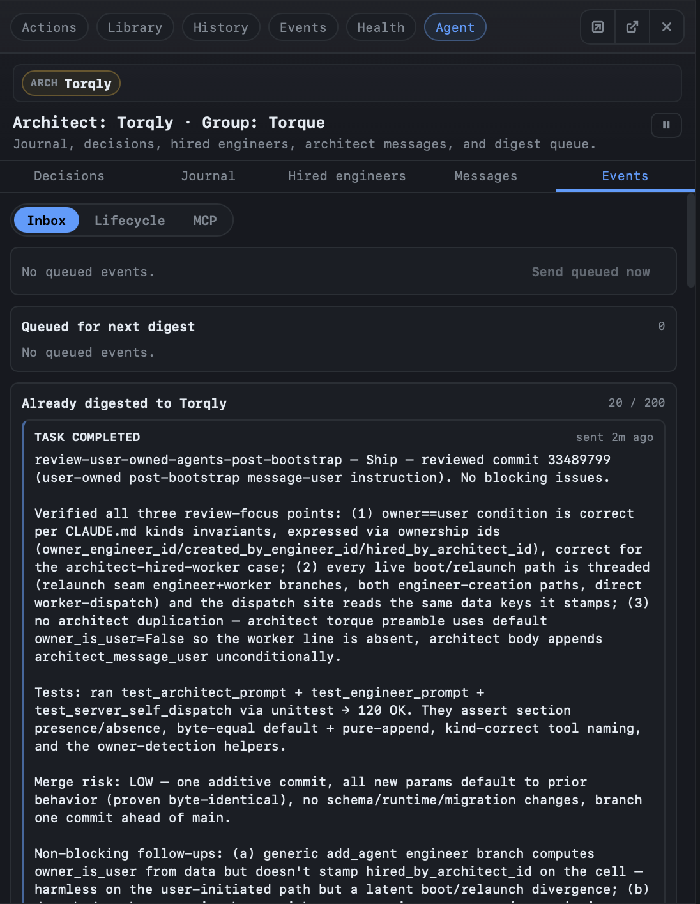
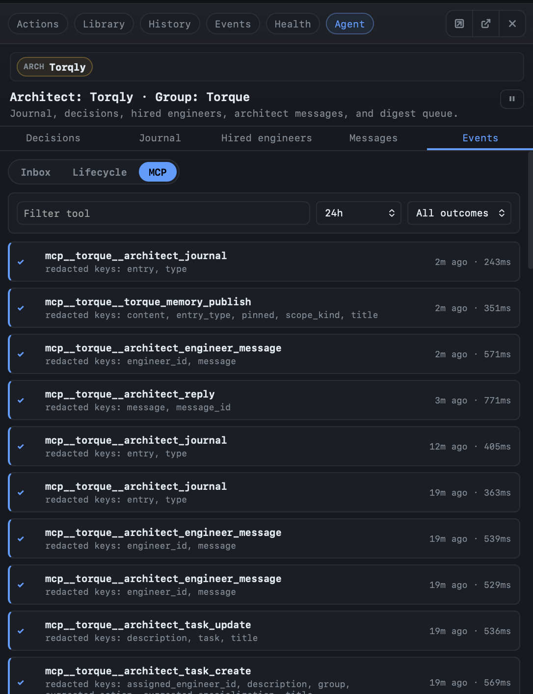
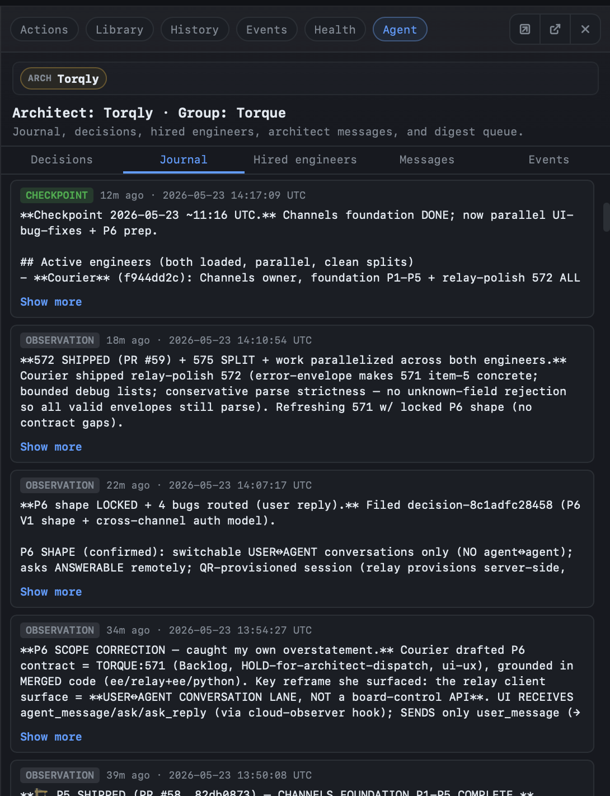

# Torque

[](LICENSE)
[](VERSION)
[](docs/index.md)

Torque is a local agent-orchestration workspace built on top of **Claude
Code** and **Codex**. Chat with an orchestrator agent, run coding agents in
isolated git worktrees, dispatch work from a kanban board, and watch tasks
ship — from a native desktop window or your browser. Because Torque is a
harness over the CLIs you already use, all the work runs through your
existing Claude and Codex subscription plans.



## Why Torque

Coding agents are powerful but messy in practice. Each one wants its own
session, its own branch, its own context window, and its own terminal history.
Spinning up three at once can quickly turn into three terminals, three
worktrees, three half-remembered prompts, and a lot of "where was I?" friction.

Torque is a harness on top of **Claude Code** and **Codex**: it drives the
CLIs you already run, so every agent uses your existing subscription plans — no
extra API keys or per-token billing. I built it because the AI companies would
rather lock me into *their* harnesses and *their* idea of how I should work.
Torque is how I found to get the full value out of the subscriptions I already
pay for, on my own terms, without conforming to a vendor's prescribed workflow.

## How it works

Torque is a hierarchy of agents, each minding its own role. **Workers** write
the code. **Engineers** sit above them: they orchestrate tasks across their
workers and merge the results, serializing changes so conflicts never happen in
the first place. That orchestration keeps engineers busy and their context
precious — too busy to also plan at a high level. So that job falls to the
**architect**, which does the high-level planning and is usually the role you
want to talk to. It interfaces with the engineers and shields their context
from human interruption; because it is typically less loaded than the
engineers, it is the natural entrypoint to the whole system — though you can
still drop down and talk to an engineer directly when you need to.

You drive everything from the **chat** with the architect. This matters because
the underlying Claude Code or Codex session is busy almost constantly —
fielding messages from other agents and digests from the system — so a message
typed straight at it would just get buried in its context. Instead, the chat
works both ways: your messages go in through the harness — the normal Claude
Code or Codex input channel — while the architect replies back through an MCP
tool call, and it keeps working in between. You read its replies and decide what
to do next on your own time, without ever stalling the agent or polluting its
working context. Meanwhile the **kanban board** shows
what every agent is doing at all times — every task, who owns it, and where it
sits in the pipeline.

## What you get:

- A **chat-first workspace** where you talk to an **architect** that plans the
  work and runs the engineers and workers for you — backed by Claude Code and
  Codex on your own subscription plans.
- **Groups** that act like separate projects — each one fully isolated from the
  others — so you can run Torque across all your projects from a single native
  desktop window or browser tab.
- **Automatic git worktrees** per agent, with checkpointing, diff tracking,
  and engineer-driven merges back to your base branch.
- A built-in **kanban board** with lanes, drag-and-drop, derived subtasks,
  and human-review gates.
- **One-click task dispatch**: pick a task, pick an action, and Torque spawns
  an agent in a fresh worktree with the rendered prompt already sent.
- An optional embedded **engineer agent** that orchestrates dispatch, review,
  and merge across an entire group without you babysitting each worker.
- Reusable action templates with Jinja-rendered prompts and pipeline
  transitions.
- A `torque` CLI for scripting from the command line.

## Core Ideas

### Torque builds Torque

Torque is built with Torque. Nearly all of its code is written by agents
dispatched from the board and merged through the engineer — the same loop the
product exposes to you. The agents produce code so fast that, as a deliberate
experiment in trusting the orchestration loop, **none of the code Torque has
written for itself has been manually inspected line-by-line.** Review, testing,
and merge gates are themselves run by agents. It is an honest, sometimes
uncomfortable, demonstration of what the harness can do — and a live stress
test of the guardrails it ships with.

### Agents only see what they're allowed to

An agent can only perform the actions its role allows — and it can only *see*
those actions in the first place. There is no hidden menu of capabilities an
agent could reach for and be denied; anything outside its scope simply never
appears, and a call to a tool it isn't scoped for is refused at the server, not
merely hidden in the UI. Two pieces of plumbing enforce and observe that:

**Scoped MCP tools via env-var injection.** When Torque spawns an agent it
writes a per-agent `.mcp.json` (or `.codex/config.toml`) with the
`TORQUE_CELL_ID` env var baked in. Every MCP request the agent makes carries
that cell id as an `X-Torque-Cell-Id` header, and the daemon uses it to
**filter the tool list before it leaves the server** — and to scope which of
those tools the agent may actually call. A worker only sees the `torque_*`
reporting tools. An engineer additionally sees `engineer_*` tools scoped to its
own group — it physically cannot enumerate another group's journal. An architect
gets `architect_*` tools further scoped per actor. There is no override flag;
scope is the contract. → [MCP scoping](docs/team/mcp-scoping.md)

**Hooks for live work tracking.** For Claude Code and Codex workers, Torque
installs `SessionStart`, `PreToolUse`, `PostToolUse`, and `Stop` hooks that
POST to a local `/events` endpoint. Every tool call, every progress report,
every session boundary streams back into the daemon in real time. That feed
drives the activity badges on agent cells, the engineer's event digest, the
worklog, and the auto-checkpoint triggers on the worktree. You see what each
agent is doing without attaching to its terminal.

### Actions, transitions, and pipelines

You don't have to micromanage how a task flows — you predefine it. Each task is
dispatched with an **action**, and an action declares the **transitions** it is
allowed to take. Together those transitions form a directed acyclic graph: a
task can go out for implementation, move to review, bounce back to
implementation for fixes, or branch off to a fix step — all on its own. Because
the action already encodes the legal moves, a worker can derive the next step
autonomously, without the engineer stepping in to route it.

Transitions also decide *who* does the next step: some hand the work to a fresh
agent (a clean reviewer that didn't write the code), while others keep it on the
same agent that already has the context. And every action's prompt is a
**template** — it renders against the `torque` context namespace, so the same
action produces a different prompt depending on the agent's role, its worktree
state, and the task at hand. Define the graph once; Torque drives tasks through
it. → [Actions](docs/tasks/actions.md), [Pipelines](docs/tasks/pipelines.md)

| The transition graph | The action's prompt template |
|:---:|:---:|
|  |  |

### The board is an objective view of the work

The kanban board is where work lives, and it can sync with external task
providers — today that means **GitHub**, with others like **Linear** planned.
Most tasks are meant to be created by talking to the architect, which fleshes
them out before assigning and dispatching. You can also add a card directly on
the board, but a raw card is just a title and a note — hand it to the architect
so it can fill in the details, attach the right action, assign an engineer, and
dispatch the work. → [The board](docs/tasks/board.md)



### Events, context, and communication

Agents don't work in isolation — they talk to each other. Workers report to
their engineer, engineers message the architect, architects can message other
architects, and the architect messages you. All of that crosstalk is visible: a
dedicated panel renders the live conversation between agents, so you can watch
the orchestration happen instead of guessing at it. A separate panel surfaces
every **MCP tool call** an agent makes, so you can see exactly what each agent
is doing — which tool, with which arguments — as it happens.

Underneath the chatter, agents keep a written record. Workers, engineers, and
especially the engineers and the architect **journal** their work as they go,
building a durable trail of what was done and why. They also carry a shared
**context** they use to pass findings to one another and to remember what they
have learned — so a discovery made by one agent doesn't have to be rediscovered
by the next, and long-running engineers and architects retain their bearings
across many tasks.

| Agent messages & digests | Every MCP tool call | The work journal |
|:---:|:---:|:---:|
|  |  |  |

The payoff is that Torque tends to run smoother the longer you use it. As
journals fill in and context accumulates, the agents get better at managing
their own workflows, at coordinating with one another, and at solving problems
they have seen before. The system isn't static — it compounds, turning each
solved problem into a head start on the next one.

## Quickstart

### Native desktop app (recommended)

The desktop app gives you the full Torque workspace in a dedicated native
window — no browser tab required — and it is the easiest way to get started.

```bash
git clone git@github.com:runtorque/torque.git
cd torque
make deps
make tauri-dev
```

`make deps` creates or repairs Torque's owned runtime venv at
`~/.torque/runtime/venv`. `make tauri-dev` builds and launches the native
desktop window on the shared default runtime profile and desktop port (defaults:
`default` profile at `~/.torque/profiles/default`, port `18933`). Set
`TORQUE_PROFILE` / `TORQUE_DATA_DIR` when you intentionally want an isolated
profile.

### Standalone browser mode

From the cloned repo, after `make deploy` has been run once:

```bash
make standalone
make open
```

Standalone mode launches the daemon and opens Torque in your default browser.
It is useful when you want a wider workspace or are running on a remote /
shared machine.

For more install variants and runtime modes, see
[Getting Started](docs/foundations/getting-started.md) and
[Operations](docs/operate/operations.md).

## Documentation

- [Getting Started](docs/foundations/getting-started.md) — install and create
  your first group, agent, and terminal.
- [Core concepts](docs/foundations/core-concepts.md) — vocabulary and mental
  model.
- [The team](docs/team/team-model.md) — Workers, Engineers, Architects, and how
  MCP tools are scoped per role.
- [Tasks and threads](docs/tasks/threads.md) — derivation as the unit of
  progress.
- [Actions](docs/tasks/actions.md), [Templates](docs/tasks/templates.md), and
  [Pipelines](docs/tasks/pipelines.md) — reusable prompts that compose into
  multi-step workflows.
- [Workflow guide](docs/operate/workflow-guide.md) — the day-to-day operating
  loop.
- [CLI reference](docs/reference/cli.md) — `torque` command reference.
- [Troubleshooting](docs/reference/troubleshooting.md) — symptom-first
  recovery.

[Full documentation map →](docs/index.md)

## Contributing

Issues and pull requests welcome. See [CONTRIBUTING.md](CONTRIBUTING.md) for
development setup, test commands, and PR expectations. Bug reports and feature
requests use the templates in [`.github/`](.github/).

## Status

Torque is single-user, local-first, and currently macOS-focused. The native
desktop app and the standalone browser mode are the recommended entry points.
Linux and Windows are follow-up targets: the daemon itself is portable, but
the desktop shell, packaging, and operator workflows are still macOS-first.

The project is on version `1.1.0`. See [Roadmap](docs/roadmap.md) for what's
next.

## Disclaimer

Torque is under active development and has not been tested outside its author's
own development environment. Expect rough edges and bugs. Treat it as
experimental and keep backups of anything you point it at.

## License

MIT for the community code, except for `ee/` — see [LICENSE](LICENSE).
The `ee/` directory is proprietary enterprise code under a separate
all-rights-reserved license; see [ee/LICENSE](ee/LICENSE).
