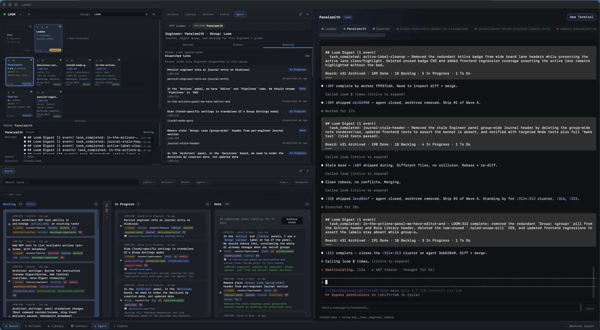

# Torque

[](LICENSE)
[](VERSION)
[](docs/index.md)

> Torque is a local agent-orchestration workspace for terminal-native
> developers. Manage AI coding agents, run them in isolated git worktrees,
> dispatch work from a kanban board, and let an embedded engineer coordinate
> the wave — from a native desktop window, your browser, or the deprecated
> secondary iTerm2 Toolbelt.



## Why Torque

Coding agents are powerful but messy in practice. Each one wants its own
session, its own branch, its own context window, and its own terminal history.
Spinning up three at once can quickly turn into three terminals, three
worktrees, three half-remembered prompts, and a lot of "where was I?" friction.

Torque puts a thin orchestration layer in front of that workflow. You define
**groups**, drop **agents** and **terminals** into them, dispatch work through
reusable **actions**, and watch tasks move across a built-in kanban board.
Every agent runs in its own isolated git worktree by default, so branch
boundaries are enforced instead of merely hoped for.

One step further: each group can have an **engineer**. The engineer is Torque's
orchestrator agent — it reads the board, dispatches workers, watches digests,
merges finished branches, and coordinates the next wave. It is the same idea
as a designated build engineer on a small team, but for a single-user OSS
workspace.

What you get:

- A visual group, agent, and terminal grid in a native desktop window, a
  browser, or the deprecated secondary iTerm2 Toolbelt sidebar.
- **Automatic git worktrees** per agent, with checkpointing, diff tracking,
  and engineer-driven merges back to your base branch.
- A built-in **kanban board** with lanes, drag-and-drop, derived subtasks,
  and human-review gates.
- **One-click task dispatch**: pick a task, pick an action, and Torque spawns
  an agent in a fresh worktree with the rendered prompt already sent.
- An optional embedded **engineer agent** that orchestrates dispatch, review,
  and merge across an entire group without you babysitting each worker.
- Reusable action templates with Jinja-rendered prompts and pipeline
  transitions.
- A `torque` CLI for scripting from the command line.

## How agents stay in their lane

Two pieces of plumbing make multi-agent orchestration safe:

**Scoped MCP tools via env-var injection.** When Torque spawns an agent it
writes a per-agent `.mcp.json` (or `.codex/config.toml`) with the
`TORQUE_CELL_ID` env var baked in. Every MCP request the agent makes carries
that cell id as an `X-Torque-Cell-Id` header, and the daemon uses it to
**filter the tool list before it leaves the server**. A worker only sees the
`torque_*` reporting tools. An engineer additionally sees `engineer_*` tools
scoped to its own group — it physically cannot enumerate another group's
journal. An architect gets `architect_*` tools further scoped per actor.
There is no override flag; scope is the contract. → [MCP scoping](docs/team/mcp-scoping.md)

**Hooks for live work tracking.** For Claude Code and Codex workers, Torque
installs `SessionStart`, `PreToolUse`, `PostToolUse`, and `Stop` hooks that
POST to a local `/events` endpoint. Every tool call, every progress report,
every session boundary streams back into the daemon in real time. That feed
drives the activity badges on agent cells, the engineer's event digest, the
worklog, and the auto-checkpoint triggers on the worktree. You see what each
agent is doing without attaching to its terminal.

## Quickstart

### Native desktop app (recommended)

The desktop app gives you the full Torque workspace in a dedicated native
window — no Toolbelt sidebar, no browser tab — and it is the easiest way to
get started.

```bash
git clone git@github.com:runtorque/torque.git
cd torque
make deps
make deploy
make run
```

`make deps` creates or repairs Torque's owned runtime venv at
`~/.torque/runtime/venv`. `make deploy` installs the primary
standalone/desktop app files under `~/.torque/app` and refreshes the CLI
symlink. `make run` starts a native desktop window on its own profile and port
(defaults: `desktop` profile, port `18933`), so it does not collide with any
Toolbelt instance you might also run.

### Standalone browser mode

From the cloned repo, after `make deploy` has been run once:

```bash
make standalone
make open
```

Standalone mode launches the daemon and opens Torque in your default browser.
It is useful when you want a wider workspace or are running on a remote /
shared machine.

### iTerm2 Toolbelt mode (deprecated secondary)

The iTerm2 Toolbelt still works for now, but it is deprecated. The primary
surfaces are standalone browser mode (`make standalone`) and the desktop app
(`make run`). If you still use the Toolbelt, migrate its data to a profile
with `scripts/migrate_toolbelt_to_profile.py` (TORQUE:645 P1b).

```bash
make deps
make deploy-toolbelt
make cli
```

Then in iTerm2:

1. Open **Scripts → torque** to launch the daemon.
2. Open **View → Show Toolbelt**.
3. Enable **Torque** from the Toolbelt gear menu.

Use `make deploy-toolbelt` again after pulling changes when you specifically
want to refresh the iTerm2 Scripts copy. The general `make deploy` target is
for the primary standalone/desktop app.

For more install variants and runtime modes, see
[Getting Started](docs/foundations/getting-started.md) and
[Operations](docs/operate/operations.md).

## Key concepts

**Groups, agents, and terminals.** A group is a workspace for one project or
one focus area. It contains agents — long-running coding sessions in their own
worktrees — and terminals, which are regular shells for ad-hoc commands and
inspection. See [Core concepts](docs/foundations/core-concepts.md).

**Automatic worktrees.** When you enable worktrees on a group, every agent
dispatched into it gets its own branch (`torque/<engineer>/<worker>-<id>`) and
checkout under `.torque/worktrees/`. The agent's terminal opens directly in
the worktree, parallel agents never trample each other's index, and the cell
shows a live branch + diff stats badge. Torque auto-checkpoints on stop and
on progress, so in-flight work survives crashes. See
[Worktrees](docs/tasks/worktrees.md).

**The kanban board.** Tasks live on a board with `Backlog`, `To Do`, `In
Progress`, `Done`, and `Archived` lanes (custom lanes welcome). Drag cards
between lanes, add tasks inline, attach an action and variables, set
dependencies, schedule for later — or do all of it from the `torque` CLI.
See [The board](docs/tasks/board.md).

**Actions and one-click dispatch.** An action is a reusable Jinja2 prompt
template. When you dispatch a task, Torque creates (or reuses) an agent,
spins up its worktree, opens the iTerm2 tab, installs the MCP config and
hooks, and sends the rendered prompt — all in one move. The prompt includes
a `torque` context namespace with the agent's identity, worktree state, and
task metadata, plus a postscript listing the exact MCP tools the agent may
call for this action's transitions. See [Actions](docs/tasks/actions.md).

**Merges and pipelines.** Actions can declare `transitions` (e.g.
`feature/implement` → `feature/review` → `feature/merge`), which become the
allowed `torque_derive` targets a worker may call. When a worktree is ready
to ship, the engineer (or you, via right-click → Merge Worktree) runs
`engineer_merge`, which handles squash vs regular merges, detects merge
boundaries on shared sequential branches, and refuses to silently lose work
on conflict. See [Pipelines](docs/tasks/pipelines.md) and
[Worktrees → Merging](docs/tasks/worktrees.md#merging).

**The engineer.** Each group can have an embedded engineer agent that watches
the board, plans the next wave, dispatches workers, batches them in parallel,
monitors event digests pushed from worker hooks, reviews diffs, merges
finished branches, and asks you for input when it hits a decision boundary.
The engineer is opt-in; Torque works fine without one, but it is the layer
that turns "six workers in flight" from chaotic into routine. See
[Engineers](docs/team/engineers.md).

## Documentation

- [Getting Started](docs/foundations/getting-started.md) — install and create
  your first group, agent, and terminal.
- [Core concepts](docs/foundations/core-concepts.md) — vocabulary and mental
  model.
- [The team](docs/team/team-model.md) — Workers, Engineers, Architects, and how
  MCP tools are scoped per role.
- [Tasks and threads](docs/tasks/threads.md) — derivation as the unit of
  progress.
- [Actions](docs/tasks/actions.md), [Templates](docs/tasks/templates.md), and
  [Pipelines](docs/tasks/pipelines.md) — reusable prompts that compose into
  multi-step workflows.
- [Workflow guide](docs/operate/workflow-guide.md) — the day-to-day operating
  loop.
- [CLI reference](docs/reference/cli.md) — `torque` command reference.
- [Troubleshooting](docs/reference/troubleshooting.md) — symptom-first
  recovery.

[Full documentation map →](docs/index.md)

## Contributing

Issues and pull requests welcome. See [CONTRIBUTING.md](CONTRIBUTING.md) for
development setup, test commands, and PR expectations. Bug reports and feature
requests use the templates in [`.github/`](.github/).

## Status

Torque is single-user, local-first, and currently macOS-focused. The native
desktop app and the standalone browser mode are the recommended entry points;
the iTerm2 Toolbelt integration is a deprecated secondary surface kept working
for rollback safety during the migration window.
Linux and Windows are follow-up targets: the daemon itself is portable, but
the terminal-control layer (iTerm2 today, Ghostty next) is the strongest
platform dependency.

The project is on version `1.1.0`. See [Roadmap](docs/roadmap.md) for what's
next.

## License

MIT for the community code, except for `ee/` — see [LICENSE](LICENSE).
The `ee/` directory is proprietary enterprise code under a separate
all-rights-reserved license; see [ee/LICENSE](ee/LICENSE).
