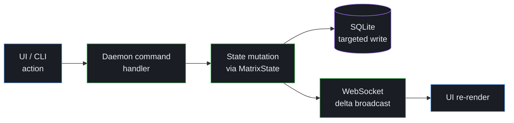

# Architecture

Torque is a local orchestration system. A long-running Python daemon manages state, agents, PTY sessions, and worktrees; a lightweight web UI renders that state in the desktop and browser surfaces; SQLite is the source of truth for persistence.

This page describes the major components and how they fit together. For the user-facing concepts (groups, agents, tasks, threads, pipelines), start with [What is Torque?](foundations/what-is-torque.md).

## Major components

### Python daemon (`torque/`)

The daemon's responsibilities, by module:

| Module | Responsibility |
|---|---|
| `server.py` | aiohttp server. HTTP `/api/cmd`, WebSocket `/ws`, hook receiver `/events`, MCP endpoints. Periodic worktree diff updater, dispatch, render-action, save-action. |
| `state.py` | `MatrixState` (in-memory + SQLite-backed), `AgentCell`, `BoardTask`, `GroupSettings`, `ArchitectSettings`, slug generation, delta accumulator + WebSocket broadcast. |
| `db.py`, `db_board.py`, `db_memory.py`, `db_schema.py` | SQLite persistence layer with WAL mode. Targeted writes, schema migrations, JSON-encoded fields. |
| `terminal_adapter.py` | Terminal interface for session lifecycle, input, resize, focus, and capability flags. |
| `local_pty.py`, `pty_supervisor*.py` | PTY ownership. Supervisor sidecar persists sessions across daemon restarts. |
| `actions.py` | Action loading, Jinja2 rendering with `torque` context namespace, transition graph discovery, pipeline detection. |
| `roles.py` | Worker / engineer / architect role file management. |
| `worktree.py` | Git worktree lifecycle — create, validate, checkpoint, rollback, diff, merge detection, gitignore management. |
| `mcp.py` | Worker MCP tools (`torque_*`). |
| `mcp_engineer.py`, `mcp_engineer_tools/` | Engineer MCP tools (`engineer_*`). |
| `mcp_architect.py` | Architect MCP tools (`architect_*`). |
| `mcp_tools_shared.py` | Authorization (`authorize_caller`), scoped state views, caller-aware result filtering. |
| `engineer.py`, `architect.py` | Role-specific system prompts, dispatch postscripts, journal/decision plumbing. |
| `events.py`, `notifications.py`, `digest_routing.py` | Event bus, throttled broadcast, macOS notifications, digest assembly + idle-gated push. |
| `cron.py` | Schedules (one-shot and recurring). |
| `adapters/` | Provider integration: Claude Code, Codex, Gemini CLI, generic fallback. |

### Frontend

Plain HTML, CSS, and JavaScript. No build step. The same frontend runs in:

- A browser window in standalone mode
- The native desktop shell (`pywebview`)

The frontend consumes a full snapshot on connect and live deltas after that. JS files are loaded in dependency order: `constants → ws → render → commands → modals → board → actions → main`. State is patched in place from delta messages, then re-rendered.

### SQLite

`torque.db` (WAL mode) is the source of truth for persistent state:

- agents, groups, group settings, group memberships
- board tasks, lanes, dependencies
- schedules
- engineer / architect settings, journal entries, decisions, pending hires
- agent history
- shared memory entries

Ephemeral fields — current activity, current process, current path, worktree diff stats, error message, needs_attention, last summary — live in memory only. They're cleared on restart. This is deliberate: those fields are derived from live observation and would be wrong if persisted.

The CLI's read-only commands (`torque task list`, `torque board list`, `torque action show`) read SQLite directly so they work even when the daemon is stopped.

## High-level data flow

For CLI writes, `bin/torque` posts to `/api/cmd`. For CLI reads (where applicable), `bin/torque` reads SQLite directly.

## Action and task model

Torque separates three things by design:

- **Roles** define *who does the work* — provider, model, system prompt, worktree behavior, environment, child terminals.
- **Actions** define *what the work prompt says* — Jinja2-rendered prompts, labels, transitions, gates.
- **Board tasks** are the concrete tracked unit of work — title, action binding, variables, lane, agent linkage, parent / pipeline metadata.

During dispatch, Torque resolves all three: the role builds the agent, the action renders the prompt with the live `torque` context namespace, the task is linked to the agent, and the dispatch postscript appended to the prompt declares which MCP tools are available based on the action's transitions.

→ [Tasks and threads](tasks/threads.md), [Actions](tasks/actions.md), [Templates](tasks/templates.md)

## MCP scoping

Three role-prefixed MCP tool surfaces — `torque_*`, `engineer_*`, `architect_*` — are filtered server-side by the caller's `kind`, resolved from the `X-Torque-Cell-Id` header. Tool list filtering happens at list time (hidden tools never appear); scoped state views filter the data each tool returns by group / by per-actor identity.

→ [MCP scoping](team/mcp-scoping.md)

## Worktree management

When enabled per group, every Worker gets a git worktree at `.torque/worktrees/<agent-id>/` on a `torque/<engineer-slug>/<worker-slug>-<shortid>` branch. The worktree manager handles creation, validation, diff summary, manual + auto + task-boundary checkpoints, rollback, merge detection (regular and squash), and conflict-aware rebase.

→ [Worktrees](tasks/worktrees.md)

## Runtime modes

The same daemon serves several deployment shapes:

- **Native desktop** — the primary app surface. `make run` launches a native
  shell backed by a standalone-mode daemon on port `18933` with data under
  `~/.torque/profiles/desktop`.
- **Standalone browser** — `make standalone` runs the PTY-backed daemon and
  `make open` opens the browser UI. This is the primary browser-only path and
  supports headless development setups.

The desktop and standalone paths use profile-scoped data directories under
`~/.torque/profiles/`.

Older releases could leave legacy Toolbelt data under the old Scripts
tree. That integration is no longer installed or updated; migrate old
data with `scripts/migrate_toolbelt_to_profile.py`.

→ [Operations](operate/operations.md)

## State broadcast model

Every mutation calls `_emit()` to queue a delta op. `broadcast()` sends `{"type": "delta", "seq": N, "ops": [...]}` to WebSocket clients. Full state (`snapshot_msg()`) is sent only on initial connect or `resync` request.

There are 12 delta op types: `agent_upsert`, `agent_remove`, `group_update`, `group_remove`, `group_rename`, `groups_reorder`, `group_settings_update`, `global_settings_update`, `task_upsert`, `task_remove`, `lanes_update`, `ui_update`, `focus_update`. The frontend patches its in-memory state from these and re-renders affected surfaces.

## Where to next

- [Operations](operate/operations.md) — runtime modes, deploy/update flow, logs.
- [Roadmap](roadmap.md) — planned work.
- [MCP tools reference](reference/mcp-tools.md) — every MCP tool, by role.
