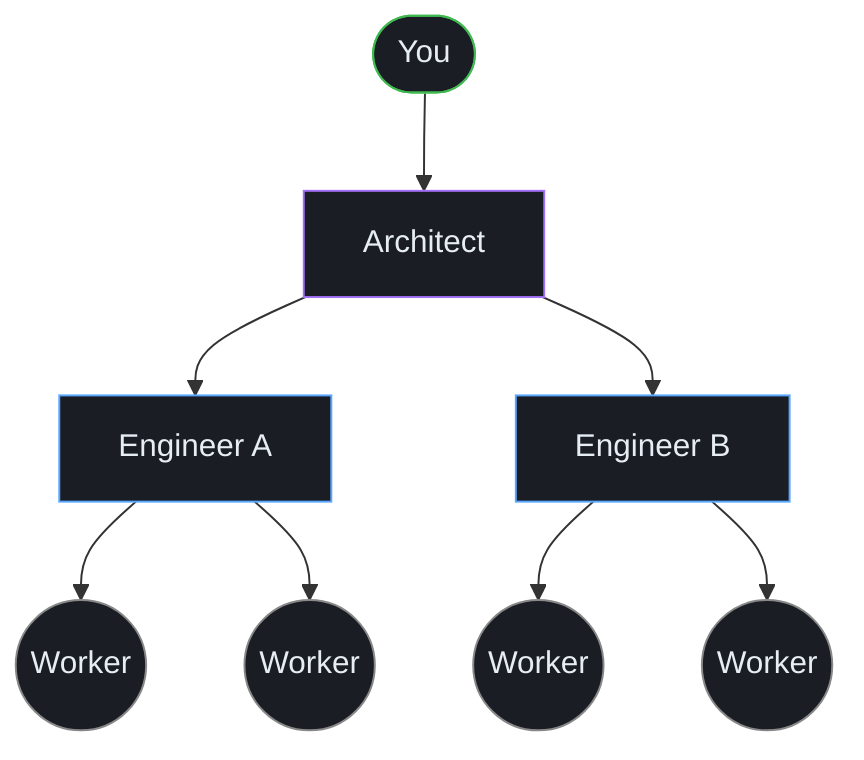

# Why Torque exists

Torque was built one painful problem at a time. Each layer of the team — Workers, Engineers, Architects — exists because the previous layer collapsed under its own weight. This page tells that story so the rest of the docs make sense as a sequence of fixes, not a pile of features.

If you're already convinced and just want the mechanics, jump to [The team model](../team/team-model.md).

## Step 1: One developer, several AI subscriptions

The starting point is the modern solo developer. You have a Claude subscription, a Codex subscription, maybe a Gemini one. You can spin up three agents in three terminal sessions and have them all working at once. You're, on paper, three engineers.

In practice you're a switchboard. You context-switch between tabs every fifteen seconds. You forget which one is doing the auth refactor and which one is patching the flaky test. You paste the same context into two of them because the third one already had it but you can't remember which one.

The first thing Torque gives you is a **grid view of your tabs**. Groups, agents, terminals. Each agent is a labeled cell with a color, a status dot, a current path, a current process. You stop having to remember which tab is which because the grid remembers for you.

That solved the navigation problem. It did not solve the coordination problem.

## Step 2: A board, because tabs aren't tasks

Once the grid existed, the next thing that broke was scope. An agent isn't a task — it's a *seat*. You'd assign one agent the work of "ship the auth refactor," and three days later you'd have no record of what it actually did, which sub-tasks completed, which ones got dropped on the floor.

So Torque got a **task board**. Real lanes (Backlog, To Do, In Progress, Done), real cards, real labels. You create tasks, you dispatch them to agents, and the agent reports back when it's done. Now you have a record. Now `git log` isn't your only memory.

That solved the persistence problem. It did not solve the **template problem**: every dispatch was you typing the same instructions over and over.

## Step 3: Actions, because you stop typing the same prompt

You quickly realize 90% of what you say to your agents is the same thing. "Implement this carefully. Read the relevant code first. Write tests. Run the suite before finishing. Report back when done."

Torque introduced **actions**: Jinja2-templated prompt files in `.torque/actions/`. You write the prompt once, parameterize it where you need to, and dispatch a task with `-t feature/implement` instead of typing 200 words of context every time. Actions can also adapt — same template, different rendered prompt depending on whether the agent is fresh, whether it's running Claude vs Codex, whether it has a worktree, whether it's continuing prior work.

That solved the prompt-reuse problem. It also unlocked something nobody planned: **pipelines**.

## Step 4: Pipelines, but not by declaring them

The way most workflow systems do pipelines is: you define a DAG, you wire up the steps, you maintain it as a separate first-class object that's always slightly out of sync with reality.

Torque doesn't do that. Actions can declare **transitions** — "after `feature/implement`, the valid next step is `feature/review`" — and from those transitions the daemon discovers pipelines as connected components in the action graph. You never write a "pipeline" definition. You write actions, and the pipeline is whatever shape they make when you connect them.

That gave us the loop most teams actually use: implement → review → fix-review → review → done. With one big bonus: every step is its own task on the board, with its own agent, its own context, its own history.

But this is where the next problem started. When the same loop ran in three streams in parallel, the workers had no idea each other existed.

## Step 5: Workers, and why they're ephemeral

The agents that do the actual code-writing — your `feature/implement` and `feature/fix-review` agents — are **Workers**. They're sharp, focused, and *deliberately ephemeral*. Each one knows about its own task and not much else. You boot it, give it a worktree, it implements, it reports back, you close it.

That ephemerality is a feature, not a bug. Workers don't pollute each other's contexts. They don't drift. You can run six of them in parallel and they don't trip over each other's plans. When they're done you throw them away.

Until you have to merge.

When two Workers finish and their changes overlap, the merge is hard. Worse, when one Worker is asked to "merge in your changes" it has no idea what the other Worker did. It happily wipes the other Worker's work because, from inside its tab, that work was never there.

This was where it became clear that the Workers themselves cannot be the only layer of intelligence in the system. Something has to know what *all* the Workers are doing.

## Step 6: Engineers, because someone has to coordinate

Enter the **Engineer**. One per group. Persistent (it survives `/clear`, restart, long pauses, anything but explicit dismissal). It watches the Workers in its group, gets a continuous digest of their events, keeps a journal of decisions, dispatches work in waves instead of all at once, reviews diffs before merging, resolves conflicts when conflicts happen.

The Engineer is good at conflict resolution because the Engineer **has the cross-Worker context Workers lack**. It saw both branches being built. It knows which Worker introduced which file. It can interrupt a Worker mid-flight if priorities change. It can decide that this branch is actually the merge target now, please rebase, please retry.

The Engineer is also good at prioritization. Workers will happily implement in the order you dispatch. The Engineer reads the board, decides which task should go next, which should be batched together, which should wait for a human checkpoint, which should be canceled outright.

That solved the coordination problem.

It immediately created a new one. **Engineers are too busy.**

## Step 7: Architects, because Engineers don't have time to plan

Once an Engineer was real, it became obvious it couldn't also be the planner. Its head was full of running streams, pending reviews, journal updates. Asking it to also do product management — "should we ship dark mode this week or finish the API refactor first?" — meant either the planning got rushed or the orchestration got dropped.

So Torque added **Architects**. The Architect is a level above the Engineer. It does the things Engineers don't have spare attention for:

- **Plans the next chunk of work.** Reads the codebase, decides what to build, writes tasks for the right Engineers.
- **Hires and dismisses Engineers.** When you're starting a new project area, the Architect proposes a new Engineer to own that group. When work in a group winds down, it dismisses the Engineer cleanly.
- **Reviews the work at a higher level than diff-by-diff.** Catches scope creep, rebalances priorities, decides when something is ready to ship.

The critical detail: even though the Architect can hire and dismiss, it must **treat Engineers as permanent team members**. You don't dismiss an Engineer just because today's work is done — that wipes its journal, breaks its stream-tracking continuity, and makes you start over the next time you need an Engineer in that area. Engineers are persistent for the same reason senior employees are persistent: their value is in the context they accumulate.

Architects are also user-created only. Torque won't auto-create an Architect for you, and an Architect can never hire another Architect. The buck stops with one Architect per project area, and ultimately with you.

## Step 8: MCP scoping, because trust has to be enforced

The last layer in the story isn't a new role — it's a guarantee about the previous ones.

When you give a Worker an MCP toolkit, you don't want it to be able to dispatch work on its own. When you give an Engineer the orchestration toolkit, you don't want it to peek at another Engineer's journal. When you give an Architect the planning toolkit, you don't want it to be able to override a different Architect's pending decisions.

Torque enforces this at the **MCP server boundary**, not in prompts. Every MCP request carries the agent's `X-Torque-Cell-Id` header. The server resolves that to a specific agent in a specific group with a specific role, and the tool surface it returns is filtered to exactly what that role can do, on exactly the data that role can see. A Worker physically cannot call `engineer_*` tools. An Engineer physically cannot read another group's journal. An Architect physically cannot resolve another Architect's pending hires.

That makes the hierarchy real. It's not a convention — it's a protocol.

## Where this leaves you

You now have the full mental model:

You sit at the top. You hire one Architect when the work calls for it. The Architect hires Engineers per area. Each Engineer dispatches Workers. Workers do the work and disappear. Tasks form threads through derivation, threads compose pipelines, and the whole thing stays legible because every interaction is a tracked task on a board.

Read [The team model](../team/team-model.md) next for the operational detail of each role, or jump straight to [Getting started](getting-started.md) if you want to see this in action.
