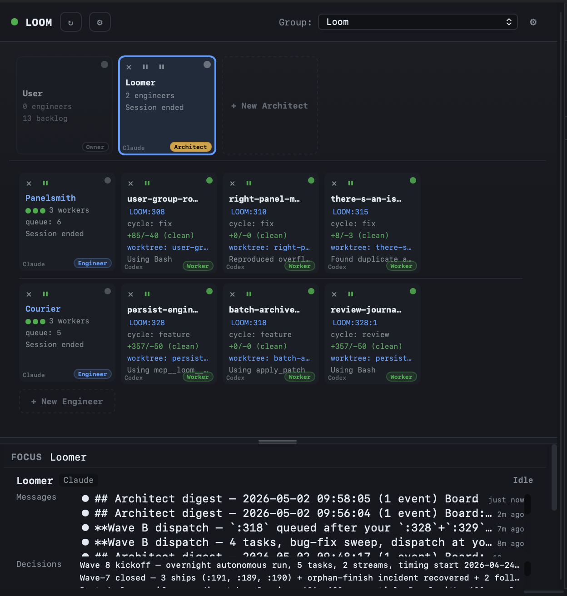

# Torque

Torque is a single-user project management powerhouse for shipping software with AI agents. You sit at the center of a small team you built yourself — architects, engineers, and workers — running in iTerm2 tabs, coordinated by a local daemon, talking to each other through structured tasks instead of through your shoulder.

## Where do you want to start?

-   **New to Torque?**

    Start with the pitch and the 60-second tour, then install.

    - [What is Torque?](foundations/what-is-torque.md)
    - [Why Torque exists](foundations/why-torque-exists.md)
    - [Getting started](foundations/getting-started.md)

-   **Building something with it?**

    Learn the team model, then the work model.

    - [The team model](team/team-model.md) — Architects, Engineers, Workers
    - [Tasks and threads](tasks/threads.md) — how progress becomes history
    - [Pipelines](tasks/pipelines.md) — DAGs that emerge from action transitions

-   **Operating it day to day?**

    The orchestration, scheduling, and notification surfaces.

    - [Workflow guide](operate/workflow-guide.md)
    - [Streams and waves](operate/streams-and-waves.md)
    - [Schedules](operate/schedules.md)

-   **Looking up a command?**

    Reference and recovery.

    - [CLI reference](reference/cli.md)
    - [MCP tool reference](reference/mcp-tools.md)
    - [Troubleshooting](reference/troubleshooting.md)

## The shape of the docs

The docs are organized around the mental model of Torque, not its UI.

| Section | What it covers |
|---|---|
| [**Foundations**](foundations/what-is-torque.md) | The pitch, the origin story, install, vocabulary primer. |
| [**The team**](team/team-model.md) | Workers, Engineers, Architects, and how MCP tools are scoped to each. |
| [**Tasks, threads, pipelines**](tasks/threads.md) | The board, derivation chains, actions, templates, pipelines, worktrees. |
| [**Operate Torque**](operate/workflow-guide.md) | Day-to-day flow, streams and waves, schedules, notifications. |
| [**Reference**](reference/cli.md) | CLI, MCP tools, settings, shortcuts, troubleshooting, architecture. |
| [**Project**](roadmap.md) | Roadmap. |

If you'd rather read the docs in their original tutorial order, follow the four cards above top-to-bottom — they're sequenced.
