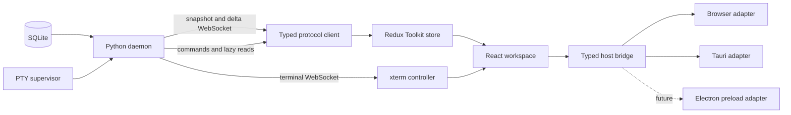

# RFC: React web UI architecture and migration

Status: Accepted — React is the default; parity hardening and classic retirement remain open
Date: 2026-08-11
Owners: Torque product and frontend maintainers

## Summary

Torque will replace its current classic-script HTML/JavaScript frontend with a
new client-only web application built with React, TypeScript, and Vite. The new
application will continue to use the existing Python daemon as its backend and
SQLite as the persistent source of truth. It will run in standalone browsers
and in the Tauri desktop shell from one codebase.

The migration will not rewrite the backend or translate the existing DOM one
element at a time. A new frontend will be built in parallel under `ui/`, using
the current UI as a behavioral reference until the new application satisfies
explicit parity, reliability, performance, accessibility, packaging, and
rollback gates.

The renderer will communicate with desktop capabilities through a small typed
host bridge. Tauri will be the primary desktop host during this project. A
future Electron host will implement the same bridge and continue to load the
same React application; Electron is not part of this RFC's implementation
scope.

## Decision

Adopt the following frontend stack:

- React with TypeScript for UI composition;
- Vite for development, bundling, code splitting, and production assets;
- Redux Toolkit for canonical snapshot/delta state and application-level UI
  state;
- plain semantic CSS variables plus CSS Modules for styling;
- React Aria Components for headless accessible dialogs, menus, popovers, and
  focus management;
- xterm.js as an imperative component owned behind a React lifecycle boundary;
- dnd-kit for accessible Board and workspace drag-and-drop;
- TanStack Virtual where large live lists need virtualization;
- Vitest, React Testing Library, and Playwright for new frontend tests;
- npm and a committed `package-lock.json` for dependency management.

Do not adopt Next.js, Remix, React Router, RTK Query, Tailwind, a styled-runtime
CSS system, or a general-purpose component theme as foundation requirements.
They may be proposed later when a concrete requirement justifies them.

## Context

### Current implementation

The current frontend is a no-build-step application composed from
`webview.html`, classic scripts under `static/js/`, and stylesheets under
`static/styles/`. The runtime contract makes script order architectural,
exposes globals and inline handlers as compatibility APIs, and mutates one
shared state object from the WebSocket modules.

At the time of this RFC, the frontend contains approximately:

- 85 JavaScript modules and 72,800 lines of JavaScript under `static/js/`;
- 17,400 lines of first-party CSS under `static/styles/`;
- 2,633 lines in `webview.html`;
- 64,700 lines of frontend Node regression tests;
- 343 inline HTML event handlers;
- 1,500 direct DOM lookup or construction calls.

The size alone is not the reason for the rewrite. The important problems are:

1. Load order substitutes for imports and module boundaries.
2. Shared globals make ownership and safe refactoring difficult.
3. State mutation, invalidation, rendering, and focus restoration are coupled.
4. Full or broad surface rebuilds require extensive manual preservation of
   focus, caret, scroll, drafts, expansion, hover, selection, and terminal tail
   intent.
5. Protocol shapes are not checked by a frontend type system.
6. The test suite contains valuable behavioral coverage but relies heavily on
   VM sandboxes and handwritten DOM fakes.
7. Desktop capability checks reach into application code through a Tauri-aware
   global shim.
8. Adding a modern dependency, reusable component, or code-split feature has no
   normal package/build path.

### Existing boundaries worth preserving

The backend already provides the right high-level separation for a modern
client:

- `GET /` serves the application shell;
- `GET /ws` sends a full snapshot followed by sequenced delta batches;
- sequence gaps cause clients to request a full `resync`;
- compact snapshots defer heavy task, archive, decision, hire, journal, and
  stream detail to explicit commands;
- `GET /ws/terminal/{cell_id}` carries terminal snapshots, output, input,
  focus, and resize traffic separately;
- `POST /api/cmd` and WebSocket commands expose application mutations and
  lazy reads;
- upload, attachment, log, runtime, and UI-state routes are already explicit;
- the Tauri shell starts or attaches to the Python daemon, manages native
  windows, and loads the daemon URL;
- standalone/browser and desktop surfaces consume the same web application;
- SQLite and the CLI remain independent of the renderer.

These boundaries let the frontend be replaced without changing Torque's
persistence model or agent runtime.

## Goals

- Create a genuinely new, maintainable UI rather than wrapping the existing
  DOM in React.
- Preserve SQLite, the Python daemon, CLI offline reads, and current agent/PTY
  behavior.
- Give snapshots, deltas, commands, entities, and native operations explicit
  TypeScript contracts.
- Centralize server-state mutation in testable reducers.
- Make components subscribe only to the state they display.
- Preserve drafts, focus, selection, scroll, expansion, and terminal intent by
  component ownership and stable identity rather than broad DOM reconstruction.
- Maintain one renderer for standalone browser and Tauri desktop modes.
- Keep the renderer portable to a future Electron host.
- Keep terminal output off the React render path.
- Preserve or improve keyboard operation, density, accessibility, detached
  windows, and native desktop behavior.
- Preserve the community/enterprise packaging boundary and fail-closed optional
  feature registration.
- Support incremental validation and rollback throughout the migration.
- Retire the classic frontend after a bounded compatibility period.

## Non-goals

- Rewriting the Python daemon, command handlers, persistence layer, PTY
  supervisor, CLI, or MCP implementation.
- Moving durable state from SQLite into browser storage.
- Introducing server-side rendering or a Node production server.
- Shipping Electron as part of this project.
- Shipping a SwiftUI or AppKit renderer.
- Maintaining pixel-for-pixel compatibility with the current interface.
- Preserving legacy DOM ids, inline handler names, global JavaScript symbols,
  or stylesheet selectors inside the new application.
- Making terminal screen contents Redux state.
- Supporting third-party executable frontend plugins in V1.
- Removing pywebview in the same change. It may remain a compatibility surface
  during migration and be retired by a separate decision after Tauri cutover.
- Redesigning backend semantics to compensate for missing frontend parity.

## Product and engineering invariants

The new UI must retain these Torque invariants:

1. SQLite remains the durable source of truth.
2. The daemon's in-memory state remains the live source of truth for ephemeral
   agent/runtime fields.
3. Web clients recover from missed deltas with a full snapshot, not local
   conflict resolution.
4. CLI read paths continue working while the daemon is stopped.
5. A high-frequency event for one agent must not rebuild unrelated panels.
6. Routine updates must not discard drafts, focus, caret, selection, expansion,
   scroll position, or terminal tail intent.
7. Terminal output must not dispatch one Redux action or React state update per
   chunk.
8. Detached windows may subscribe to shared daemon state but must not mount,
   resize, or focus hidden terminal surfaces.
9. Browser mode must not display native operations that the host bridge cannot
   perform.
10. Provider keys and other write-only secrets must never enter snapshots,
    frontend logs, Redux DevTools, or persisted client state.
11. Optional enterprise features must remain absent from community artifacts
    and must fail closed when no approved extension is present.
12. AI and optional services remain best-effort and may not prevent the core UI
    from booting.

## Target architecture



### Architectural layers

#### Protocol layer

The protocol layer owns:

- client identity and URL construction;
- compact snapshot negotiation;
- WebSocket connect, reconnect, liveness, and shutdown;
- expected sequence tracking;
- gap detection and `resync`;
- snapshot normalization;
- delta decoding and dispatch;
- command correlation and typed responses;
- unknown-message reporting;
- client-safe diagnostics with secret redaction.

It must not import React. Reducers and protocol tests must run in Node without a
DOM.

#### Canonical store

Redux Toolkit will own canonical application state. The initial slice plan is:

- `connection`: socket state, sequence, resync state, runtime identity, and
  daemon/supervisor health;
- `agents`: normalized agents and terminal records;
- `groups`: groups, hierarchy, ownership, and group settings;
- `tasks`: compact task cards, hydrated task details, lanes, schedules, and
  task-local fetch state;
- `messages`: direct messages, peer threads, asks, and bounded histories;
- `notices`: durable alerts and notifications;
- `planning`: initiatives, areas, decisions, hires, journals, thinking, and
  other lazy projections;
- `catalog`: actions, roles, specializations, templates, Agent Classes, and
  behavior overlays;
- `workspace`: persisted layout, selected principal, active group, panel
  placement, detached-window metadata, and saved split values.

`createEntityAdapter` should be used where records have stable ids. Memoized
selectors should expose view models and id lists. Components should select the
smallest stable value they need.

Redux is not the owner of every UI detail. Short-lived form values, hover,
popover state, transient drag state, local expansion, and component refs remain
local unless they must survive navigation, remount, reconnect, or another
window.

#### React application

React owns declarative UI structure, input lifecycle, accessibility semantics,
and feature composition. Feature directories own their components, selectors,
commands, tests, and CSS Modules. Cross-feature imports go through explicit
public entry points rather than reaching into another feature's internals.

The application shell will compose:

- global application chrome and Inbox;
- group and principal navigation;
- the agent workspace;
- the embedded terminal workspace;
- docked, floating, and detached feature panels;
- modal, menu, tooltip, and notification layers;
- onboarding and global shortcuts.

Stable record ids must be React keys. A render optimization must never rely on
silently mutating a selected object in place.

#### Terminal runtime

xterm.js remains imperative. A terminal controller will:

- create one xterm instance for one visible terminal mount;
- own the terminal WebSocket, fit addon, observers, and disposables;
- write output directly to xterm;
- coalesce resize messages;
- preserve terminal buffer and tail intent across surrounding React renders;
- suspend or dispose correctly when the owning surface becomes hidden;
- refuse to mount in unrelated detached windows;
- expose only metadata and bounded status to Redux.

React may rerender the terminal's surrounding chrome without replacing the DOM
node passed to `Terminal.open`. Development Strict Mode must be tested so
effect setup/cleanup cannot open duplicate sockets or terminals.

#### Host bridge

Application code will depend on a typed interface, not `window.__TAURI__`:

```ts
export interface DesktopHost {
  readonly kind: 'browser' | 'tauri' | 'electron';
  readonly capabilities: ReadonlySet<DesktopCapability>;
  detachPanel(request: DetachPanelRequest): Promise<DetachedWindow>;
  focusWindow(label: string): Promise<void>;
  reattachWindow(label: string): Promise<void>;
  listDetachedWindows(): Promise<DetachedWindow[]>;
  currentWindowBounds(): Promise<WindowBounds | null>;
  revealLogDirectory(): Promise<void>;
  openExternal(url: string): Promise<void>;
  confirm(request: ConfirmRequest): Promise<boolean>;
  runtimeConfig(): Promise<DesktopRuntimeConfig | null>;
}
```

The browser adapter exposes no native capabilities and returns explicit
unsupported results. The Tauri adapter calls approved Rust commands. A future
Electron preload adapter will expose the same methods through
`contextBridge`; React components will not change.

Capability checks, not user-agent or viewport checks, determine which native
actions render.

## Protocol strategy

### Preserve semantics before changing shapes

The first new client will consume the current compact snapshot and delta
protocol. A frontend rewrite does not justify changing transport semantics at
the same time.

The initial protocol package will model:

```ts
type ServerFrame =
  | SnapshotFrame
  | DeltaFrame
  | CommandResultFrame
  | SystemBannerFrame
  | ErrorFrame;

interface DeltaFrame {
  type: 'delta';
  seq: number;
  ops: DeltaOperation[];
}
```

Every known delta operation will be a discriminated TypeScript union. Unknown
frame types or operations must be retained in bounded diagnostics, reported to
the durable client-error path when available, and handled safely. An unknown
state-changing operation should request a resync and show a compatibility
warning rather than partially applying an ambiguous update.

Runtime validation will be proportional to risk:

- validate frame envelopes and discriminators in production;
- validate complete fixtures and per-operation payloads in tests;
- enable deeper development validation behind a flag;
- avoid repeatedly walking large trusted snapshots on hot production paths
  once envelope and version checks pass.

### Protocol fixtures and replay

Before feature work, add sanitized fixtures for:

- legacy and compact full snapshots;
- representative delta batches for every registered operation;
- a sequence gap followed by resync;
- reconnect with client-scoped focus overlays;
- lazy task/detail and paginated panel responses;
- detached-window state;
- terminal snapshot, output, exit, resize, and focus frames;
- malformed and forward-version messages.

Reducer replay tests must prove deterministic final state. During migration,
selected recordings should be applied to both the current state implementation
and the new store, with intentional differences documented.

### Backend evolution

Once the typed client is stable, a follow-up protocol RFC may add an explicit
protocol version and capability negotiation. Until then, additions must remain
backward compatible with the classic client. No existing protocol field is
removed before classic-UI retirement.

## Styling and design system

The new UI will preserve the durable principles in `DESIGN.md`—operator-first
density, calm hierarchy, stable workspaces, explicit state, and one visual
grammar—but it will not import the current stylesheet wholesale.

The styling model is:

- one global token and reset layer;
- semantic color, typography, spacing, radius, control, focus, elevation, and
  motion variables;
- a small global primitive layer for buttons, inputs, badges, tabs, and
  surfaces where consistency is more valuable than isolation;
- CSS Modules for feature and component layout;
- no CSS-in-JS runtime;
- no utility-class framework as the primary authoring model;
- no hardcoded light/dark values outside tokens;
- reduced-motion and high-contrast behavior from the first shell milestone.

Before full feature implementation, update `DESIGN.md` with the new component
API, responsive rules, density scale, and a decision record for the redesign.
Visual exploration may change appearance and information architecture, but the
RFC's state, protocol, host, and lifecycle boundaries remain fixed.

## Optional and enterprise features

The current frontend has a fail-closed enterprise panel manifest. The new UI
will replace raw manifest-to-global coupling with a versioned extension
registry.

V1 extension scope is intentionally narrow:

- declare a panel id, title, default placement, icon, and React loader;
- declare required backend/runtime capabilities;
- register optional routes into approved settings or panel extension points;
- provide no arbitrary Redux reducer replacement or unscoped DOM access;
- reject duplicate core ids and unsupported registry versions;
- render nothing when the community registry is empty.

Community builds must not resolve or package `ee/` paths. Enterprise builds may
provide a separate build entry or generated registry module. Packaging tests
must inspect the emitted assets, source maps, and manifest for enterprise path
or symbol leakage.

## Repository and module layout

The target layout is:

```text
ui/
  index.html
  package.json
  package-lock.json
  tsconfig.json
  vite.config.ts
  src/
    app/
      App.tsx
      store.ts
      providers.tsx
    protocol/
      frames.ts
      client.ts
      commands.ts
      deltaReducer.ts
      fixtures/
    host/
      types.ts
      browser.ts
      tauri.ts
    design/
      tokens.css
      globals.css
      primitives/
    features/
      agents/
      board/
      terminal/
      panels/
      inbox/
      settings/
      actions/
      planning/
    test/
      setup.ts
  e2e/
```

Feature names may be refined, but protocol, host, application, design, and
feature code must remain separate.

## Build, development, and packaging

### Development

Add these developer flows:

- `npm --prefix ui run dev`: Vite dev server with HTTP and WebSocket proxying to
  an isolated Torque daemon;
- `npm --prefix ui run typecheck`;
- `npm --prefix ui run test`;
- `npm --prefix ui run build`;
- `make ui-dev`, `make ui-test`, and `make ui-build` wrappers;
- `make tauri-dev` starts or attaches to an isolated daemon and loads the Vite
  development URL when the new client is selected;
- standalone development can open the Vite URL directly.

The proxy must cover `/ws`, `/ws/terminal/*`, `/api/*`, `/events`, `/mcp`,
`/attachments/*`, and other renderer-consumed daemon routes. The daemon origin
and profile must be configurable; no production port may be hardcoded in React
source.

### Production

Vite will emit hashed assets under `ui/dist/`. The Python daemon remains the
production origin and serves the generated index and assets. This preserves
same-origin HTTP/WebSocket behavior in browsers and keeps Tauri and a future
Electron shell aligned.

The build must use a route-independent asset strategy—relative asset URLs or a
server-resolved Vite manifest—so one artifact can boot at `/`, `/ui-next/`, and
in detached windows without producing a separate bundle for each route.

During coexistence:

- `/` continues to serve the classic UI by default;
- `/ui-next/` serves the new UI;
- `/legacy/` is added before cutover so rollback has a stable URL;
- a development/profile setting may select the default UI, but the choice must
  not enter shared durable state or surprise other profiles;
- after cutover, `/` serves the React UI and `/legacy/` remains temporarily.

The exact route names may change before implementation, but both clients must
be independently addressable during migration.

`install-standalone` must copy built UI assets without copying `node_modules`,
tests, source maps not intended for release, or enterprise sources. Release
workflows must install the pinned Node version, run `npm ci`, build the UI, and
then build the Tauri bundle. A production Tauri build must fail if the expected
UI manifest or entry asset is missing.

Tauri's `frontendDist` should point at the generated distribution for build
validation even though the runtime window loads the daemon origin.

### Security hardening

Before cutover:

- replace the null CSP with an explicit policy compatible with the selected
  production assets and localhost WebSockets;
- stop depending on an unrestricted global Tauri object;
- expose only allow-listed native commands through the typed adapter;
- keep external navigation in the host bridge and validate URL schemes;
- ensure HTML/Markdown rendering uses the existing safe-content contract or a
  reviewed sanitizer;
- ensure Redux logging and error reporting redact secrets and large terminal
  content;
- keep Electron guidance future-facing but require `contextIsolation` and a
  narrow preload bridge when that host is proposed.

## Migration plan

Each phase must be independently reviewable. Work should be split into bounded
vertical slices rather than one long-lived rewrite branch.

### Phase 0 — Baseline and parity inventory

Deliverables:

- freeze this RFC and record accepted amendments;
- inventory every current panel, modal, command, shortcut, context menu,
  detached-window behavior, lazy-load path, and browser/Tauri distinction;
- map existing frontend tests to a parity matrix;
- capture sanitized snapshot/delta/terminal fixtures;
- record current startup, snapshot, delta-application, common-interaction, and
  high-agent-count performance baselines;
- identify accessibility defects that should not become required parity;
- define the classic-client retirement window.

Gate:

- every operator-visible current feature is marked `required`, `redesign`,
  `defer`, or `retire`, with a named acceptance test or decision.

### Phase 1 — Toolchain, protocol, store, and host foundation

Deliverables:

- scaffold `ui/` with React, TypeScript, Vite, npm lockfile, linting,
  typechecking, Vitest, and CI integration;
- implement the protocol client, frame types, snapshot normalization, delta
  reducers, sequence-gap resync, reconnect, and fixtures;
- implement Redux store boundaries and selector conventions;
- implement browser and Tauri host adapters;
- add a minimal shell that reports connection/runtime state;
- add dual-serving development routes and production asset lookup;
- add community-empty extension registry and packaging guard;
- document dependency-update and generated-asset policy.

Gate:

- the new shell can connect, hydrate, apply all known delta fixtures, reconnect,
  resync, and run in browser and Tauri modes without rendering product panels.

Implementation checkpoint (2026-08-11): complete. The committed foundation
lives under `ui/`; `/ui-next/` and `/legacy/` provide the coexistence routes;
the locked build is integrated into standalone packaging, Tauri validation,
CI, and macOS release jobs. Operation-specific reducer replay covers the
classic-client registry plus literal backend emissions. Live browser smoke
tests pass against both Vite and daemon-served production assets, while the
typed Tauri host boundary, Rust URL/window integration, and a no-bundle Tauri
application build verify desktop mode. This checkpoint does not switch either
production default or begin Phase 2 product-panel work.

### Phase 2 — Design system, workspace shell, and Board slice

Deliverables:

- approve the new visual system and update `DESIGN.md`;
- implement global chrome, group navigation, panel layout, command palette,
  notifications/toasts, modals, menus, and keyboard infrastructure;
- implement Board lanes, cards, hierarchy, filters, selection, inline create,
  edit, dispatch, schedules, external sync, drag-and-drop, pipeline view, task
  detail hydration, and artifacts;
- persist only intentional workspace state;
- add component and browser end-to-end tests.

Why Board first:

- it exercises normalized entities, compact/detail hydration, drag-and-drop,
  forms, menus, selection, scroll preservation, and high-frequency deltas
  without first taking on xterm lifecycle risk.

Gate:

- the Board is usable for normal task creation-through-completion workflows in
  standalone browser and Tauri modes and meets agreed performance/accessibility
  thresholds.

Implementation checkpoint (2026-08-11): complete. The React workspace now
provides global chrome, persisted Group navigation, app-global Inbox and toast
delivery, a command palette, shared accessible menus/dialogs/state surfaces,
and the Board product slice. The Board covers lanes, cards, pipeline hierarchy,
filters, selection, keyboard traversal, inline creation, full-detail editing,
compact-snapshot detail hydration, dispatch, schedules, external sync/open,
pointer and keyboard drag-and-drop, completion acknowledgement, and artifact
inspection. Durable view preferences use the existing server commands while
selection, focus, drafts, dialogs, and collapse state remain ephemeral. The
locked browser suite verifies a live create-edit-complete workflow against an
isolated daemon; component/model/protocol tests and the Tauri host boundary
cover the shared renderer. React remains available at `/ui-next/` until later
phases satisfy the default-cutover gate.

### Phase 3 — Agent workspace and terminal slice

Deliverables:

- implement group/principal hierarchy, agent cards, focus panel, status,
  selection, agent lifecycle actions, worktree controls, and agent settings;
- implement embedded terminal mount, input, paste, focus, resize, reconnect,
  attachments, direct messages, composer, and undo/redo behavior;
- implement agent/terminal keyboard navigation;
- implement detached-window isolation for agent and terminal surfaces;
- validate multiple terminals and high-output sessions.

Gate:

- no duplicate PTY sockets or resize/focus interference across main and detached
  windows;
- terminal throughput does not cause React-wide commits;
- reconnect and daemon restart preserve expected terminal behavior.

Implementation checkpoint (2026-08-11): complete. The React workspace now
includes an Agents product area with group-scoped principal hierarchy,
Architect/Engineer ownership bands, Worker cards, independent keyboard focus
and selection, lifecycle actions, worktree controls, and server-resolved
per-agent settings. The focus surface composes child-terminal selection,
direct-message history, a persistent composer with image attachments and
semantic undo/redo, and the embedded terminal. The xterm controller owns its
WebSocket, fit/resize lifecycle, visibility gates, reconnect loop, and Strict
Mode lease outside Redux and the React render path. Tauri now allow-lists
dedicated Agents and Terminal windows; persisted detached-panel ownership
removes the main-window xterm before the detached mount connects, preventing
competing PTY focus and resize frames. Unit coverage verifies reconnect,
Strict Mode reuse, and hidden-surface suppression. A live isolated-daemon pass
verified keyboard traversal and composer undo, switched among six synthetic
agents with exactly one xterm root, transferred ownership as `0 + 1` across
main/detached windows, and recovered from a real daemon restart with preserved
agent selection and the expected stopped-session surface. React remains served
at `/ui-next/`; Phase 4 secondary surfaces are not included in this checkpoint.

### Phase 4 — Secondary panels and settings

Deliverables:

- Actions and pipeline editor;
- Agent, Architect, Engineer, Worker, class, event, hierarchy, and history
  panels;
- Inbox, Chat, Context, Health, Supervisor, Mission Control, logs, Help, and
  relay status;
- Initiatives, Thinking, decisions, hires, journals, schedules, behavior
  overlays, AI settings, templates, and remaining catalog surfaces;
- Global and Group Settings with coordinated save/dirty-state behavior;
- onboarding and cheatsheet.

Panel work may run in parallel once shared shell and protocol APIs are stable.
Each panel must include its lazy-load, empty, loading, error, permission, and
reconnect states.

Gate:

- the parity matrix has no unexplained required gaps.

Parity audit checkpoint (2026-09-21): **incomplete**. The previous coarse map
conflated event feeds with real logs, selected-agent threads with aggregate
Chat, action editing with pipeline visualization, and raw payloads with
operational UX. It is superseded by the [granular parity evidence ledger](react-ui-parity-matrix.md).
Each independent behavior and literal classic command has its own disposition
and acceptance scenario. Presence in source is not passing evidence. Required
repairs begin with logs, aggregate Chat, graph exploration, organization,
operational depth, and settings. Canvas and multi-panel layout disposition must
be explicit; D-072/D-074 already retire operator peer compose and terminal-only
detach initiation. Classic remains available until the ledger is verified.

Help checkpoint (2026-09-22): D-119 and P-185–P-192 restore correlated active
reads, explicit search/reset and audience modes, section/source navigation,
examples, provenance and readable safe Markdown. Component and isolated browser
acceptance are recorded in the ledger. This closes those browser Help repairs;
Phase 4 remains incomplete until the other independent rows are verified.

Actions highlighting checkpoint (2026-09-22): D-120 and P-184 retain native
textarea editing with a hidden syntax layer, backed by component and browser
acceptance. A discovered empty-collection YAML round-trip failure is repaired in
both daemon and offline CLI readers. The ledger records final regression gates;
this does not certify the remaining settings, command or native lifecycle rows.

### Phase 5 — Desktop, extension, release, and quality hardening

Deliverables:

- complete Tauri menus, window lifecycle, detached panels, bounds persistence,
  dialogs, external links, logs, first-run flow, and quit behavior;
- validate the enterprise extension registry and community fail-closed build;
- add production CSP and native API hardening;
- update installer, release, versioning, and artifact-verification workflows;
- run profiling at representative agent counts and terminal output rates;
- complete accessibility and reduced-motion audits;
- write operator migration and rollback documentation.

Gate:

- signed/ad-hoc production bundles, browser standalone, and community packaging
  pass their full release checks from a clean checkout.

Implementation checkpoint (2026-08-11): Phase 5 is implemented. React owns the
native-menu bridge, durable first-run flow, detached Board/Agents/Terminal/
Planning/Control windows, and bounds persistence. Tauri uses a production CSP,
restricted window capabilities, allow-listed commands, native confirmations,
and validated external HTTP(S) URLs. The release workflow now runs UI,
protocol, permission, community-package, and desktop tests before cutting a
version commit, then verifies both-architecture app signatures, DMGs, zip
archives, and checksums. Regression budgets cover a 500-agent/2,000-task
projection and a 10,000-frame terminal burst; reduced-motion and screen-reader
terminal behavior are protected. The optional-registry composition contract is
validated with a private-build-shaped fixture because private product source is
not present in the community checkout; the community artifact remains
fail-closed and is scanned after installation. Operator preview and renderer-
only rollback procedures live in `docs/operate/react-ui-migration.md`.

### Phase 6 — Cutover and classic retirement

Deliverables:

- switch `/` and primary Tauri launch to the React UI;
- keep `/legacy/` and a documented profile-level rollback during the burn-in
  window;
- triage regressions against the parity matrix and production diagnostics;
- remove classic-UI writes first, then classic assets and VM-only tests after
  the retirement gate;
- update `CLAUDE.md`, `AGENTS.md`, architecture docs, Make targets, install
  manifests, and testing references;
- retain protocol fixtures and behavior tests that remain valuable.

Classic removal is a separate reviewed change after successful cutover. Do not
delete the fallback in the same change that first makes React the default.

Implementation checkpoint (2026-08-11): the initial cutover is complete. `/`
and the primary Tauri daemon URL serve React, `/ui-next/` remains a compatible
React alias, and `/legacy/` remains the fully operational classic fallback.
`TORQUE_UI_DEFAULT=legacy` provides an explicit process/profile-scoped rollback
without changing SQLite. Root hashed assets, runtime renderer metadata, bounded
redacted client-error reporting, the community package, and both renderer routes
are release-tested. The Torque maintainers own a minimum 30-day and two-release
burn-in; classic retirement additionally requires no unresolved P0/P1 React
regression, no required parity gap, and a successful release-candidate rollback
drill. Classic writes and assets are deliberately retained in this change.

## Testing strategy

### Protocol and reducer tests

- snapshot normalization and entity identity;
- every delta operation;
- idempotent upsert/remove behavior;
- sequence gaps, reconnect, and resync;
- lazy hydration and stale response handling;
- client-scoped focus overlays;
- unknown and malformed frames;
- deterministic replay;
- secret redaction.

### Component tests

- forms, dirty state, validation, and coordinated saves;
- focus traps, keyboard navigation, and context menus;
- draft, selection, expansion, and scroll continuity;
- role- and capability-dependent action visibility;
- loading, empty, error, disconnected, and permission states;
- stable component identity under unrelated deltas.

### Browser end-to-end tests

- create, edit, dispatch, move, verify, and complete a task;
- launch, inspect, message, and stop an agent;
- open, type in, resize, reconnect, and close a terminal;
- navigate and restore panels and groups;
- use attachments, Inbox actions, settings, and lazy panels;
- reconnect after a forced WebSocket close and sequence gap;
- reload with drafts and persisted layout according to product rules.

### Desktop tests

- Tauri startup in spawn and attach modes;
- first-run flow;
- detach, focus, reattach, close, and restore panel windows;
- native menus and keyboard commands;
- dialog, external-link, log-directory, and quit behavior;
- no hidden-window terminal focus/resize traffic;
- packaged application smoke against an isolated profile.

### Performance tests

Measure rather than assume React behavior. At minimum record:

- time to usable shell and hydrated workspace;
- compact snapshot parse/normalize/apply time;
- p95 delta apply-to-paint time;
- React commit count for unrelated per-agent deltas;
- Board interaction latency at representative task counts;
- agent-grid interaction latency at the existing performance matrix;
- terminal throughput, dropped frames, and resize frequency;
- memory after repeated panel and terminal open/close cycles;
- detached-window resource use.

Targets should be based on Phase 0 baselines. A default expectation is no
material regression in startup or common interaction latency and a measurable
reduction in unrelated surface work under high-frequency deltas.

### Existing test disposition

Existing frontend tests are specifications, not permanent implementation
constraints. For each test:

- port behavior-level coverage to the new protocol, component, or end-to-end
  suite;
- retain backend/protocol tests that apply to both clients;
- retire tests that only protect classic script order, globals, HTML ids, or
  obsolete CSS after the classic UI is removed;
- document intentional behavior changes in the parity matrix and `DESIGN.md`.

## Observability

Development builds should expose an opt-in debug surface containing:

- connection state and last inbound time;
- current/expected sequence;
- resync count and reason;
- last bounded protocol errors;
- Redux action timing for snapshot and delta batches;
- component commit diagnostics for selected high-cost surfaces;
- terminal socket and resize counts;
- current host kind and capabilities.

Production diagnostics must be bounded, redact content and secrets, and route
actionable client failures into the existing durable Inbox/client-error path.
Do not persist Redux state dumps or terminal content by default.

## Accessibility requirements

Accessibility is a cutover gate, not deferred polish:

- complete keyboard operation for navigation, Board, menus, dialogs, panels,
  and terminal-adjacent controls;
- visible `:focus-visible` treatment;
- semantic roles, names, states, and live regions;
- focus return after dialogs and menus;
- no color-only status communication;
- reduced-motion support;
- usable high-contrast theme;
- drag-and-drop keyboard alternative;
- screen-reader labels for icon-only controls;
- minimum target sizing appropriate to Torque's dense desktop context.

The terminal emulator's own accessibility capabilities should be enabled and
tested without causing unacceptable throughput regressions.

## Rollout and rollback

Rollout is profile-scoped and reversible:

1. Developers use `/ui-next/` against isolated profiles.
2. Maintainers opt selected profiles into the new default.
3. Tauri development and test bundles use the new UI by default while browser
   production remains opt-in.
4. Browser and Tauri defaults switch after the cutover gates pass.
5. `/legacy/` remains available for a fixed burn-in window.
6. Classic assets are removed only after rollback usage and blocking
   regressions are resolved.

Rollback changes only which shell URL is opened. It must not require a database
migration or state downgrade. Backend protocol changes made during coexistence
must remain compatible with both clients.

## Risks and mitigations

### Rewrite scope grows without converging

Mitigation: parity inventory, vertical slices, per-phase gates, independently
reviewable changes, and a defined retirement decision.

### React introduces broad rerenders

Mitigation: normalized entities, narrow selectors, stable references,
component-level subscriptions, profiler tests, and a hard rule that terminal
output bypasses Redux/React.

### Operator state still disappears

Mitigation: distinguish server, persisted workspace, and local component state;
use stable keys; test every draft/focus/scroll contract under unrelated deltas
and reconnects.

### Protocol drift breaks one client

Mitigation: discriminated types, fixtures from real payloads, dual-client
compatibility tests, unknown-operation handling, and no removals before classic
retirement.

### Terminal lifecycle regressions

Mitigation: isolate the controller, test Strict Mode and detached windows,
instrument socket/resize counts, and keep terminal output off application state.

### New build tooling breaks installation or release

Mitigation: committed lockfile, `npm ci`, clean-checkout build tests, missing
artifact hard failures, and community package inspection.

### Framework UI becomes visually generic or less dense

Mitigation: retain Torque's design principles, use headless primitives, avoid a
pre-themed component suite, and approve the design system before panel scale-up.

### Tauri assumptions leak into React

Mitigation: host capability interface, browser adapter tests, and no direct
Tauri imports outside `ui/src/host/tauri.ts`.

### Enterprise code leaks into community artifacts

Mitigation: empty community registry, build-time allow-listing, emitted-asset
inspection, and no runtime filesystem discovery from the renderer.

## Alternatives considered

### Continue extracting vanilla JavaScript modules

Rejected. The current extraction work improves file ownership but retains
global compatibility APIs, manual DOM lifecycle, implicit protocol shapes, and
script-order coupling.

### Incrementally mount React widgets inside the classic DOM

Rejected as the primary strategy. It would create two competing ownership and
state systems and prolong the globals/inline-handler contract. A small bridge
may be used for diagnostics, but product slices should run in the parallel React
application.

### Vue 3 and Pinia

Viable runner-up. Vue would provide strong reactivity, TypeScript, and a gentle
template model. React was selected for the broader ecosystem around complex
desktop workspaces, imperative integrations, virtualization, testing, and a
future Electron renderer.

### Svelte 5 or SolidJS

Both offer attractive fine-grained updates. They were not selected because the
smaller ecosystem and more framework-specific reactivity models add long-term
maintenance risk to an already large migration.

### Angular

Rejected. Its application framework, dependency injection, router, and RxJS
conventions add more structure and migration cost than this client-only daemon
UI needs.

### Lit or custom elements

Rejected as the destination architecture. They could replace DOM fragments
incrementally but would leave Torque to design most application state, forms,
accessibility, and composition conventions itself.

### Electron now

Rejected for this RFC. Changing the renderer and desktop host together would
increase scope and make regressions harder to isolate. The host bridge preserves
the option without delaying the React migration.

## Cutover acceptance criteria

The React UI may become the default only when all of the following are true:

- every required parity-matrix row passes or has an approved replacement;
- snapshot, all known deltas, sequence-gap resync, reconnect, and lazy hydration
  pass fixture and live tests;
- browser standalone and Tauri spawn/attach modes pass end-to-end smoke tests;
- Board, agent workspace, terminal, settings, Inbox, and required panels pass
  their primary workflows;
- no known bug can cause a hidden or detached window to resize/focus another
  terminal;
- unrelated high-frequency deltas do not materially rebuild focused surfaces;
- performance meets approved Phase 0 thresholds;
- keyboard and accessibility audits have no blocking findings;
- production CSP and native capability restrictions are enabled;
- community artifacts contain no enterprise code;
- clean install, update, package, sign/ad-hoc build, and rollback are verified;
- documentation and operator migration guidance are current;
- the classic fallback has a named owner and expiration condition.

## Proposed implementation workstreams

After RFC acceptance, create separately reviewable tasks for:

1. parity inventory and protocol fixture capture;
2. UI toolchain and CI/release integration;
3. typed protocol client and Redux reducers;
4. host bridge and Tauri adapter;
5. design system and application shell;
6. Board vertical slice;
7. agent workspace vertical slice;
8. terminal controller and composer;
9. panel migration batches;
10. settings and catalog migration;
11. enterprise extension registry;
12. security, accessibility, and performance hardening;
13. cutover, rollback validation, and classic retirement.

Protocol/store work should land before panel work fans out. Once the design
system, feature API, and test harness are stable, independent panels can be
migrated in parallel without sharing implementation branches.

## Remaining review questions

The framework and host direction are decided. RFC reviewers should resolve
these remaining implementation choices before their corresponding phase:

1. Which existing visual behaviors are intentional product requirements versus
   artifacts to redesign or retire?

Resolved during implementation: React Aria Components provide the unstyled
headless primitives; production source maps do not ship; Node follows the
committed `.nvmrc`; the classic burn-in/retirement signal is defined in Phase 6;
and `make run` remains the pywebview compatibility launcher until classic-host
retirement, while `make tauri-dev` and production Tauri bundles are the native
Tauri paths. Both hosts load the React daemon root after cutover.

These questions do not reopen React, TypeScript, Vite, Redux Toolkit, the typed
host bridge, or the parallel migration strategy.

## References

- `CLAUDE.md`
- `DESIGN.md`
- `docs/reference/architecture.md`
- `docs/compact-snapshot-v1.md`
- `static/js/README.md`
- `static/js/ws.js`
- `static/js/ws/`
- `static/js/native_api.js`
- `src-tauri/`
- `tests/frontend_state_regression.test.js`
- `tests/frontend_detached_panel_window.test.js`
- `tests/frontend_ee_injection.test.js`
- `tests/tauri_shell_smoke.test.js`
- [Tauri frontend configuration](https://v2.tauri.app/start/frontend/)
- [React external store integration](https://react.dev/reference/react/useSyncExternalStore)
- [Redux normalized state and selector guidance](https://redux.js.org/tutorials/essentials/part-6-performance-normalization)
- [Vite backend integration](https://vite.dev/guide/backend-integration.html)
- [Electron process model](https://www.electronjs.org/docs/latest/tutorial/process-model)

### September parity repair checkpoint

The granular [parity ledger](react-ui-parity-matrix.md) includes source, command, modal, shortcut and individual settings-field inventories, concrete acceptance scenarios, repair evidence, and unresolved gates. Dedicated Logs, aggregate Chat, visual Pipelines, persisted organization/lane controls, supervisor/health detail and typed settings are implemented. Expanded browser coverage found and repaired compact Planning relationship refresh and main-window detached PTY ownership. Attention now shares acknowledged reply/diff-review flows; Area lifecycle, relationships and note editing use the durable backend contract. Provider discovery and sparse per-agent inheritance are covered, and native ownership now retains bounds independently of the live window label. macOS QA now verifies native detach/resize/close/reopen and menu Logs; isolated browser QA also exercises actual PTY input/output. The parity ledger records the remaining native, settings, attention and Planning gates. Settings now stage daemon-backed resets, send sparse ordinary edits, exclude runtime records and expose typed nested GitHub options. Explicit heartbeat cadence also survives restart, with legacy backfill confined to schema migration. Real attention QA now covers a generic PTY receiver, concurrent HTTP replies, replay, compact context and reconnect ordering, and a SQLite-backed approve/stale/reject cycle. Real terminal QA now covers scrollback under output, tail-preserving fit, snapshot reconnect and geometry resend; native macOS handoff confirms one owning PTY surface and retained DM draft. Thinking now uses the persisted brief field contract, full detail hydration, acknowledged sparse saves, typed scratchpad links, ordered review lifecycle and archived read-only discovery. Initiative/Decision editors now use the actual status vocabulary, sparse acknowledged writes, persisted link IDs, archive/restore and group filtering; Initiative-to-Board task creation now reviews unsaved scope and retains the acknowledged task ID for failed-link recovery; pre-creation dependencies, verification and draft evidence are now implemented with acknowledged creation and cleanup. Task creation now includes external ticket fields, named action variables and correlated unsaved-prompt preview. Active drafts survive catalog/detail refreshes; explicit dismissal discards as in Classic. Existing-task edits now wait for acknowledgement, submit sparse fields and sequence retryable attachment cleanup; existing-task previews render temporary unsaved task/agent copies through correlated reads. Existing tasks now share staged structured evidence editing, owned-upload cleanup and nested previews. Task activity has a dedicated section and card entry with actor/date/sequence detail, progressive history and correlated compact-update refresh. Numeric settings now retain blank drafts, validate before transport, reveal hidden invalid fields and preserve explicit zero values. Coordinated settings retries omit already acknowledged scopes. Active Settings now refreshes after reconnect, reconciles untouched values and nested maps, retains pending resets and editor focus, and retries failed reads in place under P-164. Context now refreshes applied queries on reconnect, reconciles editor fields and waits for matching publish/edit/pin acknowledgements; failed post-publish list refresh retries without duplicating the entry. Context now supports optional task/pipeline/agent links, keeps them across draft refresh and failed publication, and displays saved links with target navigation. History now refreshes its current list and selected detail through cancellable reads, retains reading state, retries failures and exposes persisted task/message navigation under P-168/P-173. Context now restores and saves its list/detail split through pointer and keyboard controls, retaining editor state across resize and compact transitions under P-171. Agent Classes now separate authored definitions from effective permissions, preserve unexposed YAML fields, refresh without replacing drafts, stage duplicates and wait for matched validation/write responses under P-174–P-176. Roles/Templates/Specializations now load full scoped definitions, provide typed authoring fields and stage duplicates; acknowledged saves/deletes preserve drafts and original scope under P-177–P-179. Actions now use scoped full-definition authoring, typed transitions and inline-agent fields, acknowledged lifecycle changes and previews of unsaved drafts under P-180–P-183. Prompt syntax highlighting remains open under P-184. Remaining P-112 surfaces and the independent acceptance gates stay open. Shared Board selection now requests full detail and catalogs for external task links as well as card clicks, with reopen/reconnect coverage. D-077–D-118 record the durable decisions. Phase 4 and classic retirement remain open until every required acceptance gate passes.

### Engineer identity parity checkpoint

Agent Settings now uses validated Engineer renaming, matching acknowledgements and retained failure drafts. Sparse presentation writes exclude Engineer names. Successful identity edits are not replayed when later settings fail, and pending requests retain the dialog. P-193/P-194 and D-121 record the contracts and acceptance evidence; remaining per-agent settings and native parity gates stay open.

### Stale completed-task archive parity checkpoint

Done now offers Classic's seven-day inactive-task suggestion with explicit group/filter scope, timestamp exclusions and one acknowledged batch archive. Pending/error/retry behavior preserves unrelated Board work. P-195 and D-122 define acceptance; the remaining parity gates continue to block Classic retirement.

### Per-agent settings refresh and recovery checkpoint

Agent Settings now reads current resolved values on open/reconnect and relevant defaults changes, reconciles untouched fields, preserves explicit drafts/resets, confirms dirty dismissal and tracks each acknowledged save scope. Failed later scopes retry without replaying completed writes. P-196–P-198 and D-123 define the acceptance contract; exhaustive settings runtime effects and remaining native/panel gates still block Phase 4 completion.

### Agent creation checkpoint

Worker creation displays server-resolved role/group launch fields while retaining explicit edits. All four creation kinds now wait for matching acknowledgements, preserve failed drafts and select the returned target. Terminal creation returns an explicit ID/parent response. Identical retries reuse the existing API idempotency key; Architect hiring remains a pending approval request. P-199/P-200 and D-124 define acceptance and recovery limits; remaining parity gates still block Classic retirement.
