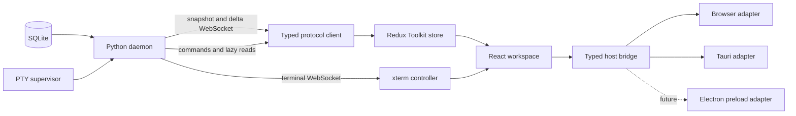

# RFC: React web UI architecture and migration

Status: Accepted — React is the default; parity hardening and classic retirement remain open
Date: 2026-08-11
Owners: Torque product and frontend maintainers

## Summary

Torque will replace its current classic-script HTML/JavaScript frontend with a
new client-only web application built with React, TypeScript, and Vite. The new
application will continue to use the existing Python daemon as its backend and
SQLite as the persistent source of truth. It will run in standalone browsers
and in the Tauri desktop shell from one codebase.

The migration will not rewrite the backend or translate the existing DOM one
element at a time. A new frontend will be built in parallel under `ui/`, using
the current UI as a behavioral reference until the new application satisfies
explicit parity, reliability, performance, accessibility, packaging, and
rollback gates.

The renderer will communicate with desktop capabilities through a small typed
host bridge. Tauri will be the primary desktop host during this project. A
future Electron host will implement the same bridge and continue to load the
same React application; Electron is not part of this RFC's implementation
scope.

## Decision

Adopt the following frontend stack:

- React with TypeScript for UI composition;
- Vite for development, bundling, code splitting, and production assets;
- Redux Toolkit for canonical snapshot/delta state and application-level UI
  state;
- plain semantic CSS variables plus CSS Modules for styling;
- React Aria Components for headless accessible dialogs, menus, popovers, and
  focus management;
- xterm.js as an imperative component owned behind a React lifecycle boundary;
- dnd-kit for accessible Board and workspace drag-and-drop;
- TanStack Virtual where large live lists need virtualization;
- Vitest, React Testing Library, and Playwright for new frontend tests;
- npm and a committed `package-lock.json` for dependency management.

Do not adopt Next.js, Remix, React Router, RTK Query, Tailwind, a styled-runtime
CSS system, or a general-purpose component theme as foundation requirements.
They may be proposed later when a concrete requirement justifies them.

## Context

### Current implementation

The current frontend is a no-build-step application composed from
`webview.html`, classic scripts under `static/js/`, and stylesheets under
`static/styles/`. The runtime contract makes script order architectural,
exposes globals and inline handlers as compatibility APIs, and mutates one
shared state object from the WebSocket modules.

At the time of this RFC, the frontend contains approximately:

- 85 JavaScript modules and 72,800 lines of JavaScript under `static/js/`;
- 17,400 lines of first-party CSS under `static/styles/`;
- 2,633 lines in `webview.html`;
- 64,700 lines of frontend Node regression tests;
- 343 inline HTML event handlers;
- 1,500 direct DOM lookup or construction calls.

The size alone is not the reason for the rewrite. The important problems are:

1. Load order substitutes for imports and module boundaries.
2. Shared globals make ownership and safe refactoring difficult.
3. State mutation, invalidation, rendering, and focus restoration are coupled.
4. Full or broad surface rebuilds require extensive manual preservation of
   focus, caret, scroll, drafts, expansion, hover, selection, and terminal tail
   intent.
5. Protocol shapes are not checked by a frontend type system.
6. The test suite contains valuable behavioral coverage but relies heavily on
   VM sandboxes and handwritten DOM fakes.
7. Desktop capability checks reach into application code through a Tauri-aware
   global shim.
8. Adding a modern dependency, reusable component, or code-split feature has no
   normal package/build path.

### Existing boundaries worth preserving

The backend already provides the right high-level separation for a modern
client:

- `GET /` serves the application shell;
- `GET /ws` sends a full snapshot followed by sequenced delta batches;
- sequence gaps cause clients to request a full `resync`;
- compact snapshots defer heavy task, archive, decision, hire, journal, and
  stream detail to explicit commands;
- `GET /ws/terminal/{cell_id}` carries terminal snapshots, output, input,
  focus, and resize traffic separately;
- `POST /api/cmd` and WebSocket commands expose application mutations and
  lazy reads;
- upload, attachment, log, runtime, and UI-state routes are already explicit;
- the Tauri shell starts or attaches to the Python daemon, manages native
  windows, and loads the daemon URL;
- standalone/browser and desktop surfaces consume the same web application;
- SQLite and the CLI remain independent of the renderer.

These boundaries let the frontend be replaced without changing Torque's
persistence model or agent runtime.

## Goals

- Create a genuinely new, maintainable UI rather than wrapping the existing
  DOM in React.
- Preserve SQLite, the Python daemon, CLI offline reads, and current agent/PTY
  behavior.
- Give snapshots, deltas, commands, entities, and native operations explicit
  TypeScript contracts.
- Centralize server-state mutation in testable reducers.
- Make components subscribe only to the state they display.
- Preserve drafts, focus, selection, scroll, expansion, and terminal intent by
  component ownership and stable identity rather than broad DOM reconstruction.
- Maintain one renderer for standalone browser and Tauri desktop modes.
- Keep the renderer portable to a future Electron host.
- Keep terminal output off the React render path.
- Preserve or improve keyboard operation, density, accessibility, detached
  windows, and native desktop behavior.
- Preserve the community/enterprise packaging boundary and fail-closed optional
  feature registration.
- Support incremental validation and rollback throughout the migration.
- Retire the classic frontend after a bounded compatibility period.

## Non-goals

- Rewriting the Python daemon, command handlers, persistence layer, PTY
  supervisor, CLI, or MCP implementation.
- Moving durable state from SQLite into browser storage.
- Introducing server-side rendering or a Node production server.
- Shipping Electron as part of this project.
- Shipping a SwiftUI or AppKit renderer.
- Maintaining pixel-for-pixel compatibility with the current interface.
- Preserving legacy DOM ids, inline handler names, global JavaScript symbols,
  or stylesheet selectors inside the new application.
- Making terminal screen contents Redux state.
- Supporting third-party executable frontend plugins in V1.
- Removing pywebview in the same change. It may remain a compatibility surface
  during migration and be retired by a separate decision after Tauri cutover.
- Redesigning backend semantics to compensate for missing frontend parity.

## Product and engineering invariants

The new UI must retain these Torque invariants:

1. SQLite remains the durable source of truth.
2. The daemon's in-memory state remains the live source of truth for ephemeral
   agent/runtime fields.
3. Web clients recover from missed deltas with a full snapshot, not local
   conflict resolution.
4. CLI read paths continue working while the daemon is stopped.
5. A high-frequency event for one agent must not rebuild unrelated panels.
6. Routine updates must not discard drafts, focus, caret, selection, expansion,
   scroll position, or terminal tail intent.
7. Terminal output must not dispatch one Redux action or React state update per
   chunk.
8. Detached windows may subscribe to shared daemon state but must not mount,
   resize, or focus hidden terminal surfaces.
9. Browser mode must not display native operations that the host bridge cannot
   perform.
10. Provider keys and other write-only secrets must never enter snapshots,
    frontend logs, Redux DevTools, or persisted client state.
11. Optional enterprise features must remain absent from community artifacts
    and must fail closed when no approved extension is present.
12. AI and optional services remain best-effort and may not prevent the core UI
    from booting.

## Target architecture



### Architectural layers

#### Protocol layer

The protocol layer owns:

- client identity and URL construction;
- compact snapshot negotiation;
- WebSocket connect, reconnect, liveness, and shutdown;
- expected sequence tracking;
- gap detection and `resync`;
- snapshot normalization;
- delta decoding and dispatch;
- command correlation and typed responses;
- unknown-message reporting;
- client-safe diagnostics with secret redaction.

It must not import React. Reducers and protocol tests must run in Node without a
DOM.

#### Canonical store

Redux Toolkit will own canonical application state. The initial slice plan is:

- `connection`: socket state, sequence, resync state, runtime identity, and
  daemon/supervisor health;
- `agents`: normalized agents and terminal records;
- `groups`: groups, hierarchy, ownership, and group settings;
- `tasks`: compact task cards, hydrated task details, lanes, schedules, and
  task-local fetch state;
- `messages`: direct messages, peer threads, asks, and bounded histories;
- `notices`: durable alerts and notifications;
- `planning`: initiatives, areas, decisions, hires, journals, thinking, and
  other lazy projections;
- `catalog`: actions, roles, specializations, templates, Agent Classes, and
  behavior overlays;
- `workspace`: persisted layout, selected principal, active group, panel
  placement, detached-window metadata, and saved split values.

`createEntityAdapter` should be used where records have stable ids. Memoized
selectors should expose view models and id lists. Components should select the
smallest stable value they need.

Redux is not the owner of every UI detail. Short-lived form values, hover,
popover state, transient drag state, local expansion, and component refs remain
local unless they must survive navigation, remount, reconnect, or another
window.

#### React application

React owns declarative UI structure, input lifecycle, accessibility semantics,
and feature composition. Feature directories own their components, selectors,
commands, tests, and CSS Modules. Cross-feature imports go through explicit
public entry points rather than reaching into another feature's internals.

The application shell will compose:

- global application chrome and Inbox;
- group and principal navigation;
- the agent workspace;
- the embedded terminal workspace;
- docked, floating, and detached feature panels;
- modal, menu, tooltip, and notification layers;
- onboarding and global shortcuts.

Stable record ids must be React keys. A render optimization must never rely on
silently mutating a selected object in place.

#### Terminal runtime

xterm.js remains imperative. A terminal controller will:

- create one xterm instance for one visible terminal mount;
- own the terminal WebSocket, fit addon, observers, and disposables;
- write output directly to xterm;
- coalesce resize messages;
- preserve terminal buffer and tail intent across surrounding React renders;
- suspend or dispose correctly when the owning surface becomes hidden;
- refuse to mount in unrelated detached windows;
- expose only metadata and bounded status to Redux.

React may rerender the terminal's surrounding chrome without replacing the DOM
node passed to `Terminal.open`. Development Strict Mode must be tested so
effect setup/cleanup cannot open duplicate sockets or terminals.

#### Host bridge

Application code will depend on a typed interface, not `window.__TAURI__`:

```ts
export interface DesktopHost {
  readonly kind: 'browser' | 'tauri' | 'electron';
  readonly capabilities: ReadonlySet<DesktopCapability>;
  detachPanel(request: DetachPanelRequest): Promise<DetachedWindow>;
  focusWindow(label: string): Promise<void>;
  reattachWindow(label: string): Promise<void>;
  listDetachedWindows(): Promise<DetachedWindow[]>;
  currentWindowBounds(): Promise<WindowBounds | null>;
  revealLogDirectory(): Promise<void>;
  openExternal(url: string): Promise<void>;
  confirm(request: ConfirmRequest): Promise<boolean>;
  runtimeConfig(): Promise<DesktopRuntimeConfig | null>;
}
```

The browser adapter exposes no native capabilities and returns explicit
unsupported results. The Tauri adapter calls approved Rust commands. A future
Electron preload adapter will expose the same methods through
`contextBridge`; React components will not change.

Capability checks, not user-agent or viewport checks, determine which native
actions render.

## Protocol strategy

### Preserve semantics before changing shapes

The first new client will consume the current compact snapshot and delta
protocol. A frontend rewrite does not justify changing transport semantics at
the same time.

The initial protocol package will model:

```ts
type ServerFrame =
  | SnapshotFrame
  | DeltaFrame
  | CommandResultFrame
  | SystemBannerFrame
  | ErrorFrame;

interface DeltaFrame {
  type: 'delta';
  seq: number;
  ops: DeltaOperation[];
}
```

Every known delta operation will be a discriminated TypeScript union. Unknown
frame types or operations must be retained in bounded diagnostics, reported to
the durable client-error path when available, and handled safely. An unknown
state-changing operation should request a resync and show a compatibility
warning rather than partially applying an ambiguous update.

Runtime validation will be proportional to risk:

- validate frame envelopes and discriminators in production;
- validate complete fixtures and per-operation payloads in tests;
- enable deeper development validation behind a flag;
- avoid repeatedly walking large trusted snapshots on hot production paths
  once envelope and version checks pass.

### Protocol fixtures and replay

Before feature work, add sanitized fixtures for:

- legacy and compact full snapshots;
- representative delta batches for every registered operation;
- a sequence gap followed by resync;
- reconnect with client-scoped focus overlays;
- lazy task/detail and paginated panel responses;
- detached-window state;
- terminal snapshot, output, exit, resize, and focus frames;
- malformed and forward-version messages.

Reducer replay tests must prove deterministic final state. During migration,
selected recordings should be applied to both the current state implementation
and the new store, with intentional differences documented.

### Backend evolution

Once the typed client is stable, a follow-up protocol RFC may add an explicit
protocol version and capability negotiation. Until then, additions must remain
backward compatible with the classic client. No existing protocol field is
removed before classic-UI retirement.

## Styling and design system

The new UI will preserve the durable principles in `DESIGN.md`—operator-first
density, calm hierarchy, stable workspaces, explicit state, and one visual
grammar—but it will not import the current stylesheet wholesale.

The styling model is:

- one global token and reset layer;
- semantic color, typography, spacing, radius, control, focus, elevation, and
  motion variables;
- a small global primitive layer for buttons, inputs, badges, tabs, and
  surfaces where consistency is more valuable than isolation;
- CSS Modules for feature and component layout;
- no CSS-in-JS runtime;
- no utility-class framework as the primary authoring model;
- no hardcoded light/dark values outside tokens;
- reduced-motion and high-contrast behavior from the first shell milestone.

Before full feature implementation, update `DESIGN.md` with the new component
API, responsive rules, density scale, and a decision record for the redesign.
Visual exploration may change appearance and information architecture, but the
RFC's state, protocol, host, and lifecycle boundaries remain fixed.

## Optional and enterprise features

The current frontend has a fail-closed enterprise panel manifest. The new UI
will replace raw manifest-to-global coupling with a versioned extension
registry.

V1 extension scope is intentionally narrow:

- declare a panel id, title, default placement, icon, and React loader;
- declare required backend/runtime capabilities;
- register optional routes into approved settings or panel extension points;
- provide no arbitrary Redux reducer replacement or unscoped DOM access;
- reject duplicate core ids and unsupported registry versions;
- render nothing when the community registry is empty.

Community builds must not resolve or package `ee/` paths. Enterprise builds may
provide a separate build entry or generated registry module. Packaging tests
must inspect the emitted assets, source maps, and manifest for enterprise path
or symbol leakage.

## Repository and module layout

The target layout is:

```text
ui/
  index.html
  package.json
  package-lock.json
  tsconfig.json
  vite.config.ts
  src/
    app/
      App.tsx
      store.ts
      providers.tsx
    protocol/
      frames.ts
      client.ts
      commands.ts
      deltaReducer.ts
      fixtures/
    host/
      types.ts
      browser.ts
      tauri.ts
    design/
      tokens.css
      globals.css
      primitives/
    features/
      agents/
      board/
      terminal/
      panels/
      inbox/
      settings/
      actions/
      planning/
    test/
      setup.ts
  e2e/
```

Feature names may be refined, but protocol, host, application, design, and
feature code must remain separate.

## Build, development, and packaging

### Development

Add these developer flows:

- `npm --prefix ui run dev`: Vite dev server with HTTP and WebSocket proxying to
  an isolated Torque daemon;
- `npm --prefix ui run typecheck`;
- `npm --prefix ui run test`;
- `npm --prefix ui run build`;
- `make ui-dev`, `make ui-test`, and `make ui-build` wrappers;
- `make tauri-dev` starts or attaches to an isolated daemon and loads the Vite
  development URL when the new client is selected;
- standalone development can open the Vite URL directly.

The proxy must cover `/ws`, `/ws/terminal/*`, `/api/*`, `/events`, `/mcp`,
`/attachments/*`, and other renderer-consumed daemon routes. The daemon origin
and profile must be configurable; no production port may be hardcoded in React
source.

### Production

Vite will emit hashed assets under `ui/dist/`. The Python daemon remains the
production origin and serves the generated index and assets. This preserves
same-origin HTTP/WebSocket behavior in browsers and keeps Tauri and a future
Electron shell aligned.

The build must use a route-independent asset strategy—relative asset URLs or a
server-resolved Vite manifest—so one artifact can boot at `/`, `/ui-next/`, and
in detached windows without producing a separate bundle for each route.

During coexistence:

- `/` continues to serve the classic UI by default;
- `/ui-next/` serves the new UI;
- `/legacy/` is added before cutover so rollback has a stable URL;
- a development/profile setting may select the default UI, but the choice must
  not enter shared durable state or surprise other profiles;
- after cutover, `/` serves the React UI and `/legacy/` remains temporarily.

The exact route names may change before implementation, but both clients must
be independently addressable during migration.

`install-standalone` must copy built UI assets without copying `node_modules`,
tests, source maps not intended for release, or enterprise sources. Release
workflows must install the pinned Node version, run `npm ci`, build the UI, and
then build the Tauri bundle. A production Tauri build must fail if the expected
UI manifest or entry asset is missing.

Tauri's `frontendDist` should point at the generated distribution for build
validation even though the runtime window loads the daemon origin.

### Security hardening

Before cutover:

- replace the null CSP with an explicit policy compatible with the selected
  production assets and localhost WebSockets;
- stop depending on an unrestricted global Tauri object;
- expose only allow-listed native commands through the typed adapter;
- keep external navigation in the host bridge and validate URL schemes;
- ensure HTML/Markdown rendering uses the existing safe-content contract or a
  reviewed sanitizer;
- ensure Redux logging and error reporting redact secrets and large terminal
  content;
- keep Electron guidance future-facing but require `contextIsolation` and a
  narrow preload bridge when that host is proposed.

## Migration plan

Each phase must be independently reviewable. Work should be split into bounded
vertical slices rather than one long-lived rewrite branch.

### Phase 0 — Baseline and parity inventory

Deliverables:

- freeze this RFC and record accepted amendments;
- inventory every current panel, modal, command, shortcut, context menu,
  detached-window behavior, lazy-load path, and browser/Tauri distinction;
- map existing frontend tests to a parity matrix;
- capture sanitized snapshot/delta/terminal fixtures;
- record current startup, snapshot, delta-application, common-interaction, and
  high-agent-count performance baselines;
- identify accessibility defects that should not become required parity;
- define the classic-client retirement window.

Gate:

- every operator-visible current feature is marked `required`, `redesign`,
  `defer`, or `retire`, with a named acceptance test or decision.

### Phase 1 — Toolchain, protocol, store, and host foundation

Deliverables:

- scaffold `ui/` with React, TypeScript, Vite, npm lockfile, linting,
  typechecking, Vitest, and CI integration;
- implement the protocol client, frame types, snapshot normalization, delta
  reducers, sequence-gap resync, reconnect, and fixtures;
- implement Redux store boundaries and selector conventions;
- implement browser and Tauri host adapters;
- add a minimal shell that reports connection/runtime state;
- add dual-serving development routes and production asset lookup;
- add community-empty extension registry and packaging guard;
- document dependency-update and generated-asset policy.

Gate:

- the new shell can connect, hydrate, apply all known delta fixtures, reconnect,
  resync, and run in browser and Tauri modes without rendering product panels.

Implementation checkpoint (2026-08-11): complete. The committed foundation
lives under `ui/`; `/ui-next/` and `/legacy/` provide the coexistence routes;
the locked build is integrated into standalone packaging, Tauri validation,
CI, and macOS release jobs. Operation-specific reducer replay covers the
classic-client registry plus literal backend emissions. Live browser smoke
tests pass against both Vite and daemon-served production assets, while the
typed Tauri host boundary, Rust URL/window integration, and a no-bundle Tauri
application build verify desktop mode. This checkpoint does not switch either
production default or begin Phase 2 product-panel work.

### Phase 2 — Design system, workspace shell, and Board slice

Deliverables:

- approve the new visual system and update `DESIGN.md`;
- implement global chrome, group navigation, panel layout, command palette,
  notifications/toasts, modals, menus, and keyboard infrastructure;
- implement Board lanes, cards, hierarchy, filters, selection, inline create,
  edit, dispatch, schedules, external sync, drag-and-drop, pipeline view, task
  detail hydration, and artifacts;
- persist only intentional workspace state;
- add component and browser end-to-end tests.

Why Board first:

- it exercises normalized entities, compact/detail hydration, drag-and-drop,
  forms, menus, selection, scroll preservation, and high-frequency deltas
  without first taking on xterm lifecycle risk.

Gate:

- the Board is usable for normal task creation-through-completion workflows in
  standalone browser and Tauri modes and meets agreed performance/accessibility
  thresholds.

Implementation checkpoint (2026-08-11): complete. The React workspace now
provides global chrome, persisted Group navigation, app-global Inbox and toast
delivery, a command palette, shared accessible menus/dialogs/state surfaces,
and the Board product slice. The Board covers lanes, cards, pipeline hierarchy,
filters, selection, keyboard traversal, inline creation, full-detail editing,
compact-snapshot detail hydration, dispatch, schedules, external sync/open,
pointer and keyboard drag-and-drop, completion acknowledgement, and artifact
inspection. Durable view preferences use the existing server commands while
selection, focus, drafts, dialogs, and collapse state remain ephemeral. The
locked browser suite verifies a live create-edit-complete workflow against an
isolated daemon; component/model/protocol tests and the Tauri host boundary
cover the shared renderer. React remains available at `/ui-next/` until later
phases satisfy the default-cutover gate.

### Phase 3 — Agent workspace and terminal slice

Deliverables:

- implement group/principal hierarchy, agent cards, focus panel, status,
  selection, agent lifecycle actions, worktree controls, and agent settings;
- implement embedded terminal mount, input, paste, focus, resize, reconnect,
  attachments, direct messages, composer, and undo/redo behavior;
- implement agent/terminal keyboard navigation;
- implement detached-window isolation for agent and terminal surfaces;
- validate multiple terminals and high-output sessions.

Gate:

- no duplicate PTY sockets or resize/focus interference across main and detached
  windows;
- terminal throughput does not cause React-wide commits;
- reconnect and daemon restart preserve expected terminal behavior.

Implementation checkpoint (2026-08-11): complete. The React workspace now
includes an Agents product area with group-scoped principal hierarchy,
Architect/Engineer ownership bands, Worker cards, independent keyboard focus
and selection, lifecycle actions, worktree controls, and server-resolved
per-agent settings. The focus surface composes child-terminal selection,
direct-message history, a persistent composer with image attachments and
semantic undo/redo, and the embedded terminal. The xterm controller owns its
WebSocket, fit/resize lifecycle, visibility gates, reconnect loop, and Strict
Mode lease outside Redux and the React render path. Tauri now allow-lists
dedicated Agents and Terminal windows; persisted detached-panel ownership
removes the main-window xterm before the detached mount connects, preventing
competing PTY focus and resize frames. Unit coverage verifies reconnect,
Strict Mode reuse, and hidden-surface suppression. A live isolated-daemon pass
verified keyboard traversal and composer undo, switched among six synthetic
agents with exactly one xterm root, transferred ownership as `0 + 1` across
main/detached windows, and recovered from a real daemon restart with preserved
agent selection and the expected stopped-session surface. React remains served
at `/ui-next/`; Phase 4 secondary surfaces are not included in this checkpoint.

### Phase 4 — Secondary panels and settings

Deliverables:

- Actions and pipeline editor;
- Agent, Architect, Engineer, Worker, class, event, hierarchy, and history
  panels;
- Inbox, Chat, Context, Health, Supervisor, Mission Control, logs, Help, and
  relay status;
- Initiatives, Thinking, decisions, hires, journals, schedules, behavior
  overlays, AI settings, templates, and remaining catalog surfaces;
- Global and Group Settings with coordinated save/dirty-state behavior;
- onboarding and cheatsheet.

Panel work may run in parallel once shared shell and protocol APIs are stable.
Each panel must include its lazy-load, empty, loading, error, permission, and
reconnect states.

Gate:

- the parity matrix has no unexplained required gaps.

Parity audit checkpoint (2026-09-21): **incomplete**. The previous coarse map
conflated event feeds with real logs, selected-agent threads with aggregate
Chat, action editing with pipeline visualization, and raw payloads with
operational UX. It is superseded by the [granular parity evidence ledger](react-ui-parity-matrix.md).
Each independent behavior and literal classic command has its own disposition
and acceptance scenario. Presence in source is not passing evidence. Required
repairs begin with logs, aggregate Chat, graph exploration, organization,
operational depth, and settings. Canvas and multi-panel layout disposition must
be explicit; D-072/D-074 already retire operator peer compose and terminal-only
detach initiation. Classic remains available until the ledger is verified.

Help checkpoint (2026-09-22): D-119 and P-185–P-192 restore correlated active
reads, explicit search/reset and audience modes, section/source navigation,
examples, provenance and readable safe Markdown. Component and isolated browser
acceptance are recorded in the ledger. This closes those browser Help repairs;
Phase 4 remains incomplete until the other independent rows are verified.

Actions highlighting checkpoint (2026-09-22): D-120 and P-184 retain native
textarea editing with a hidden syntax layer, backed by component and browser
acceptance. A discovered empty-collection YAML round-trip failure is repaired in
both daemon and offline CLI readers. The ledger records final regression gates;
this does not certify the remaining settings, command or native lifecycle rows.

### Phase 5 — Desktop, extension, release, and quality hardening

Deliverables:

- complete Tauri menus, window lifecycle, detached panels, bounds persistence,
  dialogs, external links, logs, first-run flow, and quit behavior;
- validate the enterprise extension registry and community fail-closed build;
- add production CSP and native API hardening;
- update installer, release, versioning, and artifact-verification workflows;
- run profiling at representative agent counts and terminal output rates;
- complete accessibility and reduced-motion audits;
- write operator migration and rollback documentation.

Gate:

- signed/ad-hoc production bundles, browser standalone, and community packaging
  pass their full release checks from a clean checkout.

Implementation checkpoint (2026-08-11): Phase 5 is implemented. React owns the
native-menu bridge, durable first-run flow, detached Board/Agents/Terminal/
Planning/Control windows, and bounds persistence. Tauri uses a production CSP,
restricted window capabilities, allow-listed commands, native confirmations,
and validated external HTTP(S) URLs. The release workflow now runs UI,
protocol, permission, community-package, and desktop tests before cutting a
version commit, then verifies both-architecture app signatures, DMGs, zip
archives, and checksums. Regression budgets cover a 500-agent/2,000-task
projection and a 10,000-frame terminal burst; reduced-motion and screen-reader
terminal behavior are protected. The optional-registry composition contract is
validated with a private-build-shaped fixture because private product source is
not present in the community checkout; the community artifact remains
fail-closed and is scanned after installation. Operator preview and renderer-
only rollback procedures live in `docs/operate/react-ui-migration.md`.

### Phase 6 — Cutover and classic retirement

Deliverables:

- switch `/` and primary Tauri launch to the React UI;
- keep `/legacy/` and a documented profile-level rollback during the burn-in
  window;
- triage regressions against the parity matrix and production diagnostics;
- remove classic-UI writes first, then classic assets and VM-only tests after
  the retirement gate;
- update `CLAUDE.md`, `AGENTS.md`, architecture docs, Make targets, install
  manifests, and testing references;
- retain protocol fixtures and behavior tests that remain valuable.

Classic removal is a separate reviewed change after successful cutover. Do not
delete the fallback in the same change that first makes React the default.

Implementation checkpoint (2026-08-11): the initial cutover is complete. `/`
and the primary Tauri daemon URL serve React, `/ui-next/` remains a compatible
React alias, and `/legacy/` remains the fully operational classic fallback.
`TORQUE_UI_DEFAULT=legacy` provides an explicit process/profile-scoped rollback
without changing SQLite. Root hashed assets, runtime renderer metadata, bounded
redacted client-error reporting, the community package, and both renderer routes
are release-tested. The Torque maintainers own a minimum 30-day and two-release
burn-in; classic retirement additionally requires no unresolved P0/P1 React
regression, no required parity gap, and a successful release-candidate rollback
drill. Classic writes and assets are deliberately retained in this change.

## Testing strategy

### Protocol and reducer tests

- snapshot normalization and entity identity;
- every delta operation;
- idempotent upsert/remove behavior;
- sequence gaps, reconnect, and resync;
- lazy hydration and stale response handling;
- client-scoped focus overlays;
- unknown and malformed frames;
- deterministic replay;
- secret redaction.

### Component tests

- forms, dirty state, validation, and coordinated saves;
- focus traps, keyboard navigation, and context menus;
- draft, selection, expansion, and scroll continuity;
- role- and capability-dependent action visibility;
- loading, empty, error, disconnected, and permission states;
- stable component identity under unrelated deltas.

### Browser end-to-end tests

- create, edit, dispatch, move, verify, and complete a task;
- launch, inspect, message, and stop an agent;
- open, type in, resize, reconnect, and close a terminal;
- navigate and restore panels and groups;
- use attachments, Inbox actions, settings, and lazy panels;
- reconnect after a forced WebSocket close and sequence gap;
- reload with drafts and persisted layout according to product rules.

### Desktop tests

- Tauri startup in spawn and attach modes;
- first-run flow;
- detach, focus, reattach, close, and restore panel windows;
- native menus and keyboard commands;
- dialog, external-link, log-directory, and quit behavior;
- no hidden-window terminal focus/resize traffic;
- packaged application smoke against an isolated profile.

### Performance tests

Measure rather than assume React behavior. At minimum record:

- time to usable shell and hydrated workspace;
- compact snapshot parse/normalize/apply time;
- p95 delta apply-to-paint time;
- React commit count for unrelated per-agent deltas;
- Board interaction latency at representative task counts;
- agent-grid interaction latency at the existing performance matrix;
- terminal throughput, dropped frames, and resize frequency;
- memory after repeated panel and terminal open/close cycles;
- detached-window resource use.

Targets should be based on Phase 0 baselines. A default expectation is no
material regression in startup or common interaction latency and a measurable
reduction in unrelated surface work under high-frequency deltas.

### Existing test disposition

Existing frontend tests are specifications, not permanent implementation
constraints. For each test:

- port behavior-level coverage to the new protocol, component, or end-to-end
  suite;
- retain backend/protocol tests that apply to both clients;
- retire tests that only protect classic script order, globals, HTML ids, or
  obsolete CSS after the classic UI is removed;
- document intentional behavior changes in the parity matrix and `DESIGN.md`.

## Observability

Development builds should expose an opt-in debug surface containing:

- connection state and last inbound time;
- current/expected sequence;
- resync count and reason;
- last bounded protocol errors;
- Redux action timing for snapshot and delta batches;
- component commit diagnostics for selected high-cost surfaces;
- terminal socket and resize counts;
- current host kind and capabilities.

Production diagnostics must be bounded, redact content and secrets, and route
actionable client failures into the existing durable Inbox/client-error path.
Do not persist Redux state dumps or terminal content by default.

## Accessibility requirements

Accessibility is a cutover gate, not deferred polish:

- complete keyboard operation for navigation, Board, menus, dialogs, panels,
  and terminal-adjacent controls;
- visible `:focus-visible` treatment;
- semantic roles, names, states, and live regions;
- focus return after dialogs and menus;
- no color-only status communication;
- reduced-motion support;
- usable high-contrast theme;
- drag-and-drop keyboard alternative;
- screen-reader labels for icon-only controls;
- minimum target sizing appropriate to Torque's dense desktop context.

The terminal emulator's own accessibility capabilities should be enabled and
tested without causing unacceptable throughput regressions.

## Rollout and rollback

Rollout is profile-scoped and reversible:

1. Developers use `/ui-next/` against isolated profiles.
2. Maintainers opt selected profiles into the new default.
3. Tauri development and test bundles use the new UI by default while browser
   production remains opt-in.
4. Browser and Tauri defaults switch after the cutover gates pass.
5. `/legacy/` remains available for a fixed burn-in window.
6. Classic assets are removed only after rollback usage and blocking
   regressions are resolved.

Rollback changes only which shell URL is opened. It must not require a database
migration or state downgrade. Backend protocol changes made during coexistence
must remain compatible with both clients.

## Risks and mitigations

### Rewrite scope grows without converging

Mitigation: parity inventory, vertical slices, per-phase gates, independently
reviewable changes, and a defined retirement decision.

### React introduces broad rerenders

Mitigation: normalized entities, narrow selectors, stable references,
component-level subscriptions, profiler tests, and a hard rule that terminal
output bypasses Redux/React.

### Operator state still disappears

Mitigation: distinguish server, persisted workspace, and local component state;
use stable keys; test every draft/focus/scroll contract under unrelated deltas
and reconnects.

### Protocol drift breaks one client

Mitigation: discriminated types, fixtures from real payloads, dual-client
compatibility tests, unknown-operation handling, and no removals before classic
retirement.

### Terminal lifecycle regressions

Mitigation: isolate the controller, test Strict Mode and detached windows,
instrument socket/resize counts, and keep terminal output off application state.

### New build tooling breaks installation or release

Mitigation: committed lockfile, `npm ci`, clean-checkout build tests, missing
artifact hard failures, and community package inspection.

### Framework UI becomes visually generic or less dense

Mitigation: retain Torque's design principles, use headless primitives, avoid a
pre-themed component suite, and approve the design system before panel scale-up.

### Tauri assumptions leak into React

Mitigation: host capability interface, browser adapter tests, and no direct
Tauri imports outside `ui/src/host/tauri.ts`.

### Enterprise code leaks into community artifacts

Mitigation: empty community registry, build-time allow-listing, emitted-asset
inspection, and no runtime filesystem discovery from the renderer.

## Alternatives considered

### Continue extracting vanilla JavaScript modules

Rejected. The current extraction work improves file ownership but retains
global compatibility APIs, manual DOM lifecycle, implicit protocol shapes, and
script-order coupling.

### Incrementally mount React widgets inside the classic DOM

Rejected as the primary strategy. It would create two competing ownership and
state systems and prolong the globals/inline-handler contract. A small bridge
may be used for diagnostics, but product slices should run in the parallel React
application.

### Vue 3 and Pinia

Viable runner-up. Vue would provide strong reactivity, TypeScript, and a gentle
template model. React was selected for the broader ecosystem around complex
desktop workspaces, imperative integrations, virtualization, testing, and a
future Electron renderer.

### Svelte 5 or SolidJS

Both offer attractive fine-grained updates. They were not selected because the
smaller ecosystem and more framework-specific reactivity models add long-term
maintenance risk to an already large migration.

### Angular

Rejected. Its application framework, dependency injection, router, and RxJS
conventions add more structure and migration cost than this client-only daemon
UI needs.

### Lit or custom elements

Rejected as the destination architecture. They could replace DOM fragments
incrementally but would leave Torque to design most application state, forms,
accessibility, and composition conventions itself.

### Electron now

Rejected for this RFC. Changing the renderer and desktop host together would
increase scope and make regressions harder to isolate. The host bridge preserves
the option without delaying the React migration.

## Cutover acceptance criteria

The React UI may become the default only when all of the following are true:

- every required parity-matrix row passes or has an approved replacement;
- snapshot, all known deltas, sequence-gap resync, reconnect, and lazy hydration
  pass fixture and live tests;
- browser standalone and Tauri spawn/attach modes pass end-to-end smoke tests;
- Board, agent workspace, terminal, settings, Inbox, and required panels pass
  their primary workflows;
- no known bug can cause a hidden or detached window to resize/focus another
  terminal;
- unrelated high-frequency deltas do not materially rebuild focused surfaces;
- performance meets approved Phase 0 thresholds;
- keyboard and accessibility audits have no blocking findings;
- production CSP and native capability restrictions are enabled;
- community artifacts contain no enterprise code;
- clean install, update, package, sign/ad-hoc build, and rollback are verified;
- documentation and operator migration guidance are current;
- the classic fallback has a named owner and expiration condition.

## Proposed implementation workstreams

After RFC acceptance, create separately reviewable tasks for:

1. parity inventory and protocol fixture capture;
2. UI toolchain and CI/release integration;
3. typed protocol client and Redux reducers;
4. host bridge and Tauri adapter;
5. design system and application shell;
6. Board vertical slice;
7. agent workspace vertical slice;
8. terminal controller and composer;
9. panel migration batches;
10. settings and catalog migration;
11. enterprise extension registry;
12. security, accessibility, and performance hardening;
13. cutover, rollback validation, and classic retirement.

Protocol/store work should land before panel work fans out. Once the design
system, feature API, and test harness are stable, independent panels can be
migrated in parallel without sharing implementation branches.

## Remaining review questions

The framework and host direction are decided. RFC reviewers should resolve
these remaining implementation choices before their corresponding phase:

1. Which existing visual behaviors are intentional product requirements versus
   artifacts to redesign or retire?

Resolved during implementation: React Aria Components provide the unstyled
headless primitives; production source maps do not ship; Node follows the
committed `.nvmrc`; the classic burn-in/retirement signal is defined in Phase 6;
and `make run` remains the pywebview compatibility launcher until classic-host
retirement, while `make tauri-dev` and production Tauri bundles are the native
Tauri paths. Both hosts load the React daemon root after cutover.

These questions do not reopen React, TypeScript, Vite, Redux Toolkit, the typed
host bridge, or the parallel migration strategy.

## References

- `CLAUDE.md`
- `DESIGN.md`
- `docs/reference/architecture.md`
- `docs/compact-snapshot-v1.md`
- `static/js/README.md`
- `static/js/ws.js`
- `static/js/ws/`
- `static/js/native_api.js`
- `src-tauri/`
- `tests/frontend_state_regression.test.js`
- `tests/frontend_detached_panel_window.test.js`
- `tests/frontend_ee_injection.test.js`
- `tests/tauri_shell_smoke.test.js`
- [Tauri frontend configuration](https://v2.tauri.app/start/frontend/)
- [React external store integration](https://react.dev/reference/react/useSyncExternalStore)
- [Redux normalized state and selector guidance](https://redux.js.org/tutorials/essentials/part-6-performance-normalization)
- [Vite backend integration](https://vite.dev/guide/backend-integration.html)
- [Electron process model](https://www.electronjs.org/docs/latest/tutorial/process-model)

### September parity repair checkpoint

The granular [parity ledger](react-ui-parity-matrix.md) includes source, command, modal, shortcut and individual settings-field inventories, concrete acceptance scenarios, repair evidence, and unresolved gates. Dedicated Logs, aggregate Chat, visual Pipelines, persisted organization/lane controls, supervisor/health detail and typed settings are implemented. Expanded browser coverage found and repaired compact Planning relationship refresh and main-window detached PTY ownership. Attention now shares acknowledged reply/diff-review flows; Area lifecycle, relationships and note editing use the durable backend contract. Provider discovery and sparse per-agent inheritance are covered, and native ownership now retains bounds independently of the live window label. macOS QA now verifies native detach/resize/close/reopen and menu Logs; isolated browser QA also exercises actual PTY input/output. The parity ledger records the remaining native, settings, attention and Planning gates. Settings now stage daemon-backed resets, send sparse ordinary edits, exclude runtime records and expose typed nested GitHub options. Explicit heartbeat cadence also survives restart, with legacy backfill confined to schema migration. Real attention QA now covers a generic PTY receiver, concurrent HTTP replies, replay, compact context and reconnect ordering, and a SQLite-backed approve/stale/reject cycle. Real terminal QA now covers scrollback under output, tail-preserving fit, snapshot reconnect and geometry resend; native macOS handoff confirms one owning PTY surface and retained DM draft. Thinking now uses the persisted brief field contract, full detail hydration, acknowledged sparse saves, typed scratchpad links, ordered review lifecycle and archived read-only discovery. Initiative/Decision editors now use the actual status vocabulary, sparse acknowledged writes, persisted link IDs, archive/restore and group filtering; Initiative-to-Board task creation now reviews unsaved scope and retains the acknowledged task ID for failed-link recovery; pre-creation dependencies, verification and draft evidence are now implemented with acknowledged creation and cleanup. Task creation now includes external ticket fields, named action variables and correlated unsaved-prompt preview. Active drafts survive catalog/detail refreshes; explicit dismissal discards as in Classic. Existing-task edits now wait for acknowledgement, submit sparse fields and sequence retryable attachment cleanup; existing-task previews render temporary unsaved task/agent copies through correlated reads. Existing tasks now share staged structured evidence editing, owned-upload cleanup and nested previews. Task activity has a dedicated section and card entry with actor/date/sequence detail, progressive history and correlated compact-update refresh. Numeric settings now retain blank drafts, validate before transport, reveal hidden invalid fields and preserve explicit zero values. Coordinated settings retries omit already acknowledged scopes. Active Settings now refreshes after reconnect, reconciles untouched values and nested maps, retains pending resets and editor focus, and retries failed reads in place under P-164. Context now refreshes applied queries on reconnect, reconciles editor fields and waits for matching publish/edit/pin acknowledgements; failed post-publish list refresh retries without duplicating the entry. Context now supports optional task/pipeline/agent links, keeps them across draft refresh and failed publication, and displays saved links with target navigation. History now refreshes its current list and selected detail through cancellable reads, retains reading state, retries failures and exposes persisted task/message navigation under P-168/P-173. Context now restores and saves its list/detail split through pointer and keyboard controls, retaining editor state across resize and compact transitions under P-171. Agent Classes now separate authored definitions from effective permissions, preserve unexposed YAML fields, refresh without replacing drafts, stage duplicates and wait for matched validation/write responses under P-174–P-176. Roles/Templates/Specializations now load full scoped definitions, provide typed authoring fields and stage duplicates; acknowledged saves/deletes preserve drafts and original scope under P-177–P-179. Actions now use scoped full-definition authoring, typed transitions and inline-agent fields, acknowledged lifecycle changes and previews of unsaved drafts under P-180–P-183. Prompt syntax highlighting remains open under P-184. Remaining P-112 surfaces and the independent acceptance gates stay open. Shared Board selection now requests full detail and catalogs for external task links as well as card clicks, with reopen/reconnect coverage. D-077–D-118 record the durable decisions. Phase 4 and classic retirement remain open until every required acceptance gate passes.

Agent Class assignment now uses the latest accepted per-agent status and a correlated save acknowledgement. Untouched selections follow saved state, edited choices survive refresh, live assignment/launch changes refresh visible details, and duplicate pending writes are blocked. Refusal and uncertain outcomes remain explicit without automatic replay. P-272/P-273 and D-164 record the separate status and save contracts; the broader parity and native acceptance gates remain open.

Activity class review now separates readable selected/default authority from the running class: scoped resolved grants, authored denials, lifecycle/scratch state, apply timing, independent warnings, and assignment/freeze metadata. P-275–P-277 and D-165 define these contracts. Generic connector-governance copy stays omitted as in the maintained Classic implementation; compact grant projections are not interpreted as deny rules. Settings system-prompt request correlation and copying remain separately open under P-278/P-279.

### Engineer identity parity checkpoint

Agent Settings now uses validated Engineer renaming, matching acknowledgements and retained failure drafts. Sparse presentation writes exclude Engineer names. Successful identity edits are not replayed when later settings fail, and pending requests retain the dialog. P-193/P-194 and D-121 record the contracts and acceptance evidence; remaining per-agent settings and native parity gates stay open.

### Stale completed-task archive parity checkpoint

Done now offers Classic's seven-day inactive-task suggestion with explicit group/filter scope, timestamp exclusions and one acknowledged batch archive. Pending/error/retry behavior preserves unrelated Board work. P-195 and D-122 define acceptance; the remaining parity gates continue to block Classic retirement.

### Per-agent settings refresh and recovery checkpoint

Agent Settings now reads current resolved values on open/reconnect and relevant defaults changes, reconciles untouched fields, preserves explicit drafts/resets, confirms dirty dismissal and tracks each acknowledged save scope. Failed later scopes retry without replaying completed writes. P-196–P-198 and D-123 define the acceptance contract; exhaustive settings runtime effects and remaining native/panel gates still block Phase 4 completion.

### Agent creation checkpoint

Worker creation displays server-resolved role/group launch fields while retaining explicit edits. All four creation kinds now wait for matching acknowledgements, preserve failed drafts and select the returned target. Terminal creation returns an explicit ID/parent response. Identical retries reuse the existing API idempotency key; Architect hiring remains a pending approval request. P-199/P-200 and D-124 define acceptance and recovery limits; remaining parity gates still block Classic retirement.


Agent creation now discovers classes in the pinned group's project through an owned, correlated read. Reconnect retains drafts and selection while checking availability; stale, archived or invalid explicit choices block launch until corrected. P-201 and D-125 preserve explicit-path/legacy discovery compatibility and leave backend launch validation authoritative.


### Worktree toolbar recovery checkpoint

Worktree creation now confirms active-session replacement, acknowledges the created path and requested new session, and retains partial creation so relaunch can be retried without another worktree. Toolbar checkpoint exposes acknowledged commit/no-op/refusal outcomes, and toolbar Preflight merge opens the correlated inspector. P-245–P-247 and D-146 record acceptance and retry limits. PR push confirmation, inherited merge options, contextual removal, broad settings and lazy/reconnect acceptance remain open; this checkpoint does not close Phase 4 or permit Classic retirement.


### Worktree publication review and merge-default checkpoint

Create PR now reviews the source branch, target base and push implication before sending, retaining confirmation for refusals and uncertain-outcome retries. Merge cleanup and preserved-diff options inherit the target group defaults and retain reviewed edits across refresh/reconnect. P-248/P-249 and D-147 record evidence, including real local cleanup and explicitly simulated external-PR responses. Shared-worktree removal, broad Settings/reconnect and independent native/external acceptance gates remain open; Phase 4 and Classic retirement remain unproven.


### Reviewed worktree release checkpoint

P-250 and D-148 now cover current Git/shared-use review, cancellation, active-session guards, link-only release, destructive-file warnings and retained physical-removal/branch outcomes. Real local Git/PTY browser acceptance and the full 3,208-test regression suite passed; a screenshot-discovered long-path overflow was fixed and rechecked on desktop/mobile. The parity ledger records the exact evidence and limits.

The settings audit adds P-251–P-254 for missing capture choices, retention boundaries, dirty-navigation protection and search/reveal. There are now 254 mapped behaviors: 241 implemented/equivalent dispositions, 9 open repair rows and 4 intentional retirements. Broad settings/lazy-reconnect and independent native/external acceptance remain open. This checkpoint does not certify Phase 4 or authorize Classic retirement.


### Settings draft and navigation checkpoint

P-253 and D-149 now cover explicit dirty-exit confirmation, retained pending-save results, editor identity/focus/caret and group-scope continuity. Workspace/section/group navigation, command palette, Classic-link navigation and native menu/detach entry points share the guard. An externally selected group cannot replace a dirty form; saves retain their original scope. Production-browser navigation/reconnect/validation scenarios and all 465 UI tests passed.

The main ledger now records 254 behaviors: 242 implemented/equivalent dispositions, 8 open repairs and 4 intentional retirements. Broad settings/lazy-reconnect acceptance, the explicit capture/retention/search gaps and independent native/external gates remain open. This does not claim draft persistence after hard refresh or window destruction, and does not close Phase 4.

### Capture and retention settings checkpoint — 2026-09-23

P-251/P-252 restore explicit Off/Metadata/Full choices and Classic retention minima with explanatory copy. Component regressions, controlled-time retention tests and isolated browser saves/reloads plus actual persisted event queries verify the behavior. D-150 records the contract. The main ledger now has **254 behaviors: 244 implemented/equivalent dispositions, 6 open repairs and 4 intentional retirements**. Broad settings, lazy/reconnect, settings search and native/external acceptance remain open; Phase 4 is not complete.

### Settings search checkpoint — 2026-09-23

P-254 adds local label/description/scope search with bounded accessible results, disclosure reveal and focus on the retained control. Draft values and secrets are excluded from the index. Reconnect updates available results without replacing the search query or edited form. D-151 records the interaction. The main ledger now has **254 behaviors: 245 implemented/equivalent dispositions, 5 open repairs and 4 intentional retirements**. Broad settings and lazy/reconnect rows, plus independent native/external acceptance, still prevent Phase 4 completion and Classic retirement.

### Numeric settings and inheritance audit checkpoint — 2026-09-23

P-255 supplies the remaining supported numeric bounds and endpoint persistence evidence. The audit adds P-256/P-257 for inherited launch suggestions/previews and resolved relay configuration. It also reopens P-095 because shortcut conflict handling was never implemented despite the earlier Required disposition. The ledger now has **257 behaviors: 245 implemented/equivalent dispositions, 8 open repairs and 4 intentional retirements**. Broad settings/lazy-reconnect and independent native/external acceptance remain open.


### Keyboard acceptance correction — 2026-09-23

Further source inspection reopens P-101/P-102: filtered group/panel navigator hotkeys are absent, and Board still handles N independently of the configured create-task binding. The current main ledger tally is **257 behaviors: 243 implemented/equivalent dispositions, 10 open repairs and 4 intentional retirements**. P-095 conflict handling must be verified alongside these actual dispatch paths and effective shortcut hints. Prior implementation counts remain historical dispositions, not full acceptance certification.


### Keyboard parity checkpoint — 2026-09-23

P-095/P-101/P-102 now have conflict/reset review, filtered Cmd/Ctrl+G/P entry points and actual dispatch from saved bindings, including Classic K and composer focus from Activity. D-153 and the detailed matrix record unit and isolated production-browser evidence. The main ledger now has **257 behaviors: 246 implemented/equivalent dispositions, 7 open repairs and 4 intentional retirements**. Broad settings/lazy-reconnect, inherited launch/relay projections and independent native/external acceptance still prevent a full-parity or Phase 4 completion claim.


### Inherited launch settings checkpoint — 2026-09-23

P-256 now supplies current shared/runtime provider choices and inherited launch previews without promoting empty overrides. D-154 and the parity matrix record focused and isolated live-daemon acceptance. The main ledger now has **257 behaviors: 247 implemented/equivalent dispositions, 6 open repairs and 4 intentional retirements**. Broad settings, lazy/reconnect, resolved Relay configuration and independent native/external acceptance remain open; Phase 4 is not complete.


### Resolved Relay settings checkpoint — 2026-09-23

P-257 now displays resolved configuration and source inheritance while preserving focused/dirty fields and sparse saves. D-155 and the matrix record focused, backend-contract and isolated production-browser evidence. The audit adds P-258 for the missing default role/template catalog picker. The main ledger now has **258 behaviors: 248 implemented/equivalent dispositions, 6 open repairs and 4 intentional retirements**. Broad settings, lazy/reconnect, role discovery and native/external acceptance remain open; Phase 4 is not complete.


### Default role picker checkpoint — 2026-09-23

P-258 now restores scoped catalog discovery while retaining unavailable selections, focus and sparse group saves. D-156 and the matrix record component and isolated live-daemon acceptance. The main ledger now has **258 behaviors: 249 implemented/equivalent dispositions, 5 open repairs and 4 intentional retirements**. Broad settings/lazy-reconnect audits and native/external acceptance remain open; Phase 4 is not complete.


### Digest event settings checkpoint — 2026-09-23

P-259/P-260 restore named group Engineer/Architect event choices, mandatory-floor presentation and extension-name editing with preset/reset/save/reconnect acceptance. D-157 and the parity matrix record component, backend-contract and isolated browser evidence, including a repaired narrow Settings grid overflow. The audit adds missing status-bar preview P-261. The main ledger has **261 behaviors: 251 implemented/equivalent dispositions, 6 open repairs and 4 intentional retirements**. Broad settings/lazy-reconnect and native/external acceptance remain open; Phase 4 is not complete.


### Status-bar preview checkpoint — 2026-09-23

P-261 now previews unsaved visibility choices with passive sample indicators, empty-selection feedback and retained draft/reset/save behavior. D-158 and the matrix record focused and isolated browser acceptance, including desktop/narrow visual inspection and saved-footer isolation. The audit adds missing Architect checkpoint-frequency choices P-262. The main ledger has **262 behaviors: 252 implemented/equivalent dispositions, 6 open repairs and 4 intentional retirements**. Broad settings/lazy-reconnect and native/external acceptance remain open; Phase 4 is not complete.


### Architect journal frequency checkpoint — 2026-09-23

P-262 now provides readable action/minute/manual presets and validated custom entry while preserving saved custom frequencies, focus, resets and acknowledged sparse saves. D-159 and the parity matrix record component, Classic/backend-contract and isolated production-browser acceptance. The main ledger has **262 behaviors: 253 implemented/equivalent dispositions, 5 open repairs and 4 intentional retirements**. The remaining broad settings/lazy-reconnect audits and native/external/recovery acceptance still prevent a full-parity or Phase 4 completion claim.


### Agent Activity loading checkpoint — 2026-09-25

P-263 now loads only visible role/tab resources, cancels obsolete reads, refreshes after reconnect/resync and retains accepted content, paging and unfinished MCP filters through failures/retry. D-160 and the parity matrix record component/App and real-daemon browser evidence, including the status-row overlap discovered and repaired during acceptance. Planning's separate eager-loading gap is P-264. The main ledger has **264 behaviors: 254 implemented/equivalent dispositions, 6 open repairs and 4 intentional retirements**. Broad settings/lazy-reconnect and independent native/external/recovery gates remain open; Phase 4 is not complete.


### Planning loading checkpoint — 2026-09-25

P-264 now reads visible sections plus open-editor dependencies, retains accepted collections and drafts through reconnect, and exposes retry within modal focus containment. D-161 and the parity matrix record focused/full UI checks and six isolated live browser scenarios covering loading plus existing Planning/Thinking lifecycle workflows. Further audit adds P-265–P-269 for the Area list window, search, lifecycle/type filters and stable ordering. The main ledger has **269 behaviors: 255 implemented/equivalent dispositions, 10 open repairs and 4 intentional retirements**. Broad settings/lazy-reconnect, these Area browsing repairs and independent native/external/recovery gates remain open; Phase 4 is not complete.


### Area browsing checkpoint — 2026-09-25

P-265–P-269 now restore Classic's 500-Area window, multi-field search, combined lifecycle/type filters and stable lifecycle/type/title ordering, with retained controls and unfiltered editor choices. D-162 and the parity matrix record focused/full UI checks, a 501-Area real-daemon acceptance scenario, desktop/narrow inspection and two existing workflow regressions. The main ledger has **269 behaviors: 260 implemented/equivalent dispositions, 5 open repairs and 4 intentional retirements**. Broad settings/lazy-reconnect and independent native/external/recovery gates remain open; Phase 4 is not complete.


### Activity Agent Class scope checkpoint — 2026-09-25

P-270/P-271 now isolate catalog discovery by the selected agent's project, retain desired choices through refresh/failure and apply Classic-equivalent unavailable-choice gates. D-163 and the parity matrix record focused/full UI checks, two-project live discovery/assignment/archive/delete acceptance and existing Activity/Class authoring regressions. Further audit adds P-272/P-273 for fresh status precedence and acknowledged assignment saves. The main ledger has **273 behaviors: 262 implemented/equivalent dispositions, 7 open repairs and 4 intentional retirements**. Broad settings/lazy-reconnect, the assignment repairs and independent native/external/recovery gates remain open; Phase 4 is not complete.


### Settings prompt preview and Relay audit checkpoint — 2026-09-25

P-278/P-279 now provide draft-owned, correlated Engineer/Architect previews and copying with explicit pending/error/empty/stale outcomes. D-166 and the parity matrix record 16 focused tests, the full 559-test React check and two isolated browser scenarios covering real prompt rendering, clipboard output, persisted-settings isolation and reconnect behavior. Continued audit reopens broad Relay P-079 and adds P-280–P-283 for token entry/configuration gates, credential replacement/results, device-link confirmation/outcomes and actual display-once scan details. The main ledger has **283 behaviors: 269 implemented/equivalent dispositions, 10 open repairs and 4 intentional retirements**. These counts are implementation dispositions; broad settings/lazy-reconnect and independent native/external/recovery acceptance remain open. Phase 4 is not complete.


### Relay credential pairing checkpoint — 2026-09-25

P-280/P-281 now provide transient pairing-token entry, effective configuration gates, replacement confirmation and acknowledged success/refusal/recovery. D-167 and the parity matrix record 14 focused tests, the full 573-test React check and three isolated browser scenarios with controlled Relay replies and real Settings/reconnect behavior. Live external credential minting was not performed. The main ledger has **283 behaviors: 271 implemented/equivalent dispositions, 8 open repairs and 4 intentional retirements**. Device-link confirmation and display-once scan details remain P-282/P-283; broad Relay/Settings/lazy-reconnect and independent native/external/recovery acceptance remain open. Phase 4 is not complete.


### Relay device-link checkpoint — 2026-09-25

P-282/P-283 now provide effective-config gating, inline confirmation, owned generation outcomes and a transient display-once QR/link/expiry view. D-168 and the parity matrix record 101 focused tests, the full 589-test React check and four isolated browser scenarios with consistent controlled Relay replies, actual local QR encoding, zero external requests and dismiss/close/reconnect acceptance. Live external minting was not performed. The audit adds P-284–P-286 for connection-probe detail/ownership, live diagnostics and the passive Relay indicator. Main ledger: **286 behaviors: 273 implemented/equivalent dispositions, 9 open repairs and 4 intentional retirements**. Broad Settings/lazy-reconnect and independent native/external/recovery gates remain open; Phase 4 is not complete.


### Relay connection diagnostics checkpoint — 2026-09-25

P-284–P-286 now provide an owned retained connection probe, readable live connection diagnostics and the configured passive Relay indicator with retry escalation. D-169 and the parity matrix record 29 focused tests, the full 616-test React check and five isolated browser scenarios covering real disabled probing, controlled service outcomes, draft/focus continuity and reconnect. P-079 returns to Required after the complete P-280–P-286 implementation pass. Main ledger: **286 behaviors: 277 implemented/equivalent dispositions, 5 open repairs and 4 intentional retirements**. The remaining broad rows are Settings P-087–P-090 and lazy/reconnect P-112. Live external Relay, full native/recovery and the other acceptance gates remain separate and unverified; Phase 4 is not complete.


### AI secret intent and rebuild consent checkpoint — 2026-09-25

P-287/P-288 now restore mutually exclusive clear/replace key intent, readable key status, redacted errors, typed AI acknowledgement and current-draft rebuild consent with cancellation. D-170 and the parity matrix record 13 focused tests, the full 629-test UI gate and five isolated browser scenarios. Real synthetic-key persistence ran with AI disabled; embedding-changing outcomes were controlled, with no provider execution or model downloads. P-092 is restored; P-093 remains degraded with explicit P-289–P-291 for dependency/index details, summary metering and guarded index-start outcomes. The expanded ledger has **291 behaviors: 278 implemented/equivalent dispositions, 9 open repairs and 4 intentional retirements**. Broad Settings/lazy-reconnect and independent native/external/recovery acceptance remain open; Phase 4 is not complete.


### AI runtime diagnostics and index-start checkpoint — 2026-09-25

P-289–P-291 restore dependency/index diagnostics, boot-summary metering and an owned guarded index start, completing the P-093 implementation repair. D-171 and the parity matrix record 27 focused tests, 656 UI tests, five isolated browser scenarios, inspected desktop/narrow screenshots and real disabled-AI job completion. Canonical AI delta projection is repaired and full plain `make test` passed 3,212 tests with 82 skipped. An initial run using the wrong daemon-venv interpreter failed environment-sensitive tests; targeted and full standard-interpreter reruns passed without source changes. QA is cleaned and the default daemon is untouched. Source audit adds P-292/P-293 for reverted-field dirty state and appearance preview/commit/discard. Main ledger: **293 behaviors: 282 implemented/equivalent dispositions, 7 open repairs and 4 intentional retirements**. Remaining broad Settings/lazy-reconnect and independent native/external/recovery acceptance keep Phase 4 open.


### Settings appearance and dirty-state checkpoint — 2026-09-25

P-292/P-293 now make reverted fields clean and bring appearance into Settings-owned preview, Save and discard, including guarded appearance-only navigation and explicit local-storage failure/retry. D-172 supersedes D-149's limited immediate-save exception. The parity matrix records 20 focused tests, 663 UI tests, four passing isolated browser scenarios across final combined/targeted runs, inspected desktop/narrow screenshots and cleaned QA. Source audit adds live terminal appearance P-294 and configured scrollback P-295; neither is proved by saving an appearance or scrollback field. Main ledger: **295 behaviors: 284 implemented/equivalent dispositions, 7 open repairs and 4 intentional retirements**. Broad Settings/lazy-reconnect and independent native/external/recovery acceptance remain open; Phase 4 is not complete.


### Live terminal preferences checkpoint — 2026-09-25

P-294/P-295 now apply live appearance and normalized saved scrollback to existing xterm instances without replacing the PTY connection, including preview restoration, history trimming and reconnect settings. D-173 and the matrix record 29 focused tests, 680 UI tests and five passing isolated browser scenarios with real Python PTYs; screenshots were inspected and QA is cleaned. A direct source audit reopens P-078 and maps P-296–P-299 for Mission Control request ownership, disclosure/selection, readable card/source context and dismissal projection. Main ledger: **299 behaviors: 285 implemented/equivalent dispositions, 10 open repairs and 4 intentional retirements**. Broad Settings/lazy-reconnect and independent native/external/recovery acceptance remain open; Phase 4 is not complete.


### Mission Control inspection and dismissal checkpoint — 2026-09-25

P-296–P-299 restore group-owned reads, retained disclosure/search/selection, readable evidence/source freshness and acknowledged persisted dismissal, restoring P-078. D-174 and the matrix record 13 focused tests, 693 UI tests and three passing isolated browser scenarios including real task dismissal persistence and external updates; desktop/narrow screenshots were inspected and QA was cleaned. The initial browser locator ambiguity between an ask and a health-risk card is corrected with explicit evidence that dismissal preserves the other card. Main ledger: **299 behaviors: 290 implemented/equivalent dispositions, 5 open repairs and 4 intentional retirements**. Broad Settings/lazy-reconnect audits and independent native/external/recovery acceptance remain; Phase 4 is not complete.


### Settings bounded request and acknowledgement checkpoint — 2026-09-25

P-300–P-302 repair false success on unrelated responses and indefinitely pending reads/saves. D-175 and the parity matrix record bounded observation, validated snapshots/acknowledgements, retained partial baselines, navigation recovery and no automatic retry. Acceptance passed 33 focused tests, 709 UI tests and three isolated browser scenarios using real deadlines and persisted daemon settings; QA was cleaned. Separate source audit adds Agent Settings read and save ownership repairs P-303/P-304. Main ledger: **304 behaviors: 293 implemented/equivalent dispositions, 7 open repairs and 4 intentional retirements**. Broad field/lifecycle and native/external/recovery gates remain; Phase 4 is not complete.


### Agent Settings owned requests checkpoint — 2026-09-25

P-303/P-304 now bound per-agent reads and sequential saves to a target-keyed dialog owner. D-176 and the matrix record 18 focused tests, 713 UI tests and two isolated browser scenarios proving timeout recovery, retained drafts, partial acknowledgements and persisted retry results; unmount and target replacement have component coverage. Generic PTY fixtures and isolated QA were cleaned. Further source audit reopens P-098 and maps P-305–P-308 for Behavior Overlay scope ownership, independent drafts, draft diff preview and base-version-guarded submission. Main ledger: **308 behaviors: 294 implemented/equivalent dispositions, 10 open repairs and 4 intentional retirements**. Broad audits and native/external/recovery acceptance keep Phase 4 open.


### Behavior Overlay authoring checkpoint — 2026-09-25

P-305–P-308 now provide scope-owned reads/lists, retained explicit drafts, local preview and bounded fresh-base proposal submission with idempotent retry. D-177 and the matrix record 27 focused tests, 728 UI tests and three passing isolated browser scenarios; an unrelated opt-in PTY ask scenario was skipped. Browser acceptance caught and repaired group-wide approval discovery, and verified role/Engineer persistence without implicit application. Screenshots were inspected and isolated QA cleaned. P-309/P-310 map version provenance and guarded rollback; P-098 stays open. Main ledger: **310 behaviors: 298 implemented/equivalent dispositions, 8 open repairs and 4 intentional retirements**. Broad audits and native/external/recovery acceptance keep Phase 4 open.


### Behavior history and rollback checkpoint — 2026-09-25

P-309/P-310 now provide readable version provenance, scoped historical comparisons and explicitly confirmed rollback proposals with separate approval. D-178 and the matrix record 27 focused tests, 740 UI tests and four passing combined browser scenarios (one unrelated opt-in PTY scenario skipped), plus the final narrow-layout rerun. Real daemon evidence covers stale-base refusal, retry, deduplication and restoration after approval. Historical version provenance stays immutable: rollback reactivates it. Screenshots were inspected and isolated QA cleaned. Source audit adds P-311–P-313 for proposal-review lifecycles and scope/application guidance, keeping P-098 open. Main ledger: **313 behaviors: 300 implemented/equivalent dispositions, 9 open repairs and 4 intentional retirements**. Broad audits and native/external/recovery gates remain; Phase 4 is not complete.


### Behavior review recovery and supported-scope checkpoint — 2026-09-25

P-311–P-313 now provide bounded proposal review/decision ownership, retained comparison and notes, complete acknowledgement validation, and scope/application/approval guidance. D-179 and the matrix record three reproduced regressions, 52 passing focused tests and 754 UI tests. Six distinct relevant browser scenarios passed across combined and targeted runs, including real deadlines with an already-applied approval response withheld, and all three role/two principal scopes persisted independently after approval and reload. Two suspended-runtime deadline observations failed before the continuously observed run passed; the matrix records them explicitly. Screenshots were inspected, generic fixtures removed and isolated QA cleaned. P-098 returns to Required. Main ledger: **313 behaviors: 304 implemented/equivalent dispositions, 5 open repairs and 4 intentional retirements**. Broad Settings/lazy-reconnect audits and independent native/external/recovery gates remain; Phase 4 is not complete.


### Catalog authoring recovery checkpoint — 2026-09-26

P-314–P-320 now bound Catalog/Actions/Agent Classes reads, previews, validation and mutation observation, preserve unknown-outcome drafts without replay, and retain the initially selected class through catalog reordering. D-180 and the matrix record reproduced regressions, 58 focused tests, 783 UI tests and ten passing isolated browser scenarios across new real-deadline and existing lifecycle acceptance. Screenshots were inspected and isolated QA cleaned. Main ledger: **320 behaviors: 311 implemented/equivalent dispositions, 5 open repairs and 4 intentional retirements**. A further source audit found an unbounded shared specialization-picker read. Broad Settings/lazy-reconnect and independent inventory/native/external/recovery acceptance remain; Phase 4 is not complete.


### Shared specialization recovery checkpoint — 2026-09-26

P-321 now bounds on-demand/reconnect discovery while preserving ordered selections, manual edits and retry ownership. D-181 and the matrix record two reproduced failures, 18 passing focused tests, 785 UI tests and one integrated live browser scenario exercising real timeouts across creation, per-agent settings and group defaults with persisted ordering. Screenshots were inspected and isolated QA cleaned. Further source audit maps unbounded Pipeline/History/Help/Context/Supervisor observations as P-322–P-327. Main ledger: **327 behaviors: 312 implemented/equivalent dispositions, 11 open repairs and 4 intentional retirements**. Broad audits and independent inventory/native/external/recovery acceptance keep Phase 4 open.


### Operational panel recovery checkpoint — 2026-09-26

P-322–P-327 now bound visible Pipeline/History/Help/Context/Supervisor reads and Context mutation observation, preserving accepted state and independent retry without replay. D-182 and the matrix record reproduced stalls, 72 focused tests, 809 UI tests and six passing production browser scenarios with actual deadlines and persisted Context recovery. Screenshots were inspected and isolated QA cleaned. Source audit maps Context pane-width queue recovery as P-328. Main ledger: **328 behaviors: 318 implemented/equivalent dispositions, 6 open repairs and 4 intentional retirements**. Broad audits and independent inventory/native/external/recovery acceptance keep Phase 4 open.


### Context pane-width recovery checkpoint — 2026-09-26

P-328 now bounds width persistence and stops queued writes after refusal or unknown outcome while retaining the latest visible ratio for explicit retry. D-183 and the matrix record two reproduced regressions, 20 focused tests, 811 UI tests and live persisted-but-withheld acknowledgement acceptance with compact layout and reload. Screenshots were inspected and isolated QA cleaned. Field audit maps the misleading inert Auto terminals group control as P-329. Main ledger: **329 behaviors: 319 implemented/equivalent dispositions, 6 open repairs and 4 intentional retirements**. Broad audits and independent inventory/native/external/recovery acceptance remain; Phase 4 is open.


### Compatibility-only terminal setting checkpoint — 2026-09-26

P-329 now hides the ignored automatic-terminal fallback and preserves compatibility data through edit/reset/reload. D-184 and the matrix record two reproduced regressions, 32 focused Settings tests, 14 backend guard/persistence tests, 813 UI tests and passing isolated production-browser acceptance. Screenshot inspected and isolated QA cleaned. Main ledger: **329 behaviors: 320 implemented/equivalent dispositions, 5 open audits and 4 intentional retirements**. Broad Settings/lazy-reconnect audits and independent inventory/native/external/recovery gates remain; Phase 4 is open.


### Text boundaries and consolidated Settings lifecycle checkpoint — 2026-09-26

P-330 restores Classic's scoped text save rules without altering exact drafts, instruction payloads or arbitrary maps. D-185 and the matrix record the reproduced path regression, 40 focused tests, 821 UI tests and a four-scope production partial-save/reload scenario. Seven additional current-build browser scenarios consolidate appearance, navigation, read/write outcomes, reconnect and validation acceptance; P-090 returns to Required. Screenshots inspected and isolated QA cleaned. Main ledger: **330 behaviors: 322 implemented/equivalent dispositions, 4 open audits and 4 intentional retirements**. Remaining broad rows are P-087/P-088/P-089/P-112; independent inventory, Planning combinations, native/external/recovery gates still apply. Phase 4 remains open.


### Ownership-tree activation and terminal handoff checkpoint — 2026-09-26

P-331/P-332 restore double-click/Enter terminal activation and the live Focus on click preference. Production QA additionally exposed P-333: the previous PTY briefly shared a visible container with its replacement. Cell/session-specific mounts now detach the previous surface immediately, with session-scoped one-shot focus intent. D-186 and the matrix record reproduced regressions, 107 focused tests, 825 UI tests and three passing real-PTY browser scenarios covering exact input targeting, one visible terminal, draft/reconnect retention, scrollback and preferences. Screenshots inspected and isolated QA cleaned. Main ledger: **333 behaviors: 325 implemented/equivalent dispositions, 4 open audits and 4 intentional retirements**. Broad Settings/lazy-reconnect audits and independent inventory, Planning, native/external/recovery gates remain; Phase 4 is open.


### Planning recovery audit — 2026-09-26

Source audit adds P-334–P-337 for bounded editor details, owned/validated mutation sequences, Initiative task-option discovery and the separate acknowledged-task link step. These paths bypass the top-level Planning collection timeout and still require reproduced regression tests and repair. The complete 116-scenario browser run is live on isolated port 19041; no terminal result is claimed. The matrix now tracks **337 behaviors: 325 implemented/equivalent dispositions, 8 open audits/repairs and 4 intentional retirements**. Broad field contracts, lazy/reconnect, independent inventory, Planning combinations and native/external/recovery acceptance remain; Phase 4 and Classic retirement are open.


### Complete browser run and fixture corrections — 2026-09-26

The complete 116-scenario browser run finished with 111 passing and five failing scenarios, with no skips. Investigation identified stale acknowledgement/transport fixtures, historical QA profile assumptions and an assertion that erased unrelated Mission gates from its expected result. All five corrected scenarios then passed against isolated runtimes, including a self-contained real Relay file/environment fixture. A clean complete-suite rerun remains required; targeted reruns are not substituted for it. The matrix records logs, screenshots and verified QA cleanup. The implementation count remains 337 mapped / 325 implemented or equivalent / 8 open / 4 retired, and P-334–P-337 Planning recovery is still the next application repair. Phase 4 remains open.

### Planning request recovery implementation — 2026-09-26

P-334–P-337 now implement bounded detail/catalog reads, owned and validated mutation sequences, retained intermediate edits and acknowledged-task link recovery without duplicate creation. Production testing exposed and corrected the compact Decision-create acknowledgement contract. D-187 and the matrix record the reproduced regressions, 40 focused tests, 840 UI tests and 13 passing production browser scenarios with real deadlines and no skips. Recovery screenshots inspected. Main ledger: **337 mapped / 329 implemented or equivalent / 4 open / 4 retired**. Broad Settings and reconnect audits, Board request gaps, complete inventory/Planning combinations, a clean full browser rerun and native/external/recovery acceptance remain; Phase 4 and Classic retirement are open.

### Board read recovery and accessible dialog titles — 2026-09-26

P-338/P-339 now bound compact activity hydration and task prompt previews, with explicit retry, task identity checks, retained reading/draft state and cancelled-owner rejection. Production testing also exposed P-344: the dialog name could disappear during a child edit; shared ModalDialog now explicitly labels itself with its visible title. D-188/D-189 and the matrix record four reproduced Board failures, 25 focused tests, 846 UI tests and seven passing production browser scenarios with real deadlines. Screenshots inspected; both isolated QA runtime generations and helpers verified stopped.

Further source audit explicitly maps P-340–P-343 for creation/upload cleanup, edit/evidence cleanup, inactive-task archive and initial task-detail hydration. Creation draft tokens are not idempotency keys. Main ledger: **344 mapped / 332 implemented or equivalent / 8 open / 4 retired**. Broad Settings/lazy-reconnect audits and independent full-suite/inventory/Planning/native/external/recovery acceptance remain; Phase 4 and Classic retirement are open.

### Board entry and archive recovery — 2026-09-26

P-342/P-343 now recover initial/reconnect task-detail reads and inactive-task archive observation with explicit deadlines, target/group ownership, retry and late-result rejection. Task details validate the existing full-record contract before projection. The retained editor shares dialog height with its error banner so Save/Cancel remain visible at compact sizes. D-190 and the matrix record five reproduced failures, 105 focused tests, 851 passing UI tests and passing evidence for all ten targeted browser scenarios. A final-layout run had nine passes and one preview timeout across a verified 213-second Mac sleep; the exact unchanged preview then passed in 16.3 seconds. That interruption is retained as evidence and does not certify sleep/resume parity. Screenshots inspected and isolated QA processes verified stopped.

Main ledger: **344 mapped / 334 implemented or equivalent / 6 open / 4 retired**. P-340/P-341 creation/upload/edit recovery and broad Settings/lazy-reconnect audits remain, alongside clean full-browser, inventory/Planning, native/external/recovery acceptance. Phase 4 and Classic retirement remain open.


### Board edit and evidence cleanup recovery — 2026-09-26

P-341 now retains ownership across bounded save/upload/evidence/cleanup operations, validates acknowledgements and preserves accepted edits when later cleanup fails. Explicit retry performs only remaining cleanup, late results cannot affect a replacement editor, and reconnect never replays mutations. D-191 and the matrix record six reproduced failures, 116 focused tests, 857 passing UI tests and 11 passing production browser scenarios in 3.3 minutes. Recovery screenshots were inspected, including compact-window footer visibility.

Main ledger: **344 mapped / 335 implemented or equivalent / 5 open / 4 retired**. P-340 creation/upload recovery and broad Settings/lazy-reconnect audits remain. Existing creation receipts need concurrent-retry verification because pending HTTP coalescing is currently limited to worktree writes. A clean full browser run, inventory/Planning combinations and native/external/recovery acceptance remain; Phase 4 and Classic retirement are open.


### Schedule source audit correction and creation acceptance — 2026-09-26

The schedule row P-043 is reopened: React omits next-run state despite the existing acceptance requirement. Source comparison adds P-345–P-350 for Board authoring catalog recovery, schedule named variables, trigger modes/presets, operational metadata/order, cross-group discovery/reassignment and deletion confirmation. The earlier coarse schedule disposition overstated implementation. Current corrected ledger: **350 mapped / 334 implemented or equivalent / 12 open / 4 retired** while creation recovery P-340 remains under browser acceptance.

Creation's frozen implementation passed 865 UI tests and the full 3,217-test regression suite (82 skips). Browser QA exposed creation actions outside the visible compact dialog; repair and browser revalidation remain required. Full migration acceptance, Phase 4 and Classic retirement are open.


### Board creation and cleanup recovery accepted — 2026-09-26

P-340 now has production acceptance for exact-intent creation retry, overlapping keyed-request coalescing, bounded uploads/removal/discard and compact-dialog recovery. P-341 additionally preserves possibly committed uploads after a lost save acknowledgement and prevents saving evidence while Cancel cleanup is uncertain. Draft single-file removal requires acknowledged retry before creation. D-191/D-192 and the parity matrix record the reproduced failures and limits.

Final validation: **869 UI tests / 101 files**, lint/typecheck/build verification, **12 targeted production browser scenarios / 5.6 minutes**, and the unchanged backend's frozen **3,217-test full suite / 82 skips**. The first new browser file check incorrectly used a filesystem path as a URL; canonical-route inspection and the corrected full targeted run passed. Recovery screenshots were inspected and preserved.

Current ledger: **350 mapped / 335 implemented or equivalent / 11 open / 4 retired**. Schedules P-043/P-346–P-350, Board catalog recovery P-345, broad Settings P-087–P-089 and lazy/reconnect P-112 remain open. Schedule Run now also needs a handler-callback regression: source still references pre-extraction names. Complete browser/inventory/Planning/native/external/recovery acceptance, Phase 4 and Classic retirement remain open.


### Schedule parity accepted — 2026-09-26

P-043/P-346–P-350 now have implementation and production acceptance: trigger modes and six presets, named variables, all-group discovery/reassignment, operational metadata with explicit timezone formatting, and reviewed removal. Run now's extracted handler now uses its injected dispatch/event callbacks. Visible schedule catalogs/read recovery is implemented; the remaining Board create/edit/batch catalog consumers keep P-345 open. D-193 and the matrix record behavior and evidence.

Validation: **879 UI tests / 102 files**, lint/typecheck/build verification; **3,219 full regression tests / 82 skips**; **2 final production browser scenarios / 53.8 seconds** with actual generic-worker dispatch, all lifecycle operations, persisted mode/group/variable changes, confirmed deletion, unknown creation recovery without duplication, and hidden-panel reconnect checks. Final screenshots were inspected. The final CSS-only cleanup has separate build and browser verification; backend source did not change after its full pass.

Ledger: **350 mapped / 341 implemented or equivalent / 5 open / 4 retired**. Open items are P-087/P-088/P-089/P-112/P-345. Full browser/inventory/Planning/native/external/recovery gates, Phase 4 and Classic retirement remain open; these counts are implementation dispositions, not complete migration certification.


### Board catalog recovery checkpoint — 2026-09-26

P-345 now uses bounded, group-owned catalog reads for task creation/editing, first-open batch editing and Initiative-to-Board creation, sharing schedule discovery. Target-group changes refresh options; failures/reconnect retain accepted choices and drafts; hidden surfaces stop reads; unrelated, malformed and late responses are rejected. D-194 records unavailable selections and ownership. Verification passed 885 React tests plus seven production-browser scenarios covering catalog recovery and shared creation/schedule/link workflows. The parity ledger is **350 mapped / 342 implemented or equivalent / 4 open / 4 intentionally retired**. P-087/P-088/P-089/P-112 and independent full-browser, inventory, Planning, native, external and recovery acceptance remain open. Phase 4 and Classic retirement are not complete.


### Artifact preview checkpoint — 2026-09-26

P-351/P-352 restore Classic extension/MIME classification and legacy storage handling, add owned 15-second file/body/image observation with retry, and preserve accepted text and the enclosing task draft through reconnect. Stable refresh/retry controls preserve keyboard focus and nested Escape after recovery. Final verification passed 916 React tests and four production-browser scenarios after repairing a real uploaded-path regression and a retry-focus defect found by browser QA. D-195 and the parity ledger record the evidence and limits. The ledger is **352 mapped / 344 implemented or equivalent / 4 open / 4 intentionally retired**; P-087/P-088/P-089/P-112 and independent acceptance gates remain open. This does not certify Phase 4 or authorize Classic retirement.


### Attention recovery checkpoint — 2026-09-26

P-353/P-354 add bounded, owned question/parent reads and answer delivery. Accepted context and editor state survive refresh; an uncertain answer retains its exact payload and recipient until a fresh read permits explicit retry. Reconnect never resends; changed targets and contradictory acknowledgements cannot silently clear the draft. D-196 and the parity matrix record 927 passing React tests and four production-browser scenarios, including real deadlines, concurrent resolution and one PTY delivery. The isolated runtime was cleaned up. Ledger: **354 mapped / 346 implemented or equivalent / 4 open / 4 intentionally retired**. Broad settings/reconnect audits and complete browser/inventory/Planning/native/external/recovery acceptance remain; Phase 4 and Classic retirement remain open.


### Creation read recovery checkpoint — 2026-09-26

P-355 bounds owned Agent Class and launch-default reads, retains selected classes and explicit overrides through retry/reconnect, rejects late results and avoids offline launch-default requests. D-197 and the matrix record 930 React tests and four production-browser scenarios passing. Source and HTTP concurrency audits add open P-356/P-357 for unscoped creation options and duplicated pending launches; completed receipt replay does not establish safe overlapping retry. Ledger: **357 mapped / 347 implemented or equivalent / 6 open / 4 intentionally retired**. No backend mutation behavior changed; broad settings/reconnect and independent full acceptance gates remain open.


### Pending launch coordination checkpoint — 2026-09-26

The backend portion of P-357 now shares pending keyed launch operations for all six React creation commands, survives cancellation of an HTTP waiter, rejects conflicting payloads and replays completed receipts. D-198 and the matrix record the six reproduced races, seven focused request tests and a passing standard full run of 3,220 backend tests (82 skips) plus 930 React tests. An earlier run with the installed runtime interpreter failed environment-dependent fixtures and is explicitly excluded from passing evidence. UI unknown-outcome recovery and post-creation failure handling remain open; ledger counts stay **357 / 347 implemented or equivalent / 6 open / 4 retired**.


### Creation role ownership checkpoint — 2026-09-26

P-356 now provides group-owned role discovery with bounded observation, explicit retry, retained draft/selection, unavailable-role launch gating and no hidden requests. D-199 and the matrix record 938 React tests and five production-browser scenarios passing on the final build, including real cross-group roles, deletion, unrelated replies and a deadline. QA is cleaned up. Ledger: **357 mapped / 348 implemented or equivalent / 5 open / 4 intentionally retired**. P-357 launch recovery, broad settings/reconnect audits and independent acceptance gates remain open.


### Uncertain and incomplete creation checkpoint — 2026-09-26

P-357 now retains the exact reviewed launch through bounded observation, uncertain delivery, reconnect and explicit retry. Backend allocation tracking returns inspectable partial outcomes and preserves completed operations through receipt/verification failures; verified rollback permits editing. Global-navigator protection prevents losing an unresolved creation owner. D-200 and the parity matrix record 3,233 backend tests (82 skips), a final 949-test UI check and seven production-browser scenarios, including real timeout/replay and a real failure after terminal allocation. Isolated QA is stopped. Ledger: **357 mapped / 349 implemented or equivalent / 4 open / 4 intentionally retired**. Broad P-087/P-088/P-089/P-112 and independent full-browser/inventory/Planning/native/external/crash-recovery acceptance remain open; Phase 4 and Classic retirement are not complete.


### GitHub draft-check recovery checkpoint — 2026-09-26

P-358 now settles GitHub discovery/preflight deadlines independently of fetch cancellation and rejects late suggestions while retaining the selected project, draft and editor state. D-201 and the matrix record four reproduced failures, a passing 954-test UI check and three production-browser scenarios using the read-only gh fixture, including the actual 30-second deadline and explicit save verification. Isolated QA is stopped. Ledger: **358 mapped / 350 implemented or equivalent / 4 open / 4 retired**; broad settings/reconnect audits and independent migration acceptance remain open.


### Retained loop-cancellation recovery checkpoint — 2026-09-26

P-359 now bounds loop cancellation at 30 seconds while retaining its captured agent/loop/key in the shared composer store. Selection and reconnect do not replay it; expired responses cannot settle a retry, and unrelated drafts and replacement loops remain protected. D-202 and the matrix record two reproduced failures, 30 focused UI tests, six backend loop regressions, a 956-test UI check and two real-daemon browser scenarios. QA is stopped. Ledger: **359 mapped / 351 implemented or equivalent / 4 open / 4 retired**. Broad audits and independent full migration acceptance remain open.


### Terminal delivery and receipt checkpoint — 2026-09-26

P-360 now coordinates overlapping keyed terminal sends and turn cancellations, shields delivery from caller disconnects and retains successful results through failed receipt persistence. P-362 prevents absent/closed PTYs from being reported as sent. D-203 and the matrix record reproduced failures and 297 passing focused backend tests using actual command, turn-service and PTY-adapter paths. A complete make test run passed 956 React tests but had one footer-fixture failure among 3,242 backend tests (82 skips); that exact fixture passed on a diagnostic rerun, without establishing a clean final full run. P-361 keeps uncertain post-effect submission/cancellation recovery explicitly open. Ledger: **362 mapped / 353 implemented or equivalent / 5 open / 4 retired**. Broad settings/reconnect audits and independent migration acceptance remain open.


### Uncertain composer delivery recovery — 2026-09-26

P-361 now retains exact submitted intent across offscreen deadlines, exposes explicit receipt recovery and reviewed release, and prevents stale attached-composer receipts from replacing newer parent turns. Correlated no-input refusals permit editing; post-effect errors retain uncertain backend receipts without rerunning handlers. D-204 and the matrix record 305 focused backend tests, a clean full make test (3,251 tests / 82 skips), 961 React tests and seven production-browser scenarios, including actual deadlines and one real PTY delivery after a lost acknowledgement. The isolated profile was cleaned up. Ledger: **362 mapped / 354 implemented or equivalent / 4 open / 4 retired**. P-087/P-088/P-089/P-112, upload recovery and complete browser/inventory/Planning/native/external/crash acceptance remain open; Phase 4 and Classic retirement are not certified.


### Full browser findings and direct-state broadcast recovery — 2026-09-26

The frozen `6c7b183b` browser run completed **142 passed / 5 failed / 147 total**. Four failures came from stale test setup/assertions; the Planning archive-recovery failure exposed a persisted external update whose delta was never flushed by the direct-command path. Seven subscriber/HTTP regressions verify Planning writes publish before acknowledgement without periodic runtime traffic and reads do not flush unrelated changes. That candidate passed full `make test` (3,258 backend tests / 82 skips; 961 React tests). An adjacent audit then reproduced the same omission in Agent Class assign/clear, Engineer specializations and durable Relay credentials. D-205 and explicit domain mutation manifests now cover those paths; the expanded candidate passed 260 focused backend tests and awaits its final full/backend and browser reruns. The ledger remains **362 mapped / 354 implemented or equivalent / 4 open / 4 retired**. This is not full parity acceptance or permission to retire Classic.


The direct-state follow-up passed all 21 targeted browser scenarios, including the original five failures, and 271 focused backend tests. The expanded full backend run had one outdated credential-test fake missing `broadcast()` among 3,263 tests (82 skips); the corrected fixture now asserts that broadcast explicitly. The final complete rerun remains pending. Screenshots were inspected and the isolated QA profile was shut down with zero PTY sessions. This targeted pass does not replace a clean complete browser run or close the remaining parity gates.


Final verification for this checkpoint is green: complete `make test` passed **3,263 backend tests / 82 skips**, plus **961 React tests**, lint/typecheck/build; 271 focused backend tests and 21 targeted browser scenarios passed. The matrix records exact logs/footer and cleanup evidence. No full parity or Classic-retirement claim is made: a clean complete browser rerun and the remaining settings/recovery/native/external gates are still open.


### Composer upload deadlines — 2026-09-26

P-363/D-206 adds independently bounded 30-second request/body observation to composer image uploads. Offscreen expiry releases controls while preserving drafts and accepted images; complete descriptor validation and the existing source key prevent malformed or expired acknowledgements from inserting tokens or settling a newer upload. The matrix records four reproduced component failures, 965 passing React tests, four existing composer browser passes and two new real-deadline/PTY receiver passes, with screenshots inspected and the isolated profile cleaned up. The new browser fixture's final assertion correction passed lint/typecheck. Ledger: **363 mapped / 355 implemented or equivalent / 4 open / 4 retired**. Broad settings/lazy recovery and independent acceptance remain open; no full backend run was repeated for this frontend-only repair.


### Raw terminal image-drop recovery (2026-09-26, acceptance pending)

P-364 maps the reproduced raw terminal drop failures: empty paste on refusal, serial file failure propagation, unbounded request/body observation and stale paste after pane reacquisition. Per-file bounded upload results preserve successful paths and explicit retry; original-lease ownership prevents late paste/focus. D-207 records the behavior. Full UI and real-PTY browser acceptance are pending; broad settings/recovery and independent full-browser/native/external/crash gates remain open.


P-364 acceptance is complete: full UI validation passed **109 files / 981 tests**, and all four isolated real-PTY browser scenarios passed, including request/body timeouts, partial success, original-pane ownership, scrollback and live preferences. The compact recovery screenshot was inspected and the six QA sessions closed. Ledger: **364 mapped / 356 implemented or equivalent / 4 open / 4 intentional retirements**. The three broad Settings audits, P-112 and independent complete-browser/native/external/crash gates remain open.


### Workspace navigation save recovery (2026-09-26, acceptance pending)

P-365 repairs unbounded navigation persistence and prevents timeout recovery from letting old requests overwrite newer choices. Durable per-window revisions atomically guard persistence; exact replay preserves another window's later save, and accepted writes publish even after caller cancellation. D-208 and schema migration 31 define the contract. The full UI check passed 987 tests; full backend and real daemon browser acceptance remain pending. This does not close the broad settings/recovery or independent acceptance gates.


P-365 is accepted: full regression passed **3,270 backend tests / 82 skips** and **987 React tests**, final production build verified, and all three final-build navigation browser scenarios passed. Compact error wording now reflects an unconfirmed outcome. Ledger: **365 mapped / 357 implemented or equivalent / 4 open / 4 intentional retirements**. Broad Settings and P-112 plus independent full-browser/native/external/crash gates remain open.


### Ownership-tree navigation retention (2026-09-26, acceptance pending)

P-366 repairs two reproduced losses of operator disclosure: remounting Agents expanded every branch, and Expand all cleared hidden groups' choices. Window-local workspace state now retains explicit collapse with selection/drafts, while expansion is scoped to the displayed group. D-209 keeps this distinct from the Classic group-level collapsed-default setting. Focused shell regressions pass; full UI and production browser acceptance remain pending.


P-366 is accepted: full UI validation passed **989 tests**, and all **11 adjacent browser parity scenarios** passed. Explicit ownership disclosure now survives navigation and preserves other groups during Expand all. Compact screenshot inspected and isolated QA stopped. Ledger: **366 mapped / 358 implemented or equivalent / 4 open / 4 intentional retirements**. A fresh complete browser run and broad Settings/recovery/native/external/crash acceptance remain outstanding.

Terminal focus readiness checkpoint (2026-09-26): the complete 154-case browser run at `606a7fd8` passed 153 scenarios and exposed one real terminal activation race. D-210 repairs existing P-332/P-113 by delaying explicit focus until the socket is ready and preserving composer focus when the page becomes visible. Six additional controller regressions, the old-build delayed-open reproduction, the 109-file/995-test UI gate and 17 adjacent browser scenarios support the repair. The final strengthened focus scenario also passed. A complete post-repair browser run and the broader settings/recovery/native gates remain outstanding; Phase 4 is not complete.

Logs recovery checkpoint (2026-09-26): D-211 extends existing P-006/P-112 with a 15-second bound over request and body observation, retained accepted tail/cursor and explicit retry. Six reproduced failures, 21 focused tests, the 110-file/1,001-test UI gate, 14 adjacent browser scenarios and two corrected real-time deadline scenarios support the repair. Broader parity and complete post-repair browser acceptance remain open.


Native bounds recovery checkpoint (2026-09-26): D-212 extends P-108/P-123/P-124 with shared main/detached restoration against connected display work areas. The titlebar regression, eleven new geometry cases, full Rust suite (35 unit/two integration tests) and ten isolated visible native-window scenarios support the repair. Physical multi-monitor, sleep/crash and other-platform acceptance remain open; this does not certify complete native or Phase 4 parity.


Settings compatibility checkpoint (2026-09-26, acceptance pending): D-213 distinguishes three inactive legacy fields from active Classic layout preferences. Inactive stored values are preserved through React edits/reset/reload rather than represented by controls with no runtime effect. Classic window filtering and group collapse remain editable and explicitly scoped. This repairs existing P-087/P-088 contracts; the broader field-by-field Settings and P-112 audits remain open.


D-213 acceptance passed: four red regressions, 29 focused tests, the full 1,005-test UI gate, five functional browser scenarios and three final compatibility/layout scenarios support the Settings repair. All 73 numeric storage-audit cases passed; runtime effects and complete field-by-field/browser/native acceptance remain separate. The three broad Settings rows and P-112 are still open.


Terminal Settings evidence checkpoint (2026-09-26): a new real-daemon/browser acceptance test verifies saved terminal launch defaults, explicit creation overrides, group fallbacks, sourced files, merged environment, quoted arguments, actual process-exit policy, and draft/focus/caret continuity through unrelated deltas and seven reconnects. Observed launch values are retained as a test artifact. These existing behaviors passed without production changes; the broader Settings/P-112 and independent completion gates remain open.

Terminal Settings final validation: `make ui-check` passed lint/typecheck, **110 files / 1,005 tests**, production build and verification (`/private/tmp/settings-terminal-ui-check-20260926.log`). Documentation contracts checked 72 Markdown files and `git diff --check` passed. Browser inventory is now **158 tests in 98 files**; the complete suite was not repeated. The isolated profile on port 19068 ended with zero PTY sessions; exact daemon 76884, ingest 76905 and supervisor 76906 were stopped and PID absence/port release verified. No production backend/protocol changes; full `make test` was not repeated. Counts remain 366 mapped / 358 implemented or equivalent / four open / four intentionally retired.


Planning team audit (2026-09-26): two failing regressions exposed lost optional hire-rejection notes and unreadable real journal records. D-214 and P-367/P-368 document their source repairs and pending live acceptance. All 45 Planning tests and TypeScript checking pass. The running 158-case browser suite still targets the frozen bedaaef7 bundle; the new React source has not been built into that run. Phase 4 remains open.

Planning development-browser acceptance: both new real-daemon scenarios passed (request timeout 40.4s; response-body timeout 39.3s) through Vite against the separate disposable profile on port 19070. Each test verified draft/focus/caret on reconnect, a refused rejection, a server-persisted rejection with its acknowledgement withheld, identical-note explicit retry, stored resolution text, and readable journal content/disclosure after reconnect and reload. The recovery-dialog screenshot was inspected. The first fixture attempt omitted required workspace `controlTab` and stopped before UI execution; correcting the fixture resolved it. Log: `/private/tmp/planning-team-dev-browser-fixed-20260926.log`. QA ended with zero PTY sessions; exact daemon/sidecars/Vite processes were stopped and ports 19070/5180 verified free. This is development-build evidence; production-build acceptance and full UI validation remain pending while the baseline 158-case production-browser run continues.


Planning team final acceptance (2026-09-26): P-367/P-368 restore custom hire-rejection notes and real journal text/metadata/disclosure. Full UI checks passed 111 files / 1,010 tests plus lint/typecheck/build verification; five final production-browser scenarios passed against an isolated daemon, including request/body deadlines and adjacent Planning workflows. Both QA profiles were cleaned up with zero PTY sessions. Separately, the frozen bedaaef7 baseline passed all 158 browser tests in 42.4 minutes. Current inventory is 160 tests / 99 files; the complete 160-case suite and full backend suite were not repeated for this frontend-only change. Ledger: 368 mapped / 360 implemented or equivalent / four open / four intentional retirements. Phase 4 remains incomplete pending the remaining Settings, recovery and acceptance audit.


Behavior-default acceptance checkpoint (2026-09-30): two additional production-browser scenarios exercise all 65 offered values across 18 Engineer/Architect controls, including actual save/reopen, sparse command payloads, reconnect drafts and daemon-backed resets. Saved policy values reach real generated prompts. The existing 146 focused backend regressions for digest timing, prompts, inheritance and routing passed. Final validation passed all five affected/adjacent browser scenarios and `make ui-check` (111 files / 1,010 tests, lint/typecheck/build/verify). Per-role JSON evidence confirms all 65 values. Documentation contracts passed; disposable QA was cleaned up. The complete 162-case browser suite and full backend suite were not repeated. No production behavior changed, and the four broad parity rows remain open. Exact field coverage and evidence limits are recorded in the parity matrix.


Global-runtime acceptance and count-repair checkpoint (2026-09-30): metrics toggles now have real daemon-tick/Health evidence, and four local PTY receivers verify authored and explicitly empty Engineer/Architect boot nudges. Save/reopen/reset and reconnect/refusal continuity pass; three browser scenarios, 22 focused backend tests and the 1,010-test UI gate passed. Screenshot review then reproduced inflated Control Center totals from recoverable deleted records. P-369/D-215 excludes those records only from current counts while retaining Restore/history; component acceptance passed and live/full UI validation is pending. Remaining global AI choice persistence and the other broad parity gates stay open.


P-369 is accepted: the count repair passed its component regression, full UI gate (112 files / 1,011 tests, lint/typecheck/build/verify), and real removal/restore/reconnect/reload scenario. Global metrics and boot-nudge scenarios passed again on that repaired production build; final browser result was 3/3. A duplicate cleanup in the first browser fixture was corrected without changing product behavior. Documentation validation passed; isolated QA ended with zero PTYs and was cleaned up. The complete 165-scenario browser suite and full backend suite were not repeated. Ledger: 369 mapped / 361 implemented or equivalent / four open / four intentional retirements. Broad parity and retirement gates remain open.


AI settings contract checkpoint (2026-09-30): the field audit reproduced an unsupported FastEmbed option in React; the daemon accepts only Sentence Transformers. P-370/D-216 removes that impossible-to-save choice, with 38 focused AI/settings tests passing. New browser acceptance covers actual AI provider/model/corpus/summary persistence and an opt-in offline master-toggle/local-model failure case. Live and full UI validation are pending; broad parity gates remain open.


P-370 accepted (2026-09-30): React now offers only the supported Sentence Transformers runtime. Full UI validation passed 112 files / 1,012 tests with lint/typecheck/build/verify, and six AI browser scenarios passed on the production bundle. Actual field persistence, exact draft recovery and fresh offline index failure after enabling AI are covered; the latter remains visible after reload with zero generation calls. The 37 focused backend tests passed after making an existing missing-dependency fixture independent of installed optional packages. Final test lint/typecheck passed, screenshots were inspected and disposable QA was cleaned up. Full backend and complete 167-scenario browser suites were not repeated. Ledger: 370 mapped / 362 implemented or equivalent / four open / four intentional retirements. The three Settings audits, lazy/reconnect audit and independent acceptance gates remain open.


Agent environment audit (2026-09-30): real launch verification found that Worker creation trimmed trailing spaces from exact saved environment defaults. P-371/D-217 fixes the shared parser for literal values, with five reproduced component failures. This explicitly improves the Classic trimming behavior to honor the established exact-map settings contract. Live/full UI acceptance is pending; broad parity gates remain open.


P-371 accepted (2026-09-30): exact environment values now survive creation. Five new regressions reproduce the prior loss; 31 focused creation/recovery tests and the full 1,017-test UI check pass. Three production-browser scenarios verify six agent and three terminal launches, map/file precedence, explicit overrides, clearing and settings recovery. A test locator was corrected after trace inspection; all launch assertions remain. The 73 focused backend checks pass, and final test lint/typecheck and documentation checks pass. QA was cleaned up. Full backend and complete-browser suites were not repeated. Ledger: 371 mapped / 363 implemented or equivalent / four open / four intentional retirements; broad parity gates remain open.


Settings guidance checkpoint (2026-09-30): D-217 now distinguishes literal empty map values from inheritance; D-218 restores Classic's distinction between Inbox event recording and additional macOS delivery. Both omissions were reproduced by focused component regressions. Notification field persistence and real event-ingest/Inbox acceptance are being added. These refine existing P-088 contracts; broad parity gates remain open.


Settings guidance and notification acceptance (2026-09-30): literal empty map inputs no longer claim inheritance, and desktop/Inbox delivery semantics match Classic's documented behavior. The full UI gate passed 1,019 tests with lint/typecheck/build/verify; 33 focused settings checks and 15 backend notification/Inbox checks passed. Two production browser scenarios prove four notification fields through real persistence and event ingestion, visible durable Inbox records, off-state suppression/history retention and the six environment launch cases. The completion fixture uses a real local user message to satisfy the existing Running guard. Screenshots and JSON evidence were inspected; QA was cleaned up. Final static/documentation checks passed. Native banners, full backend and the complete 169-scenario browser suite were not rerun. Ledger remains 371/363/four open/four retired; broad parity gates remain open.


Worktree creation settings checkpoint (2026-09-30): nine group fields now have real Settings save/reopen and local Git evidence. Three Worker launches verify explicit/default branch and directory selection, explicit/ignored symlinks, nested submodule materialization, and worktrees disabled. Draft/focus/caret survives four reconnects and a refused save retries identically. Checkpoint/squash flags reach created workers; their actual trigger/merge effects remain separate. Final validation passed both production-browser scenarios (including real merge/review), 105 focused backend tests, the full 1,019-test UI gate with lint/typecheck/build verification, and documentation contracts. Screenshots and JSON evidence were inspected; disposable QA ended with zero PTYs and was cleaned up. The complete 170-scenario browser suite and full backend suite were not rerun. No production change or new mapped item; ledger remains 371/363/four open/four retired and broad parity gates remain open.


Checkpoint/merge effects audit (2026-09-30): all four progress/end-of-turn checkpoint combinations pass real Git verification after UI Settings save/reload. The merge scenario found a missing completed-task attribution selector; P-372/D-219 implements explicit selection with reconnect/refusal retention, reassignment blocking and fixed uncertain retries. Three component regressions reproduced the gap and all 35 inspector tests pass; production-browser/full UI acceptance remains pending. Focused backend merge/event/report checks pass 74 tests. Broad parity remains open.


Released-task merge acceptance (2026-09-30): P-372/D-219 now allows explicit selection of an assigned task or this worker's matching unassigned open boundary. Backend checks group, recording worker, repository, branch, base and recorded commit; automatic attribution and reassignment gates remain unchanged. Compact snapshots carry the required provenance. Final UI validation passed 1,024 tests with lint/typecheck/build verification; three final browser scenarios passed actual checkpoint, six merge/cleanup cases and adjacent review behavior. The full regression suite passed 3,276 tests with 82 skips after correcting environment-dependent test fixtures. Five additional lazy/reconnect browser scenarios passed. Screenshots/JSON and documentation checks passed; the complete browser and native suites were not repeated. Ledger: 372 mapped / 364 implemented or equivalent / four broad open / four intentional retirements. QA port 19079 remains isolated for the next field audit, which has reproduced a missing terminal-prefix name suggestion. Phase 4 and final parity remain open.


Terminal-prefix field audit (2026-09-30): live Settings save/reload reproduced a missing New Terminal name suggestion; three component regressions confirm the gap. P-373/D-220 restores Classic's unused suffix behavior while preserving edited/cleared names and pending retry identity. Final UI/browser validation remains pending; broad parity gates remain open.


Terminal-prefix acceptance (2026-09-30): P-373/D-220 passed three reproduced regressions, 34 focused creation/recovery checks, the full 1,027-test UI gate and two production-browser scenarios. Saved prefixes now create correctly numbered names across groups; manual/cleared drafts, focus/caret and exact retry identity survive updates and reconnects. Adjacent real terminal launch/default/exit behavior passed again. Documentation checks passed; the isolated QA daemon and sidecars ended with zero PTYs and were cleaned up. Backend implementation is unchanged since the preceding 3,276-test/82-skip pass; full browser/native suites were not repeated. Ledger: 373 mapped / 365 implemented or equivalent / four broad open / four intentional retirements. Full parity remains unproven.


Companion-terminal/settings audit (2026-09-30): four real process launches verify explicit directory, parent worktree, terminal default and group fallback precedence after React Settings save/reload. No directory implementation change was needed. D-221 clarifies eleven retained profile/color/backend metadata controls without removing values or promising unsupported embedded-terminal effects. Eleven missing-guidance regressions were reproduced and 44 focused settings checks pass; final UI/browser acceptance remains pending. Broad parity gates remain open.


Companion-terminal and launch metadata acceptance (2026-09-30): four actual terminal processes verify directory precedence after Settings save/reload. Nine actual launches verify eleven saved profile/color/backend metadata fields, overrides and clearing, while preserving current PTY behavior. D-221 guidance is visible and accessible without removing stored metadata. Final validation passed 44 focused settings checks, 62 backend launch checks, the full 1,038-test UI gate and both production-browser scenarios. Screenshot/JSON evidence was inspected. No backend implementation changed; full backend/browser/native suites were not repeated. Ledger remains 373/365/four open/four retired, and broad field/lazy/reconnect acceptance remains incomplete.


Worker launch defaults audit (2026-09-30): P-374/D-222 repairs New Worker's generic preview overriding saved worker-specific values. Shared resolver helpers keep raw preview and launch precedence aligned. Two regression failures were reproduced; final UI/backend and real-process browser acceptance remain pending. This does not close the broad settings/recovery gates.


Worker launch defaults acceptance (2026-09-30): P-374/D-222 passed 65 focused backend checks, 35 creation/recovery checks, the full 1,039-test UI gate and full backend regression (**3,277 tests / 82 skips**). Final production-browser acceptance passed both scenarios: three actual worker command/default/override/fallback launches plus nine adjacent metadata launches. Shared raw preview and executable launch precedence now agree. The isolated QA daemon and sidecars were cleaned with zero PTYs. Ledger: **374 mapped / 366 implemented or equivalent / four broad open / four intentional retirements**. Full browser/native and broad field/recovery acceptance remain incomplete.


Principal launch defaults audit (2026-09-30): live shell verification reproduced discarded explicit principal overrides. P-375/P-376 and D-223 forward shell/icon/environment; P-371's earlier literal-value acceptance did not cover actual explicit principal launches. P-377 scopes arguments/init and icon controls to supported kinds. Focused regressions pass; full gates and actual-process acceptance remain pending.


Principal defaults acceptance (2026-09-30): **P-089 is closed** against all 23 Engineer and 19 Architect editable fields. The parity ledger now contains an explicit 42-row evidence table. P-375/P-376/P-377 fix discarded principal shell/environment/icon overrides, render custom ownership icons and limit startup controls to supported kinds; P-371's real explicit principal environment coverage is completed. Final checks passed **1,045 UI tests**, full backend **3,277 tests / 82 skips**, and **10 production-browser scenarios** including 18 actual launches and both principal shell switches. QA profiles/sidecars were cleaned with zero PTYs. Ledger: **377 mapped / 370 implemented or equivalent / three broad open / four intentional retirements**. Global Settings, Group Settings and consolidated lazy/reconnect acceptance remain open, along with independent full-browser/native/inventory gates. Full parity and Classic retirement are not claimed.


Group runtime and Board default acceptance (2026-09-30): saved session resume, idle timeout and behavior approval now have real adapter/PTY/health-loop/approval evidence. P-378/D-224 repairs general task creation bypassing the saved lane default; actual tasks verify inherited lane/labels/action, explicit overrides and cleared fallback. Final UI checks pass 1,047 tests; focused backend checks pass 111. The corrected final Board batch passes 3/3; policy/bounds/compatibility/reconnect separately passed 7/7. The parity matrix records the intervening invalid-lane fixture failure and exact run boundaries. QA was cleaned with zero PTYs and the default daemon untouched. Ledger: **378 mapped / 371 implemented or equivalent / three broad open / four intentional retirements**. Full make test, the complete 181-case browser inventory and native acceptance were not repeated. P-087/P-088/P-112, Phase 4 and Classic retirement remain open.


Principal worktree scope acceptance (2026-09-30): P-379/D-225 removes ignored Engineer/Architect launch-time worktree inputs and payloads, matching Classic's principal creation contract, while retaining Worker drafts and launch controls. Both principals' separate reviewed Worktree Create flows pass actual Git/PTY creation, cancellation and relaunch tests. Final checks pass 50 focused tests, the full 1,050-test UI gate and 4/4 production-browser worktree scenarios. QA was cleaned with zero PTYs. No backend/protocol changes; full backend/browser/native suites were not repeated. Ledger: **379 mapped / 372 implemented or equivalent / three broad open / four intentional retirements**. P-087/P-088/P-112 and Phase 4 remain open; the next Group Settings audit includes creation-capacity feedback and remaining downstream policy evidence.


### Group agent capacity accepted (2026-09-30)

P-380/D-226 repairs missing React pre-creation capacity feedback and backend counting of recoverable deletions. Shared creation/reviewer counting excludes deleted agents and terminals, while stopped/dismissed agents retain seats. React preserves drafts at capacity and permits exact receipt recovery when an uncertain successful launch consumed the last seat. The matrix records reproduced failures, three focused backend tests, 1,057 passing UI tests and three passing production-browser scenarios. The full backend suite passed 3,280 tests (82 skips), followed by a frozen three-scenario browser pass after all installation-test rebuilds ended. Both isolated QA profiles are stopped. Ledger: **380 mapped / 373 implemented or equivalent / three broad open / four intentionally retired**. Broad Settings/reconnect and independent migration gates remain open.


### Context lifetime and role launch accepted (2026-09-30)

Runtime testing verifies saved Context expiry on real published records, including unchanged expiry after editing/pinning and later setting changes. Default-role launch testing exposed P-381/D-227: saved YAML line wrapping truncated long launch commands during reload. Safe complete-YAML role reading now preserves full strings and the existing scalar semantics. Acceptance passed 3,283 backend tests (82 skips), 1,057 UI tests and eight frozen production-browser scenarios. Saved default and explicit roles reach real local Worker processes with complete arguments; clearing restores shared launch defaults. Both QA profiles are stopped. Ledger: **381 mapped / 374 implemented or equivalent / three broad open / four intentionally retired**. Broad Settings/reconnect and independent migration gates remain open.


Settings policy acceptance (2026-09-30): new live regressions verify actual dispatch lanes and guidance prompts, persisted event-history trimming, pipeline-depth refusals/unlimited continuation, and repeated-probe thresholds/windows. The parity matrix records six field-specific runtime contracts and the corrected fixture assumptions. This is acceptance work for existing P-087/P-088 controls; it adds no new behavior row or product decision. Final validation passed 43 focused backend tests, the full 1,057-test UI gate with lint/typecheck/build verification, and 8/8 frozen production-browser scenarios. Actual runtime JSON and the reconnect screenshot were inspected. No production code changed; the full backend, complete 190-test browser inventory and native suite were not repeated. Counts remain 381 mapped / 374 implemented or equivalent / three broad open / four retired; P-087/P-088/P-112 and independent release gates remain open.
