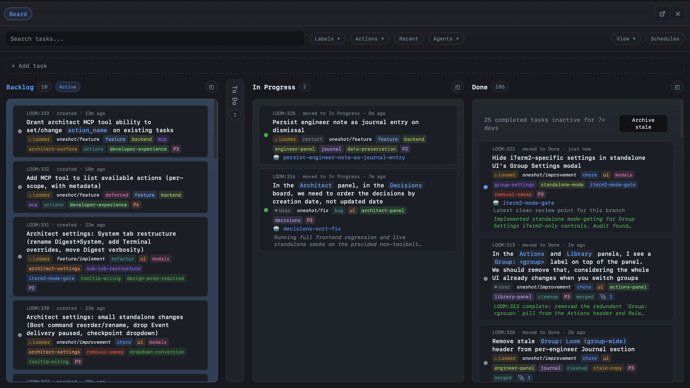

# The task board

The board is where work lives. Every meaningful piece of work in Torque exists as a card on the board; the lifecycle of that work is the card's movement through lanes and the thread of derived cards under it.



This page covers the operational mechanics: lanes, task fields, dispatch, dependencies, scheduled work, inline creation, filtering. For the thread/derivation model that gives the board its shape, read [Tasks and threads](threads.md). For the pipelines that define legal task transitions, read [Pipelines](pipelines.md).

## Lanes

Lanes are columns. Tasks move between them as their state changes.

| Lane | Purpose |
|---|---|
| **Backlog** | Default landing zone for new tasks. Anything that isn't actively in motion. |
| **To Do** | Planned and ready-to-dispatch. |
| **In Progress** | Actively assigned to an agent. Tasks move here on dispatch. |
| **Done** | Completed. |
| **Archived** | System-managed, used by archive/restore flows. |

The five lanes above are **reserved** — they cannot be renamed or deleted. You can add custom lanes through Group Settings. Custom lanes can hold tasks like any reserved lane; they just don't get the special semantics around dispatch (`In Progress`) or completion (`Done`).

```bash
torque board lanes                              # list lanes with task counts
torque board add "Deploy to staging" -l "To Do" # add task to a specific lane
torque board move fix-login -l Done             # move task between lanes
```

## Task fields

| Field | Description |
|---|---|
| **Task** | The description — what needs to be done. |
| **Group** | Which group the task belongs to. |
| **Lane** | Current board lane. |
| **Action** | The action used to render the dispatch prompt. → [Actions](actions.md) |
| **Variables** | Values for the action's template variables. |
| **Assignee** | Free-text assignee name. |
| **Labels** | Tags for filtering and categorization. |
| **Agent** | The concrete agent working on this task (set on dispatch). |
| **Attachments** | Legacy image attachments included in prompts as paths. |
| **Artifacts** | Structured artifact metadata — logs, diffs, reports, snippets, generated docs, file refs. |
| **Dependencies** | Other tasks that must reach Done before this one can be dispatched. |
| **Scheduled time** | Optional future time when Torque should auto-dispatch. |

Derived tasks also carry `parent_task_id`, `pipeline_depth`, and `pipeline_root_id`. → [Tasks and threads](threads.md)

## Creating tasks

**From the board UI**: click **+ Add task** at the top of any lane. An auto-growing textarea appears.

- Press ++enter++ to create.
- Press ++shift+enter++ for a newline.
- Press ++escape++ to cancel — draft text is preserved if you blur and click **+ Add task** again.

Inline creation is optimized for quick plain tasks. For richer tasks (with an action, variables, or dependencies), open the full task modal — it has an action picker, dynamic variable fields, and an attachment uploader.

**From the CLI**:

```bash
# Plain task
torque task create "Fix the login redirect bug" -g backend

# With an action
torque task create "Add input validation" -t feature/implement -g backend

# With action variables
torque task create "Fix auth tests" -t oneshot/fix \
  -v MODULE=auth -v TEST_CMD=pytest -g backend
```

## Editing tasks

Right-click a card → **Edit**, or double-click. From the CLI:

```bash
# Inline updates
torque task edit add-validation -t "Add input validation to all API endpoints"
torque task edit add-validation --action feature/implement
torque task edit add-validation -l feature,priority

# Open the task as YAML in $EDITOR
torque task edit add-validation
```

## Moving tasks

Drag cards between lanes in the UI, or:

```bash
torque task move add-validation -l "In Progress"
torque task move add-validation -l Done
```

## Dispatching

Dispatch is what connects a task to an agent. Torque creates (or reuses) an agent, links the task, moves it to the dispatch lane (default: In Progress), renders the prompt, and sends it.

**From the UI**: right-click a card → **Dispatch**. The dispatch dialog lets you pick an existing agent or spawn a fresh one.

**From the CLI**:

```bash
# Create and dispatch in one step
torque task dispatch "Add dark mode" -t feature/implement -g frontend

# Dispatch and wait for completion
torque task dispatch "Fix the bug" -t oneshot/fix -g backend -w
```

Internally, dispatch is a six-step pipeline:

1. **Agent creation** — fresh agent (or existing one if you picked one). Settings come from group defaults, the task's role reference, or the action's `agent` block.
2. **Worktree** — if the action or role wants one, an isolated worktree is created. → [Worktrees](worktrees.md)
3. **Task linking** — `agent_id` is set on the task, lane changes to the dispatch lane.
4. **Prompt rendering** — Jinja2 renders the action's `prompt:` field with `{{ TASK }}`, your custom variables, and the `torque` namespace. → [Templates](templates.md)
5. **Artifact shaping** — Torque appends type-aware artifact references after the prompt. Images render under `## Attached images`; structured artifacts render under `## Task artifacts`; derived tasks may also surface direct-parent handoffs under `## Upstream handoff artifacts`.
6. **Prompt delivery** — sent to the agent's terminal. New agents get a 2-second boot delay before the first send.

When dispatching to an existing agent, `torque.context.is_clean` is `False` in the template, so adaptive prompts can render the abbreviated branch. → [Templates](templates.md#torquecontext--dispatch-history)

## Dependencies

Dependencies model "not yet" without losing the task. A task with dependencies sits in Backlog or To Do, but Torque refuses to dispatch it until every dependency is Done.

```bash
torque task create "Deploy auth middleware" -g backend --depends-on review-auth
torque task edit deploy-auth-middleware --depends-on review-auth,run-auth-tests
```

Behavior:

- The card shows a lock badge when blocked.
- The right-click → Dispatch action is disabled until the chain clears.
- Moving a Done dependency back out of Done re-blocks anything that was depending on it.

Use this for "deploy after review", "QA after implementation", "migration after backup verified" patterns.

## Scheduled work

Two ways to defer work:

**Scheduled tasks** — a normal task with a future `scheduled_at` time. Torque dispatches that exact task when the time arrives.

```bash
torque task create "Kick off release checklist" -g ops --at "tomorrow 09:00"
```

**Schedules** — reusable triggers that create a fresh task each time they fire. One-shot with `--at` or recurring with `--cron`. → [Schedules](../operate/schedules.md)

```bash
torque schedule create weekly-deps \
  -g backend \
  --cron "0 9 * * 1" \
  --task "Weekly dependency update {date}" \
  -t maintenance/deps
```

Placeholders supported in `--task`: `{date}`, `{time}`, `{datetime}`.

## Reading derived tasks

Derived tasks render as smaller, indented cards nested under their parent on the board. Each shows a `↳ depth N · from: parent-slug` indicator. The parent's status badge shows where the work currently lives ("On Review", "Implementing fix", etc.).

Right-click any task → **View pipeline** opens the thread overlay — a full graphical view of the chain with click-to-focus. → [Tasks and threads](threads.md)

## Status badges

When a parent task has active children, a status badge appears on the parent card showing the current pipeline stage. The badge text is configurable via the `status:` field on the action's transition. Common values: "On Review", "Implementing fix", "Awaiting Input", "Verifying".

The badge is purely informational — the parent task stays in In Progress regardless. → [Pipelines](pipelines.md#declaring-transitions)

## Filtering and viewing

```bash
torque task list                       # all tasks grouped by lane
torque task list -l "In Progress"      # filter by lane
torque task list -g backend            # filter by group
torque task list --label review        # filter by label
torque task list --action feature/implement  # filter by action
```

The board's filter bar mirrors these options visually. The **Schedules** tab in the board UI lists active schedules with **Run now** triggers and enable/disable toggles.

## Archive and stale tasks

Done tasks older than a configurable threshold (7 days by default) collapse into an **Archive stale** banner at the top of the Done lane. Click it to bulk-archive everything older than the threshold.

Archived tasks move to the **Archived** lane and disappear from filters that don't explicitly include them. They're still queryable, still part of any thread they belonged to, just visually quiet.

## Where to next

- [Tasks and threads](threads.md) — the derivation model that produces multi-card threads on the board.
- [Actions](actions.md) — the prompt templates dispatch uses.
- [Pipelines](pipelines.md) — the transitions between actions that produce the thread shape.
- [Worktrees](worktrees.md) — branch isolation per dispatched task.
- [CLI reference](../reference/cli.md) — every `torque task` subcommand.
