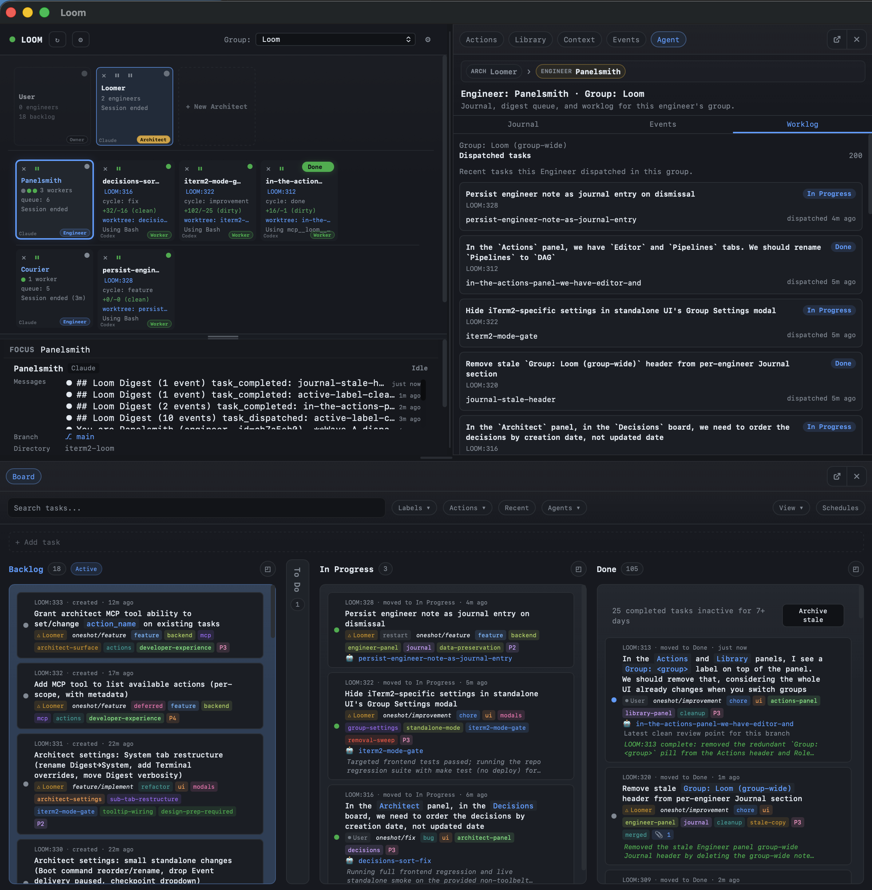

# Task lifecycle

Tasks in Torque move forward. Backlog → In Progress → Done. They don't bounce backward. The combination of that forward-only rule and the [thread](threads.md) model is what makes the board readable: every state change is either lane-forward (visible in the lane move) or thread-deeper (visible in the derivation), never invisible.

This page explains the actual lifecycle: what each transition means, what's allowed, what isn't, and how cascade completion closes thread roots.

## The forward-only principle

When a task moves backward — say, from In Progress back to To Do — anyone looking at the board has to ask *why*. The answer lives in chat history they don't have. The board stops being a snapshot and becomes a puzzle.

Torque avoids this by treating every task as a **discrete unit of work**. If an implementation fails review, the review agent does not reopen the original task. It **derives** a new task ("Fix the issues found") that's its own unit of work with its own lifecycle. The chain of tasks tells the full story:

```text
LOOM:290        Implement auth middleware       Done
LOOM:290:1      Review auth implementation      Done
LOOM:290:2      Fix the issues found            Done
LOOM:290:3      Re-review auth implementation   Done
```

You read the board left-to-right within each row, and top-to-bottom within each thread. The lane never lies.

## Lane semantics

The reserved lanes have specific meanings:

| Lane | What it means |
|---|---|
| **Backlog** | Anything not actively in motion. New tasks land here. `torque_ask(...)` puts derived tasks here for human review. |
| **To Do** | Planned and ready-to-dispatch. The Engineer's "next wave candidates" usually live here. |
| **In Progress** | Actively assigned to an agent. Tasks move here on dispatch and stay here until their entire thread closes. |
| **Done** | Complete. Reached via `torque_done`, `torque_ready`, or cascade completion. |

A task in In Progress means **work is happening on it** — either directly (an agent is in its terminal working on it right now), or indirectly (a derived child task is in flight, with the parent waiting for the chain to resolve).

The status badge fills in the detail. While a parent is in In Progress with its review child also in In Progress, the parent's badge reads "On Review" so you know which level the work is currently happening at.

## Status badges within a lane

Lane = where the task is. Status = what's happening within the lane.

Badges are set by the `status:` field on the transition the parent followed:

```yaml
# In feature/implement.yaml
transitions:
  - action: feature/review
    when: "Implementation complete and ready for review"
    status: "On Review"
```

When the implementing Worker calls `torque_derive(action="feature/review")`, the parent stays in In Progress and its badge becomes **"On Review"**. If `status:` is omitted, the badge defaults to the target action's name (e.g., `feature/review`).

A few common badge patterns:

- `"On Review"` — child reviewer is reading the diff.
- `"Fixing review issues"` — child fixer is addressing review comments.
- `"Awaiting Input"` — `ask` transition fired, the human has to answer.
- `"Verifying"` — verification task is running tests / smoke checks.
- `"Implementing"` — explicit override for the implement action's own state.

Custom lanes don't get pipeline status semantics. They're for manual organization (priority columns, team columns, etc.). The pipeline system uses badges within the reserved lanes; it doesn't move tasks into custom lanes.

## What a Done lane actually looks like



Two patterns visible there:

1. **Single-task closes.** A simple `torque_done` on a task with no derivations — work that fit in one shot.
2. **Thread closes.** A parent that closed via cascade completion when its last child closed. You can see the chain by expanding the card.

Both are equally valid endings. The Engineer or the action's `auto_close_on_done` flag decides whether the agents involved get cleaned up after.

## Cascade completion

Cascade completion is the rule for closing parent tasks:

> When a task is marked Done (via `torque_done` or `torque_ready`), Torque walks up the parent chain. For each ancestor, check: are all my children Done? If yes, mark me Done too and continue walking up. If no, stop.

In practice:

- A leaf task closing might or might not close its parent — only if it's the last child standing.
- A thread root only closes when the entire subtree is Done.
- The status badge on intermediate tasks tells you which level is currently active.

`torque_ready` is the variant that **also unlinks the calling agent** from the task, signaling that the agent is available for unrelated work. Use it when the agent is going to be repurposed; use `torque_done` when the agent might still receive a follow-up dispatch.

→ [Tasks and threads — Cascade completion](threads.md#cascade-completion-when-does-the-parent-close)

## Non-Done outcomes

Not every task ends in Done. The other outcomes:

| Outcome | How it gets there | What it means |
|---|---|---|
| **Blocked** | `torque_blocked(reason="...")` | Need user input to continue. Adds `blocked` label, flags the agent for attention. Task stays in In Progress. |
| **Error** | `torque_error(message="...")` | Unrecoverable error. Adds `error` label, agent flagged. Task stays in In Progress. |
| **Awaiting Input** | `torque_ask(question="...")` | Derived task in Backlog with `human` label; parent stays In Progress with badge "Awaiting Input". |
| **Depth limit** | Worker tried to derive past `max_pipeline_depth` | Task gets `depth-limit` label, agent flagged. The chain didn't run. |
| **Manual archive** | User moves the task to Archived | The work was abandoned or superseded. |

For Blocked and Error states, the task is "stuck" but not "failed" — you (or the Engineer) read the agent's last activity, decide what to do, and either dispatch a fix, edit the task, or archive it. The state is yours to act on.

## Auto-close behavior

Some actions set `auto_close_on_done: true`. When that flag is set on the action, Torque may close the agent automatically after `torque_done` — but only when:

1. The pipeline root task is itself Done (no other children waiting).
2. The agent has no queued or reply follow-up work.

This is mostly used for short-lived reviewer agents that should clean themselves up after a successful review. Implementation agents typically leave `auto_close_on_done` false because you might want to dispatch a follow-up task to the same agent.

## Verification gate

Some workflows include a verification step — checking that the merged change actually deployed, that smoke tests passed, that the manual restart didn't break anything. Workers report this through `torque_verify`:

```text
torque_verify(
  state="passed",
  tests_run="auth integration suite, smoke",
  test_outcome="full_suite_passed",
  notes="Restart clean, no errors in logs for 5min",
)
```

Use `full_suite_attempted=true`, `test_outcome="unrelated_flake_accepted"`, and `isolated_rerun_evidence="..."` when a broad suite hit an unrelated flake but focused/isolated reruns passed. Use `deploy_attempted=false` plus `live_smoke_pending=true` when a worker intentionally did not deploy/restart from inside the live daemon and operator smoke remains.

The CLI equivalents (`torque task verify ...`) and the Engineer tool (`engineer_task_verify(...)`) stamp the same audit fields. They emit a `task_verification_updated` event so failed/pending checkpoints stay visible at the orchestration layer rather than being buried in agent activity.

The verify metadata becomes part of the task's audit trail. It's especially useful for the Engineer's review pass before merging — `engineer_task_show` surfaces it on the task detail.

## Where to next

- [Tasks and threads](threads.md) — the derivation model that produces multi-card threads on the board.
- [The board](board.md) — operational reference for lane management, dispatching, dependencies.
- [Pipelines](pipelines.md) — how transitions and target routing govern thread shape.
- [Worktrees](worktrees.md) — branch isolation per task.
