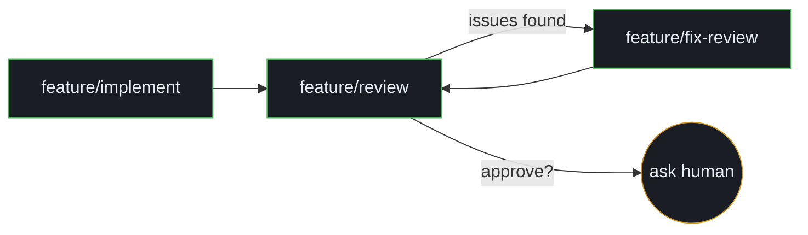

# Pipelines

Most workflow tools make you declare pipelines explicitly: a separate definition file, a DAG, a YAML state machine, a maintenance burden. Torque doesn't.

In Torque, **pipelines emerge from action transitions**. You write actions. Each action declares which actions it's allowed to hand off to. The set of all those declarations forms a graph. Connected components in that graph are pipelines. Torque discovers them; you never write a "pipeline" definition.

That has two consequences worth dwelling on:

1. **You can compose pipelines after the fact.** Add a `feature/security-review` action with a transition from `feature/review`, and a new pipeline shape exists. No code changes, no schema migration, no orchestration config.
2. **The board cards and the pipeline are the same thing.** A "task in `feature/review`" *is* a node in the pipeline. A derived task *is* an edge being followed. There's no separate state to keep in sync — the threads on the board are the live execution.

The mechanic is `task_derive`, the data is the `transitions:` field on each action, and everything else here is detail.

## A minimal pipeline

Three actions, eight lines of transitions, and you have the canonical implement-review-fix loop:

```yaml
# .torque/actions/feature/implement.yaml
name: feature/implement
transitions:
  - action: feature/review
    when: implementation is complete and ready for review
prompt: |
  Implement the feature.
  {{ TASK }}
```

```yaml
# .torque/actions/feature/review.yaml
name: feature/review
transitions:
  - action: feature/fix-review
    when: issues were found that need to be fixed
  - ask: true
    when: changes look correct but need human sign-off before merging
prompt: |
  Review the implementation.
  {{ TASK }}
```

```yaml
# .torque/actions/feature/fix-review.yaml
name: feature/fix-review
transitions:
  - action: feature/review
    when: all review issues have been addressed
prompt: |
  Fix the issues found during review.
  {{ TASK }}
```

The pipeline that emerges:



There's no pipeline file. The discovery is `torque pipeline list`. The view is the same in the Actions panel under the **Pipelines** view (a pannable, zoomable canvas with bezier edges).

## Declaring transitions

Each transition has up to four fields:

| Field | Type | Required | What it does |
|---|---|---|---|
| `action` | string | unless `ask: true` | The next action's name. |
| `when` | string | yes | Plain-English description of when to take this transition. Shown to the agent. |
| `status` | string | no | The parent task's status badge while this transition is active. Defaults to the target action name. |
| `target` | string | no | Where the derived task goes: `parent`, `root`, `self`, or omitted (= new agent). |

The `ask` transition replaces `action:` with `ask: true`:

```yaml
transitions:
  - ask: true
    when: changes look correct but need decision-owner approval before merging
```

The `when` field is documentation that the agent reads. It's included in the dispatch postscript so the Worker knows when each transition is appropriate. Be specific. "When ready" is useless; "implementation is complete and tests pass" is actionable.

The `status` field is what the parent's badge shows on the board while a child task is active. Without it the badge defaults to the action name; setting `status: "On Review"` reads better than `status: feature/review`.

## How an agent uses transitions

When Torque dispatches a task, it appends a postscript to the prompt telling the Worker which `mcp__torque__*` tools are available and what the legal next steps are:

```text
Report your progress with these Torque MCP tools:
- task_complete(message="brief summary") — task complete, no follow-up needed
- task_derive(action="feature/review") — implementation is complete and ready for review
- task_blocked(reason="reason") — need user input to continue
- task_error(message="message") — unrecoverable error
```

The Worker reads it and calls the appropriate tool. The server validates the transition before dispatching:

- If the agent calls `task_derive` with an action **not** listed in the current action's transitions, the call rejects with `transition_not_allowed`.
- If the call is legal, the new task is created and dispatched per the transition's `target`.

That validation is server-side. A Worker can't bypass the transition graph by inventing an action name. → [MCP scoping](../team/mcp-scoping.md)

## Transition-targeted routing

The `target` field on a transition decides **where** the derived task goes. Three options plus the default:

### default — new agent

If the transition omits `target`, Torque creates a fresh agent for the derived task. The new agent inherits the calling agent's worktree (so it sees the same code), but starts with a clean conversation.

This is what you want for `implement → review`: the reviewer should be a fresh head reading the diff, not the implementer marking its own homework.

### `target: self` — continue in the same agent

The follow-up task arrives in the **same terminal session** after a short delay. The agent keeps its full conversation context.

```yaml
transitions:
  - action: research
    when: more sub-questions to investigate
    target: self
```

Useful for multi-phase actions where one head should handle sequential steps without a context handoff. The agent's `torque.context.is_clean` will be `False` on the second dispatch, so adaptive templates will render the short follow-up branch automatically.

### `target: parent` — back to the originating agent

The derived task routes to the **calling agent's parent agent**. This is how `feature/review` sends fix work back to the original implementer:

```yaml
# In feature/review.yaml
transitions:
  - action: feature/fix-review
    when: issues were found
    target: parent
```

When the reviewer derives `feature/fix-review`, the fix task lands in the implementer's terminal, on the implementer's worktree, with the implementer's full context. The reviewer is gone; the implementer now has work again.

This produces a thread shape where two agents bounce work back and forth — implementer → reviewer → implementer → reviewer → done — without losing context on either side.

### `target: root` — back to the root agent

Same idea as `parent`, but routes to the agent that handled the **root task** of the thread, regardless of how deep the chain has gotten. Useful for actions that always want to come home to the originator.

## Worktree inheritance

When a task is derived, the worktree comes from one of two places:

- **`target: parent` / `target: root` / `target: self`** → worktree comes from the **target** agent. The new task runs on the target's branch.
- **No target (new agent)** → worktree comes from the **calling** agent. The new agent sees the same code as the one that derived the task.

Either way, the worktree is **inherited**, not recreated. A pipeline of `implement → review → fix → review → merge` runs entirely on the implementer's worktree branch. That's by design — every reviewer and fixer in the chain is reading and writing the same set of files.

There's one exception worth knowing: a review-cycle fix that derives `feature/fix-review` from `feature/review` re-parents the task to the review's *parent task*, so the worktree lookup walks past the reviewer to the implementer. That keeps the fix on the implementer's branch even when the reviewer was a fresh agent on the same worktree. → [Tasks and threads](threads.md#threads-and-worktrees)

## The `ask` transition

`ask: true` is the decision owner-in-the-loop gate. It's a transition that, when taken, **does not auto-dispatch**.

```yaml
transitions:
  - ask: true
    when: changes look correct but need decision-owner approval before merging
```

When an agent calls `raise(question="...")`, Torque resolves the immediate decision owner (Worker → owning Engineer; hired Engineer → hiring Architect; Architect or orphan → user).

1. A derived task is created in the **Backlog** lane with a `human` label.
2. The task body contains the question.
3. Nothing is dispatched. The board pauses on this task.
4. You read the question, write the answer (by editing the task or replying through the panel), then dispatch.

This is the right transition for "looks good but I want approval", "this is reversible vs not", "ship now or after the related fix lands". It's not the right transition for ambiguous instructions to the agent — those go through `task_blocked`.

In the pipeline graph view, `ask` transitions render as small pill nodes snug to their source action, distinguishing them from regular action transitions.

## Depth limits

Pipelines have a depth limit (default 10, configurable in global settings as `max_pipeline_depth`) to prevent runaway chains:

```yaml
max_depth: 5    # action-level override
```

When a Worker tries to derive past the limit:

- The `task_derive` call rejects with `depth_limit_exceeded`.
- The agent is flagged for attention.
- The task gets a `depth-limit` label.

If you legitimately need a deeper chain — e.g. a research pipeline that recursively investigates sub-questions — set `max_depth` higher on the relevant action.

## LOC review gates

A transition to `feature/review` can carry a `loc_gate` block to tune the automatic non-test LOC review gate for that specific action:

```yaml
transitions:
  - action: feature/review
    when: implementation is complete or LOC gate requires review
    loc_gate:
      ship_direct_max: 50
      review_default_above: 150
      self_review_bypass_allowed: false
```

| Field | Type | Description |
|---|---|---|
| `ship_direct_max` | int | Non-test LOC at or below which direct completion may ship without review. |
| `review_default_above` | int | Non-test LOC above which Torque auto-derives `feature/review`. |
| `self_review_bypass_allowed` | bool | Whether an explicit self-review bypass request may skip this gate. |

The effective threshold is `max(ship_direct_max, review_default_above)`: diffs at or below that count may close directly; diffs above trigger `feature/review`.

The resolution order for review policy:

1. `loc_gate` on the action's `feature/review` transition.
2. The action-level `review_required_above_loc` threshold.
3. The Architect's `architect_review_gate_thresholds` setting.

For implementation actions (`implementation_depth: true`), the default review threshold kicks in at 150 non-test LOC if nothing else is set.

## Discovering pipelines

```bash
# List all pipelines discovered from action transitions
torque pipeline list

# Show one pipeline's structure with transition descriptions
torque pipeline show feature/implement

# Show the full task chain (thread) for a specific task
torque task chain LOOM:290
```

In the Actions panel UI, the **Pipelines** view renders the action graph as a pannable canvas with SVG bezier edges. BFS layout puts entry nodes at the top, terminals at the bottom. Back-edges (e.g. `fix-review → review`) route via left or right side using quadratic S-curves so they don't overlap forward edges.

## Patterns worth knowing

A handful of patterns recur often enough to be worth naming.

### The implement-review-fix loop

The canonical pipeline: `implement → review → (fix → review →)* done`. Three actions, two transitions, one human-approval gate. Most product work fits this shape.

### The research-into-implementation handoff

`research → propose → implement → review → done`. The research action ends with a `propose` transition that produces a structured proposal task; you read the proposal and dispatch from there.

### The verification gate

`implement → review → verify → done`. The `verify` action runs deploy/restart/smoke tests and reports through `task_verify`. The Engineer can read the verification result and decide whether to merge.

### The research recursion

`research` with `target: self` and a transition to itself when sub-questions emerge. The single agent walks down the question tree, recording findings as it goes, deriving deeper questions for itself rather than spinning up new agents.

### The escalation chain

`implement → review`, where `review` has both `feature/fix-review` (mechanical fix) and `ask: true` (escalate to human). The reviewer gets to decide whether the issue is something a fix-worker can handle or something that needs you.

## Where to next

- [Tasks and threads](threads.md) — how pipeline transitions become visible thread structure.
- [Templates](templates.md) — the Jinja2 layer underneath each action's prompt.
- [Actions](actions.md) — the action YAML format around transitions.
- [MCP scoping](../team/mcp-scoping.md) — server-side enforcement of the transition graph.
