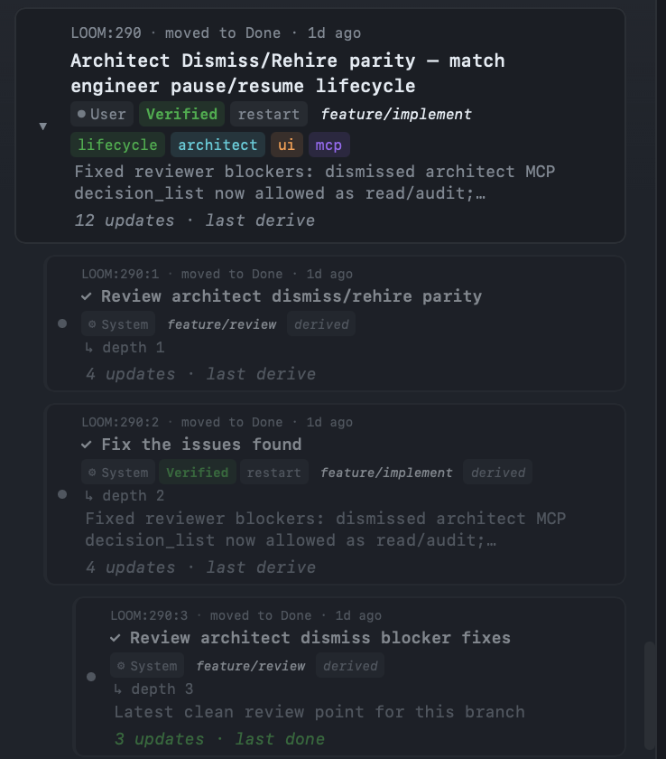
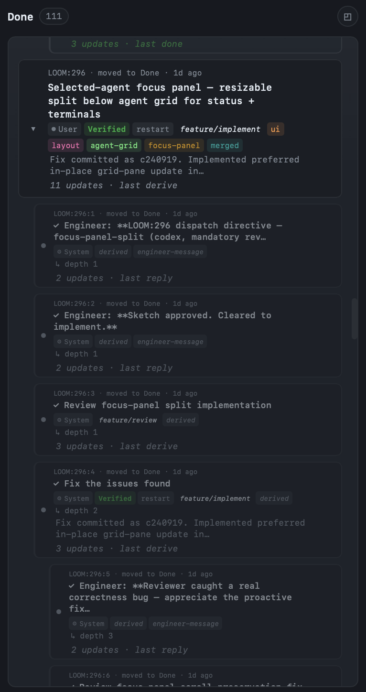

# Tasks and threads

Most task systems treat a task as a thing that has a status. Backlog, In Progress, Done. The status changes over time and you watch the field flip.

Torque doesn't work like that. A task in Torque is the *root* of a thread. As work progresses, the agent doing it **derives** new tasks for follow-up steps — review the implementation, fix the review issues, re-review, validate, ship. Each derived task is parented to the one before it, gets its own depth-incremented ID, and renders on the board as a subordinate card under its parent.

By the time the work is done, you don't have one task with a status of "Done". You have a tree. The tree is the historical record. It's how Torque shows progress instead of just announcing it.

## What a thread looks like

This is a real thread on a real board:



Read it from the top:

- **`LOOM:290`** is the root task: "Architect Dismiss/Rehire parity — match engineer pause/resume lifecycle." It started in Backlog, was dispatched with the `feature/implement` action, and the implementing Worker eventually called `task_complete`.
- **`LOOM:290:1`** is the first derivation: a review task. The implementing Worker called `task_derive(action="feature/review")` when it finished, which created this task and dispatched a Reviewer Worker on the same worktree.
- **`LOOM:290:2`** is the second: a fix task. The Reviewer found issues, called `task_derive(action="feature/fix-review")`, and the Implementer (or a fresh fix-worker, depending on transition routing) addressed them.
- **`LOOM:290:3`** is the third: a re-review. The fix-worker called `task_derive(action="feature/review")` again. The reviewer marked it the latest clean review point.

Every step is its own task with its own agent, its own context, its own audit trail. The whole tree took the work from "Implement this" to "Reviewed, fixed, re-reviewed, ready to merge" in five steps that you can scroll back through any time.

## Why threads, not status fields

The thread shape exists because **shipping software is rarely linear**. The status field hides the loop:

- "In review" is misleading. There might be three review iterations behind that label.
- "Done" doesn't tell you whether someone reviewed it or just declared victory.
- "Blocked" tells you nothing about who's working on the unblock.

Threads make those loops visible. A task that went `implement → review → fix → review → done` shows you all four steps. A task that went `implement → review → done` shows you it shipped without a fix cycle. That's information you'd otherwise have to dig out of git log.

It also means **the board is the audit log**. You don't need separate status reports. You don't need standups. You scroll back through the threads and the threads tell you what happened.

## Derivation in action

The mechanic is one MCP call. When a Worker is finishing a task and the next step is a different task, it calls:

```text
task_derive(
  description="Review the implementation",
  action="feature/review",
)
```

Torque does six things:

1. Validates that `feature/review` is a legal next action — it must be listed in the current action's `transitions`. If not, the call rejects with `transition_not_allowed`. → [Pipelines](pipelines.md)
2. Creates a new task with depth = parent depth + 1 and ID `<root_id>:<n>`.
3. Stamps `parent_task_id`, `pipeline_root_id`, and a `derived` label on the new task.
4. Inherits the worktree according to the transition's routing (`target: parent`, `target: self`, default = new agent on calling agent's worktree). → [Pipelines](pipelines.md#transition-targeted-routing)
5. Dispatches the new task — either to a fresh agent or to the existing target agent.
6. Updates the parent task's status badge to whatever the transition declared (e.g. "On Review").

The parent task stays in In Progress with a status badge until its whole tree resolves. When the deepest descendant is marked Done, **cascade completion** walks back up the chain — if all of an ancestor's children are Done, that ancestor moves to Done too.

That's why a thread "completing" looks like a domino: the leaf flips, then its parent, then its parent, all the way up to the root.

## Reading depth

Task IDs encode the thread structure:

| ID format | Meaning |
|---|---|
| `LOOM:290` | Root task in group `LOOM`, sequence number 290. Depth 0. |
| `LOOM:290:1` | First child of `LOOM:290`. Depth 1. |
| `LOOM:290:1:1` | First grandchild — first child of `LOOM:290:1`. Depth 2. |
| `LOOM:290:2` | Second child of `LOOM:290`. Depth 1. (Independent of `:1`.) |

In the UI, derived cards appear visually nested under their parent with a `↳ depth N` indicator. A right-click → **View pipeline** opens a thread overlay showing the whole tree with click-to-focus.

The depth limit (default 10, configurable in global settings as `max_pipeline_depth`) prevents runaway chains. When a Worker tries to derive past the limit, the call rejects, the task gets a `depth-limit` label, and the agent is flagged for attention.

## Threads as histories

A longer-running thread looks like this:



The Done lane on a busy day is a column of these. Each is its own complete story: what got built, what got reviewed, what got fixed, what got merged. You can hand someone the URL of a single thread and they have the full provenance of one piece of work.

This is also where the audit value of threads compounds. Three months from now, when you're trying to remember why you implemented retry handling the way you did, you can:

1. Find the merge commit.
2. Find the task that produced it (Torque records the linkage).
3. Walk up to the thread's root.
4. Read the review comments, the fix-review derivation rationale, the original implementation prompt.

That history isn't somewhere you have to remember to look. It's exactly where you'd already look.

## Cascade completion: when does the parent close?

The cascade rule is simple but worth being explicit about:

> When a task is marked Done (via `task_complete` or `agent_ready`), Torque walks up the parent chain. For each ancestor, it checks: are **all** my children Done? If yes, mark me Done too and continue walking up. If no, stop.

This means:

- A leaf task closing doesn't necessarily close its parent — only if it's the last child.
- A parent task can have one Done child and one In-Progress child; it stays In Progress.
- The root task closes only when the entire subtree is Done.

The status badge on intermediate tasks shows where the work currently lives. If `LOOM:290` shows "On Review" while `LOOM:290:1` is in In Progress, that's the system telling you the action is happening one level deeper.

There's an escape hatch: `agent_ready` is the Worker's way of saying "I'm done and you can also stop tracking my involvement on this thread." It does the cascade *and* unlinks the calling agent from the task. Useful when the agent is going to be repurposed for unrelated work.

## Threads and worktrees

By default, derivation **inherits the worktree from the calling agent**. This is what makes `implement → review → fix-review → review` work cleanly — every step in the thread sees the same branch.

When a transition declares an explicit `target` (`self`, `parent`, `root`), the worktree is inherited from the **target** agent instead. A `target: parent` derivation routing the task back to the original implementer continues on the implementer's worktree, which is what you want for fix-review cycles. → [Pipelines](pipelines.md#worktree-inheritance)

A consequence worth knowing: if you derive into a fresh-worker dispatch (no target), the new Worker sees the calling Worker's branch. Your reviewer sees the implementer's worktree. That's intentional — it's how the reviewer can read the diff.

## Threads and the decision owner

Sometimes a Worker hits a question that needs its immediate decision owner. The pattern is
`raise`:

```text
raise(question="Should we ship this behind a feature flag?")
```

This creates a derived task — same thread, just one extra depth — that lands in **Backlog** with a `human` label, **not dispatched**. The board pauses. The decision owner reads the question and writes the answer (by editing the task body and dispatching it, or by replying through the panel), and the thread continues.

The `ask` derivation is special in two ways: it doesn't auto-dispatch, and it appears as a small pill node in the pipeline graph rather than a regular action node. → [Pipelines](pipelines.md#the-ask-transition)

## Threads spanning multiple agents

A thread can pass through multiple agents. The simplest case:

```text
Implementer Worker (LOOM:290)
  └→ Reviewer Worker (LOOM:290:1)        ← new agent on same worktree
       └→ Implementer Worker (LOOM:290:2) ← back to original via target: parent
            └→ Reviewer Worker (LOOM:290:3) ← reviewer reused via target: parent
```

In this thread, two agents handle four tasks. The Implementer keeps its full conversation context across `:290` and `:290:2`. The Reviewer keeps its conversation context across `:290:1` and `:290:3`. Neither has to be reminded what the work is — they were there.

This is one reason the dispatch postscript is dynamic: a fresh agent gets the full reference; an agent already in conversation gets a shorter reminder. → [Workers](../team/workers.md#what-a-worker-actually-receives-at-boot)

## CLI for inspecting threads

```bash
# Walk the full chain for one task
torque task chain LOOM:290

# Pipeline view of all threads currently in flight
torque pipeline list

# A specific pipeline shape
torque pipeline show feature/implement
```

In the UI, right-click any task and select **View pipeline** to open the thread overlay.

## Where to next

- [Pipelines](pipelines.md) — how transitions and `target` routing govern thread shape.
- [Actions](actions.md) — the prompt-template layer threads run inside.
- [Worktrees](worktrees.md) — branch isolation per thread.
- [Task board](board.md) — the lane structure threads move through.
