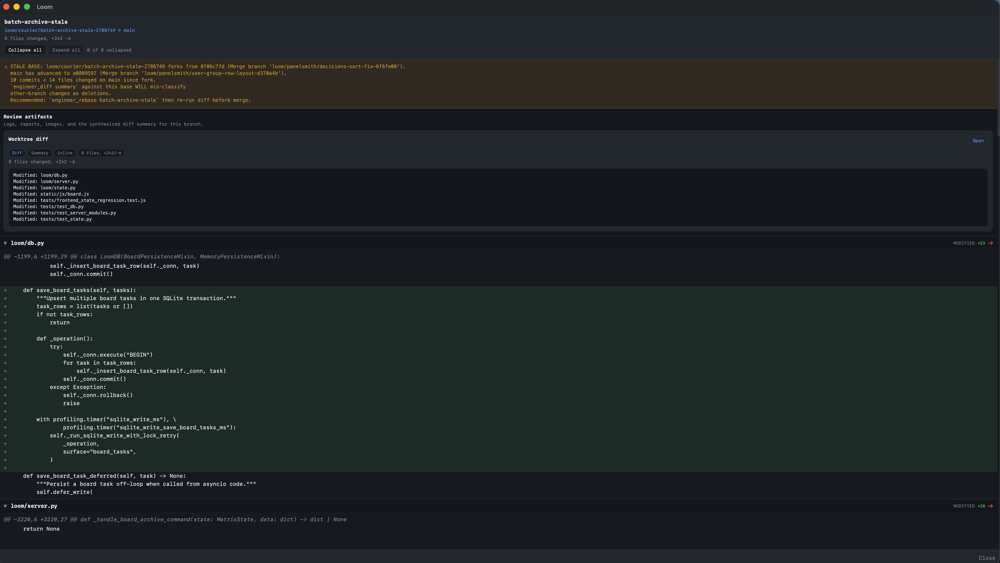
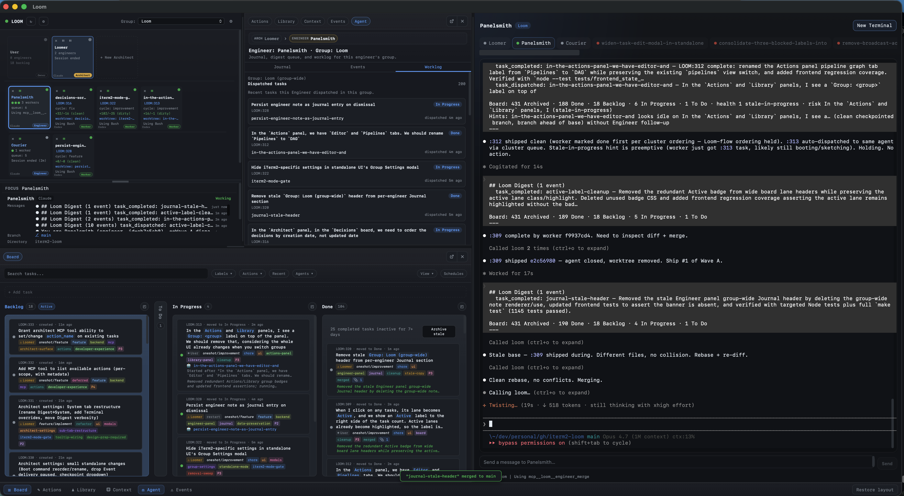

# Worktrees

Git worktrees are how Torque keeps parallel Workers from trampling each other. Each Worker gets its own working copy of the repo on its own branch. Two implementers can both be writing code right now and neither one knows or cares.

This page covers what worktrees are, how Torque manages their lifecycle (creation, checkpointing, merging, cleanup), and what you should know to operate them confidently.

## Why worktrees

Without worktrees, two agents working in the same repo would conflict — one's uncommitted changes would land on the other's index, and you'd spend more time untangling state than reviewing code.

Worktrees give each agent its own working copy on a separate branch. The use cases:

- **Parallel features** — multiple Workers implement different features at the same time.
- **Review pipelines** — a reviewer Worker and a fix Worker work on the same branch in sequence without stepping on each other.
- **Safe experimentation** — a Worker can refactor freely without touching `main`.

When pipelines hand off across agents, the worktree is **inherited** — the reviewer sees the implementer's changes because it's on the same branch. → [Tasks and threads — Threads and worktrees](threads.md#threads-and-worktrees)

## Enabling worktrees

Worktrees are enabled per group in [Group settings](../operate/group-settings.md):

1. Open Group Settings (gear icon on the group header).
2. Go to **Workers → Worktree**.
3. Set **Workspace mode** to **Isolated worktree**.

Once enabled, every new worker created in that group gets its own worktree, and the worker's working directory is set to the worktree path.

```bash
torque group settings backend -s git_worktree=true
torque group settings backend -s worktree_base_branch=main
torque group settings backend -s worktree_auto_checkpoint=true
torque group settings backend -s 'worktree_symlinks=["etl/**/node_modules",".venv"]'
torque group settings backend -s worktree_symlink_gitignored_paths=true
```

### Settings reference

| Setting | What it does |
|---|---|
| **Workspace mode** | Choose a shared group checkout or an isolated worktree for each Worker. |
| **Base directory** | Where worktrees live, relative to repo root. Default `.torque/worktrees`. |
| **Base branch** | Branch to fork from. Default current HEAD. |
| **Automatic checkpoints** | Choose manual only, stop-only, progress-only, or progress-plus-stop checkpointing. Progress checkpoints cover `task_progress`, `task_complete`, and `agent_ready` and are throttled. |
| **Merge mode** | Require pull requests, require direct local merges, or use pull requests by default while allowing an explicit direct fallback. |
| **Direct-merge history** | Preserve Worker commits or use `git merge --squash` when a direct local merge occurs. Pull-request merges always request GitHub squash. |
| **Default post-merge cleanup** | Default cleanup behavior after the branch is actually merged when no explicit choice is given. Defaults to keeping the worker/worktree warm; opt in to auto-sweep to close the worker and delete the merged worktree/branch. |
| **Preserve merge diff** | Save the full pre-merge patch as a diff artifact on the latest open boundary task. |
| **Explicit symlinks** | Repo-relative paths or globs to mirror into each worktree as symlinks (e.g. `etl/**/node_modules`). Useful for shared caches. |
| **Symlink all gitignored paths** | Ask Git for ignored files/directories and symlink them into new worktrees. This may expose secrets and shared mutable files. Torque skips `.torque/` runtime state and never replaces paths that already exist in the worktree. |

## How a worktree is created

When a Worker is dispatched into a group with worktrees enabled:

1. Torque creates a branch named `torque/<engineer-slug>/<worker-slug>-<shortid>` (or `torque/user/<worker-slug>-<shortid>` for User-spawned workers; engineer/architect worktrees stay flat as `torque/<slug>-<shortid>`).
2. A worktree is checked out at `<repo-root>/.torque/worktrees/<agent-id>/`.
3. The agent's working directory is set to the worktree path.
4. The agent's terminal opens in the worktree.
5. Torque installs adapter files (hooks, MCP config, persistent prompt files) into that worktree.

`.torque/worktrees/` is auto-added to `.gitignore` so worktree directories don't pollute your main checkout. Torque also adds its injected runtime files to the repo's git exclude list so worktree-backed sessions don't make `git status` noisy:

- `.mcp.json`
- `.claude/settings.local.json`
- `.claude/instructions.md`
- `.claude/skills/torque-*/`
- `.codex/config.toml`
- `.codex/hooks.json`

For Engineer and Worker worktrees, Torque writes `.claude/settings.local.json` with `autoMemoryEnabled: false` so one agent's auto-memory index can't bleed into another agent's identity context.

!!! note "Repo requirement"
    The group's working directory must be inside a git repository for worktrees to function. If it's not, the setting is silently ignored.

## Worktree status in the UI

The agent cell shows a live worktree summary:

- **Branch badge** — the worktree branch name.
- **Diff stats** — files changed, insertions, deletions relative to the base branch.
- **Dirty indicator** — whether there are uncommitted changes.

These update periodically (every 60 seconds) and after any checkpoint.



## Checkpoints

Checkpoints are snapshot commits on the worktree branch. They let you save progress and roll back if needed.

### Manual checkpoints

**UI**: right-click an agent → **Checkpoint Worktree**.

**CLI**:

```bash
torque worktree checkpoint impl-add-auth
```

Stages all changes (`git add -A`) and commits with the message `torque: checkpoint N — agent-name`.

### Auto-checkpoints

When **Auto-checkpoint on stop** is enabled, Torque commits whatever's in the working tree when an agent's session ends. This catches in-progress work if the agent crashes or is stopped unexpectedly.

When **Checkpoint on progress / done** is enabled, Torque also creates checkpoints when the agent reports `task_progress`, `task_complete`, or `agent_ready`. These are throttled so progress spam doesn't create a commit every few seconds.

### Task boundary checkpoints

When the same agent runs sequential tasks on a shared worktree, Torque records a **task-scoped boundary** when each worktree-backed task reaches `done` or `ready`:

- If the worktree is dirty at completion, Torque creates a dedicated boundary commit.
- If clean, Torque records a marker against the current `HEAD`.
- Queued same-agent follow-up tasks point back via `resume_after_boundary_task_id`.

This lets Torque identify the **latest clean mergeable task boundary** on a shared branch instead of treating the whole branch history as one undifferentiated unit. The Engineer's `agent_get` surfaces these boundaries so it can decide whether to merge now or wait for queued work to finish.

### Viewing checkpoints

```bash
torque worktree history impl-add-auth
```

Shows all commits on the branch since fork, with SHA, timestamp, message, and diff stats.

### Rolling back

```bash
torque worktree history impl-add-auth          # find the SHA
torque worktree rollback impl-add-auth abc1234 # hard reset to that commit
```

This is a hard reset — changes after that checkpoint are discarded.

## Merging

When a Worker's branch is ready to ship, Torque's default path is PR-based:
it pushes the worktree branch, creates or reuses a GitHub pull request, and
requests a squash merge into the base branch. Torque then verifies the merged
base commit locally before it runs cleanup.

If the branch carries a real configured nested submodule delta (the production
case is `ee/` / `torque-ee`), Torque now ships that nested change through its own
PR **before** the parent PR: it pushes the nested branch, opens/reuses the nested
PR, requests a **merge-commit** merge there, syncs nested `main`, and commits a
mechanical parent gitlink bump to the merged nested-main SHA. Parent Torque PRs
still squash-merge. Branches with zero nested gitlink delta do not push a nested
branch and do not create a nested PR.

**UI**: right-click the agent → **Merge Worktree**.

**Engineer / CLI**: `worktree_merge(...)` (or `torque worktree merge ...`).

Torque still has an explicit direct-local fallback for repositories or moments
where the GitHub PR flow is not appropriate. Pass `force_direct=true` to
`worktree_merge` to bypass PR creation and run the legacy local merge path. That
fallback still honors the normal clean-worktree, task-boundary, conflict,
sibling-divergence, and stale-base safety gates unless you also pass the
separate force flags. For real `ee/` deltas, `force_direct=true` does **not**
direct-push `torque-ee` main; Torque still runs the nested PR-first sequence and
fails closed if that path is unavailable.

Torque tracks the merge result and verifies it landed:

- **Regular merge** — detected via `git merge-base --is-ancestor`.
- **Squash merge** — default for PR merges; direct-local squash fallback is detected by simulating with `git merge-tree --write-tree`, falling back to "did the base branch advance and pick up these file changes."

If the group is configured with the GitHub board-sync provider, PR merges can
close linked GitHub issues automatically. With **Close linked issues via PR
body** enabled, Torque appends missing `Closes #123` /
`Closes owner/repo#123` references to the created or reused PR body. This only
applies to the PR path (`engineer_merge_mode=pr`, or `engineer-choice` without
`force_direct=true`); direct-local merges do not have a PR body to carry closing
refs. → [Board sync](../operate/board-sync.md#pr-closing-references)



### Merge boundaries on shared sequential branches

On shared same-agent branches (`target: self` chains, queue-of-tasks workflows), Torque merges only the **latest clean task boundary**:

- Review and merge views show which completed task currently defines the merge boundary.
- If a queued follow-up has already started, Torque blocks merge and reports that the older boundary is no longer cleanly mergeable.
- Re-dispatching or adopting the implementation root while its own review boundary is open does not count as starting a follow-up. It also clears successor metadata written by older Torque versions, so retrying the supported dispatch/adoption flow repairs that false block without moving the task between lanes.
- If queued follow-up tasks still remain after a successful merge, Torque keeps the agent and worktree alive, resets the branch to the updated base branch, and leaves the queued tasks attached for the next wave.

For a driverless merge, pass the public `task` argument when Torque requests
explicit implementation attribution. Torque forwards it as the internal merge
task identity; callers do not need a separate `merge_task_id` parameter.

Boundary commit fields intentionally distinguish the reviewed branch commit
from the final base commit. `latest_reviewed_commit_sha` (and the boundary
`commit_sha`) points at the pre-squash branch commit that passed review. After
the PR is actually merged, `merge_commit_sha` / `latest_merged_commit_sha`
points at GitHub's final squash commit on the base branch, so it will usually
be a different SHA.

### Settings the merge respects

- **Squash on merge** (default on) — applies to `force_direct=true` direct-local merges. The default PR path always requests a squash merge.
- **Default post-merge cleanup** — keep-warm (default) / close session / remove worktree / auto-sweep (close session and remove the merged worktree/branch). Cleanup runs only after a confirmed PR merge or direct merge, never when a PR is merely created or left pending. Merged streams are marked merged and hidden from the open-stream dashboard; the auto-sweep option removes the stale branch/worktree side too.
- **Preserve merge diff by default** — captures the full pre-merge patch and stores it as a diff artifact on the latest open boundary task.

If the branch has queued same-agent follow-up tasks attached, Torque keeps the agent and worktree alive regardless of cleanup choice — the next wave continues on a freshly reset branch.

### Pending PRs and branch protection

If GitHub blocks the squash merge because required checks, reviews, or branch
protection are still pending, `worktree_merge` records the PR metadata on the
latest open boundary and returns `pending: true`. Requested cleanup flags are
stored with that PR metadata, but Torque does not close the worker, remove the
worktree, move tasks to Done, reset the local branch, or mark the boundary
merged until an actual merge is confirmed.

V1 intentionally does **not** run background PR polling. Watch GitHub or rerun
`worktree_merge` after the checks/reviews pass; the rerun reuses the open PR,
refreshes metadata, and finalizes local base sync plus cleanup only after the
PR reports a merge commit SHA.

Nested `ee/` PRs are folded into the existing Torque review boundary. A pending
nested PR blocks parent PR creation/merge and cleanup; rerun `worktree_merge`
after it is mergeable. If the nested PR already merged but the parent did not,
the rerun detects the merged nested-main SHA, avoids creating a duplicate nested
PR, refreshes the parent gitlink if needed, and resumes the parent merge.

### When merges conflict

If `worktree_merge` detects a conflict, it returns conflict context instead of forcing the merge through. The Engineer can then run `worktree_rebase` against the latest base branch and retry. `worktree_rebase` aborts cleanly on conflict and returns enough detail for the Engineer to either fix the conflict (sometimes by re-dispatching to the Worker) or escalate to you.

For shared sequential branches, both `worktree_merge` and `worktree_rebase` enforce the same merge-readiness checks before they run — the latest task boundary must still be cleanly mergeable.

## Relaunch and recovery

Worktrees persist independently of any live terminal session. On relaunch, Torque:

- Reuses the existing worktree if it's still valid.
- Clears stale worktree metadata if the path is gone.
- Recreates a new worktree if config still says the agent should have one.

This is why a stopped agent can often be relaunched back into the same isolated branch without manual setup.

Task boundaries are reconstructed from persisted task metadata on restart. If the recorded boundary SHA no longer matches the branch tip, Torque treats it as non-clean and refuses to present it as a merge target until a new clean boundary is recorded.

When Torque itself performs a successful rebase for a clean shared worktree, it re-anchors the latest clean boundary to the rebased tip — provided the worktree is clean, the boundary matched the pre-rebase tip, and no follow-up work has started from it.

## Manual worktree operations

```bash
# Create a worktree for an existing agent
torque worktree create impl-add-auth
torque worktree create impl-add-auth --relaunch    # also relaunch the agent in it

# Remove a worktree
torque worktree remove impl-add-auth
torque worktree remove impl-add-auth --relaunch    # relaunch in original repo
```

Removing a worktree deletes the directory and its branch. The agent's working directory reverts to the original repo root.

!!! note "Auto-cleanup on agent removal"
    When you remove an agent from Torque, its worktree is cleaned up automatically. Removing the agent also removes Torque-managed runtime files (hooks, MCP config, persistent prompt files) from the worktree directory.

## Closing agents with active worktrees

When you remove an agent that has an active worktree with uncommitted changes, Torque warns you about the state (dirty files, commit count) so you can checkpoint or merge before closing.

If you've enabled **Auto-checkpoint on stop**, the warning is mostly informational — Torque will commit whatever's in the working tree before tearing down. If not, you should review and either checkpoint manually or accept that uncommitted changes will be lost.

## Where to next

- [Tasks and threads](threads.md) — how worktrees flow through pipeline derivations.
- [Pipelines](pipelines.md) — `target` routing and worktree inheritance.
- [Engineers](../team/engineers.md) — the role that handles merging and cleanup.
- [CLI reference](../reference/cli.md) — every `torque worktree` subcommand.
