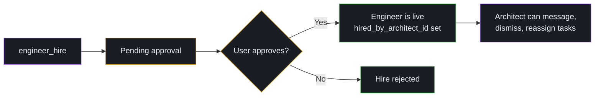

# Architects

The Architect is the layer above the Engineer. It plans, hires, and decides — the things Engineers don't have spare attention for once they're in the middle of orchestrating a wave.

> **Why Architects exist.** Once Engineers became real, it was obvious that asking them to *also* do product management would either rush the planning or drop the orchestration. The Architect handles the planning so Engineers can stay focused on their loop. → [Why Torque exists](../foundations/why-torque-exists.md#step-7-architects-because-engineers-dont-have-time-to-plan)

## What an Architect does

An Architect runs in its own managed PTY session with an Architect-scoped
projection of Torque's canonical MCP vocabulary. It maintains:

1. **A decision log** — durable record of cross-cutting product decisions, with status (`proposed`, `accepted`, `revised`, `rejected`) and links to the tasks and engineers they affect.
2. **A private journal** — checkpoints, observations, plans. Same shape as an Engineer's journal but architect-scoped.
3. **An engineer roster** — which Engineers it has hired, which are dismissed, which are pending approval.
4. **A board read** at the group level — every task, every assignee, every label, every attribution.
5. **A peer-message inbox** — durable same-group Architect threads, including reply obligations.
6. **An ask channel** to you for blocking product/scope questions.
7. **A safety-gated worktree path when its Agent Class grants it** — inspect,
   rebase, publish, or merge only eligible hired-Engineer streams.

The Architect doesn't dispatch Workers directly. It creates tasks, assigns them to Engineers, and lets Engineers handle the Worker-level orchestration. That separation is what keeps the Architect free to plan instead of orchestrate.

## You hire the Architect

Architects are **user-only**. There is no flow that auto-creates an Architect for you, and an Architect cannot hire another Architect. The buck stops with one Architect per project area, and ultimately with you.

When you create an Architect, Torque:

1. Persists an agent record with `kind: architect`, `persistent: true`, and a `TORQUE_ARCHITECT_ID` env binding.
2. Boots the agent with the architect system prompt — its mission, the architect tool reference, an opinionated session-boot checklist, and the operating policy (autonomy mode, journal cadence, review gate thresholds).
3. Pins the cell to the User column in the grid.

The agent survives daemon restarts, `/clear`, and long pauses. Closing its tab pauses it; you reopen it from the same launch dialog and it resumes with full journal and decision-log context.

## The Architect's session boot checklist

When the Architect starts, resumes, relaunches, recovers after `/clear` or a
daemon restart, or wakes for a digest or another Torque event, its system
prompt walks it through a deterministic orientation sequence:

1. `boot_summary` — cached recovery context first, with raw reads as the
   immediate fallback when it is empty, stale, refreshing, or unavailable.
2. `attention_digest` — the compact list of actionable gates.
3. `journal_list` — prior checkpoints, observations, and plans when exact
   detail is needed.
4. `decision_list` — durable decisions and their current status.
5. `peer_inbox(requires_reply=true)` — unanswered peer-Architect messages.
6. `agent_thread_list` — active Engineer peer threads when relevant.
7. `agent_list` — hired and visible Engineers.
8. `hire_list` — pending or recently resolved hires.
9. `board_summary` — board state by Engineer, including peer-message counts.
10. `event_list` — coarse-grained attribution and debug context when needed.

After recovering context, the Architect must compare current state with its
last user-facing update before yielding:

- If meaningful state changed, it proactively calls canonical
  `user_message` with a concise, deduplicated status: what changed, current
  state, and the next step and owner. Meaningful changes include dispatched
  progress; task, review, or merge completion; blockers, stalls, or recovery;
  pending user action; scope or priority changes; and corrections to prior
  status.
- If nothing material changed, it positively chooses not to message. Empty
  heartbeats and unchanged state should not create noise.
- A reply to a `## Message from the User` must pass that block's exact
  Message ID as `reply_to_id`. Digest- or wake-driven proactive status omits
  `reply_to_id`.

Free-text terminal output is not user-facing delivery. The Architect must use
the canonical product `user_message` tool when the status should reach the
user. This prompt rule does not grant a class new authority or make the daemon
send messages automatically.

## Hiring Engineers

This is the operation Architects spend the most time on, and the one with the strictest guardrails. Hires are **never silent**.



Concretely:

1. The Architect calls `engineer_hire(name=..., command=..., provider=..., directory=..., specializations=[...])`.
   The hire returns immediately with `status: "pending"`.
2. A board-visible task appears asking you to approve the hire.
3. You approve. Torque creates the Engineer agent with `hired_by_architect_id` set to this Architect's ID.
4. The Architect must poll `hire_list(hire_id=...)` before treating the Engineer as live. Sending tasks to a still-pending Engineer errors.

The optional `specializations` list is ordered: the first slug is the
Engineer's primary specialization, and `[]` means a generalist. Hire-time
specializations ride the same pending-hire → user-approval flow, so the
approved Engineer starts with the list the Architect requested.

Why the approval step? Because hires are real budget — a new persistent agent, a new system prompt, a new digest cadence, a new chunk of your subscription quota. The Architect proposes; you approve.

### Engineer specializations

Architect-managed Engineer specializations use the project taxonomy from
`.torque/specializations/`: `ui-ux`, `orchestration-core`, `runtime-pty`,
`desktop-shell`, `worktree-release`, `prompts-config`, and
`quality-observability`.

- `engineer_hire(..., specializations=[...])` proposes the ordered
  list for a new Engineer. Unknown slugs are rejected before a pending hire is
  created, and `[]` explicitly requests a generalist.
- `engineer_update(engineer_id, specializations=[...])`
  full-replaces the ordered list for an Engineer this Architect hired. The
  first entry becomes primary; `[]` clears the list/generalist. This is an
  ownership-scoped roster edit and does **not** require a fresh user approval.

### Dismiss and rehire

Engineers are persistent — you don't dismiss them lightly. But when work in a group winds down, dismissing an Engineer is the right move:

- `engineer_lifecycle(engineer_id, operation="dismiss")` — closes the session, sets `dismissed_at`, and preserves history. **Reversible.**
- `engineer_lifecycle(engineer_id, operation="rehire")` — clears `dismissed_at` and restores the same Engineer.

Dismissed Engineers still appear in `agent_list(include_tombstoned=true)`.
Trying to assign tasks to one fails until it is rehired.

Use `engineer_lifecycle(operation="restore")` to recover an Engineer within the
7-day soft-delete window.

## Decisions vs. journal

This is the most-confused distinction for new Architects, so it's worth dwelling on:

| | **Decision** | **Journal entry** |
|---|---|---|
| Audience | Permanent product log | Architect's own working memory |
| Visibility | Cross-session, durable | Cross-session, but private to one Architect |
| Status field | Yes (`proposed` → `accepted` / `revised` / `rejected`) | No |
| Linked entities | Tasks and Engineers | None |
| When to write | "We're going to do X for reason Y" | "I noticed Z, planning to think about W next" |
| Examples | "Use Postgres for the user store"; "Defer dark mode to v2" | "Engineer A is over-allocated"; "Plan: spin up an integrations Engineer next week" |

Decisions are the durable artifacts you'd want to read three months from now. The journal is the running scratchpad. Both survive `/clear`. Both are scoped to this single Architect — other Architects can't read them.

The decision log is also more strict about updates: once linked to a task or engineer, those links can only be appended, not removed. To retire a decision, you mark it `archive: true` rather than deleting it.

## What the Architect can and can't see

Architect scope is asymmetric and worth memorizing:

- **Engineers in its group**: The Architect sees both **hired** Engineers (with `hired_by_architect_id == architect.id`) and **visible** Engineers (no architect ownership) in the same group. It can fully control hired Engineers (message, dismiss, rehire, reassign tasks); for visible ones it has read-only board awareness.
- **Tasks**: Reads all tasks in the group, with full `created_by` attribution. Edits only tasks created by itself or the User. Cannot edit other Architects' tasks, Engineer-created tasks, or system-derived parent tasks. Can move any visible task between lanes.
- **Workers**: Indirect visibility only — through their owning Engineer's worklog and journal entries. The Architect doesn't directly control Workers.
- **Worktrees**: No authority is inferred from the Architect title. When the
  frozen Agent Class grants `worktree.read` or `worktree.merge`, the canonical
  worktree operations are projected only for eligible hired-Engineer streams.
  Existing ownership, reviewed-SHA, worktree-boundary, preflight, conflict,
  and configured merge-mode checks still apply.
- **Other Architects**: Same-group Architects can discover and direct-message each other. The message may include explicit task, Engineer, or decision snapshots, but it does **not** grant access to the sender's private journal, decision log, hired-Engineer controls, or cross-group state. Pending hires remain per-Architect.

The boundary isn't a convention — it's enforced server-side. → [MCP scoping](mcp-scoping.md)

## Messaging

Architects and the Engineers they hired have a direct, audited messaging channel:

- `agent_message(agent, message)` — send to a hired Engineer.
- `agent_reply(message_id, message)` — reply to an existing hired-Engineer thread.

Engineers reply through `supervisor_message(...)` or `agent_reply(...)`.

When a hired Engineer raises a blocking question, read it with
`agent_ask_get(engineer_id)` and answer it with
`agent_ask_answer(engineer_id, answer)`. A plain `agent_message` does not clear
the question or resume delivery.

If you message a dismissed Engineer, the message buffers. When you rehire, buffered messages are delivered. This makes async hand-offs safe.

Same-group Architects also have durable peer messaging:

- `peer_list(include_dismissed=false)` — discover other non-tombstoned Architects in the group.
- `peer_message(peer, message, ack_required=false, ...)` — message one eligible peer and optionally attach visible context.
- `peer_inbox(requires_reply=true)` — recover unanswered peer threads.
- `peer_reply(message_id, message, ack_required=false)` — continue a peer thread.

Use peer messaging for coordination between product surfaces: "does this task belong to your area?", "can you sanity-check this boundary?", "FYI, I am cutting scope X." Use `ack_required=true` only when the other Architect must answer. Do **not** use it for broadcast announcements, formal task handoff, Engineer ownership transfer, or shared decision ownership; those remain deferred/non-goal V1 behaviors. Durable outcomes from the conversation should still be written to the relevant Architect's own decision log.

Messages to a dismissed peer Architect are saved as buffered and replay when that Architect is re-hired. Tombstoned/deleted Architects cannot receive new peer messages.

## Asking the user

Architects have one ask channel:

- `user_ask(question)` — blocking. Creates a human-input task and pauses the
  board until you answer.

Use this for product-level checkpoints: "Should we ship dark mode now or after the API refactor?" — not for orchestration questions, which the Engineer should be handling.

## Multiple Architects

You can run more than one Architect — for instance, one focused on backend product, another on frontend product, or one per major product line. Operational consequences:

- Each Architect's decision log, journal, pending hires, and engineer roster is **separate**.
- Both Architects see all tasks in the group, but each can only edit tasks they created (or tasks created by the User).
- Same-group Architects can message each other directly, but those messages do not change task ownership, Engineer ownership, or decision ownership.
- Two Architects can coexist in the same group without interfering. The User still mediates cross-group coordination and formal ownership changes.

This is by design. Peer messaging is a coordination channel, not an authority-transfer mechanism.

## Architect settings

Configurable per group:

| Setting | Values | What it does |
|---|---|---|
| `architect_autonomy_mode` | `dispatch_freely`, `dispatch_after_confirm`, `ask_always` | Prompt-level guardrail for when the Architect should ask before routing work. Hard gates (like hire approval) are still enforced regardless. |
| `architect_digest_verbosity` | `terse`, `balanced`, `verbose` | How much detail in pushed digests. |
| `architect_push_interval` | seconds (≥10) | Normal digest cadence. |
| `architect_max_interval` | seconds | Cap on regular digest timing. |
| `architect_heartbeat_interval` | seconds (`0` = off) | Quiet seconds before sending an idle heartbeat. |
| `architect_journal_checkpoint_frequency` | `manual_only`, `every_N_actions`, `every_N_minutes` | When to remind the Architect to write a checkpoint. |
| `architect_review_gate_thresholds` | `{ship_direct_max, review_default_above, self_review_bypass_allowed}` | Informational gates the Architect uses when reasoning about review depth — not auto-enforced. |
| `architect_enabled_events` | list | Which event kinds appear in digests. |

Beyond those, launch settings (provider, boot command, model, reasoning effort, working directory, shell, and custom instructions) live in the Architect tab of the relevant group settings.

## Gotchas

A short list of things that will surprise you if you don't know them:

- **Hires are always pending.** `engineer_hire` returns `status: "pending"`.
  The Architect must poll `hire_list` before using the new Engineer.
- **A dismissed Architect blocks mutations.** If you dismiss the Architect itself (`dismissed_at > 0`), all its mutations (task create, hire, message, decision write, journal write) are rejected with "architect is dismissed". Reads still work. Rehire to unblock.
- **Decision links append-only.** You can link tasks/Engineers to a decision
  but not unlink. Retire one with `decision_update(archived=true)`.
- **Suggested actions don't auto-bind.** When the Architect creates a task with a `suggested_action`, the Engineer is free to choose a different action when dispatching. The suggestion is non-binding.
- **Review gate thresholds are advisory.** They don't block ship. They're just guidance for the Architect's own reasoning.
- **Workers are not directly visible.** The Architect sees them through Engineer journals and worklogs. Don't expect direct Worker controls in the Architect toolkit.
- **Peer-message context is a snapshot, not a scope grant.** Referencing another Architect's task, Engineer, or decision in a message does not let the recipient edit that task, message that Engineer, or read the sender's private decision log/journal.
- **`ack_required` is advisory.** It makes a peer thread show up as requiring reply; it does not lock the board or create a human ask task.

## A day in the life of an Architect

Concrete walkthrough of an Architect's working session, so the toolkit feels less abstract. Times are illustrative.

**09:00 — Boot.** The Architect's tab opens. Its system prompt has it run the orientation sequence:

```text
boot_summary()                     # cached recovery context
attention_digest()                 # actionable gates
journal_list()                     # exact private checkpoints
decision_list()                    # decisions and their statuses
peer_inbox(requires_reply=true)    # peer threads I owe
agent_list(include_tombstoned=true)
hire_list(status_filter="pending")
board_summary()
event_list()                       # attribution when needed
```

It writes a checkpoint journal entry summarizing the state it just
reconstructed, then applies the wake-to-user status contract before yielding.

```text
journal_write(
  type="checkpoint",
  text="Resuming. 2 hired engineers (Panelsmith, Courier), 1 dismissed
  (BatchArchive, last week). Board: 18 in flight, 3 blocked. Open decision:
  D-19 'use Postgres for memory' still proposed. No pending hires."
)
```

**09:15 — Plan the day.** Reads the user's standing priorities. Drafts a wave: three new tasks, two for Panelsmith (UI work), one for Courier (transport layer). Writes one decision describing the priority shift since yesterday:

```text
decision_create(
  title="Prioritize transport reliability over UI polish this week",
  rationale="Three production reports in two days. Polish backlog can wait.",
  status="accepted",
)
```

**09:25 — Create tasks.** Three `task_create(...)` calls. Each task lands
assigned to an Engineer with a non-binding `suggested_action`.

**09:30 — Realize Courier is over-allocated.** The transport work is too much for one Engineer. Decides to hire a second transport-focused Engineer:

```text
engineer_hire(
  name="Conductor",
  command="claude",
  provider="claude-code",
  directory="/repo",
  specializations=["runtime-pty", "orchestration-core"],
)
# returns {id: "...", status: "pending"}
```

A board task appears asking the User for approval. The Architect waits, doing other work.

**10:05 — Hire approved.** The Architect polls:

```text
hire_list(hire_id="...")
# returns {status: "approved", engineer_id: "..."}
```

Sends the new Engineer a welcome message:

```text
agent_message(
  agent="...",
  message="Welcome. You're owning transport reliability. Read the
  hand-off task LOOM:401 first; the Courier journal has your
  predecessor's open thread on retry semantics."
)
```

Reassigns one of Courier's tasks to Conductor.

**12:00 — Midday checkpoint.** Writes a journal checkpoint, glances at
digests, and answers an `agent_message` thread.

**16:00 — End of day.** Reads `event_list`, reviews the priority decision,
archives an obsolete decision with `decision_update(id="D-12",
archived=true)`, and writes a final checkpoint.

The Architect's tab closes. State persists in SQLite. Tomorrow's Architect (the same one, after restart) reads the checkpoint and picks up from there.

## Where to next

- [Engineers](engineers.md) — the layer the Architect coordinates with most.
- [MCP scoping](mcp-scoping.md) — what enforces "this Architect can't read another Architect's decisions."
- [MCP tools reference](../reference/mcp-tools.md) — canonical operations and
  caller-specific behavior.
