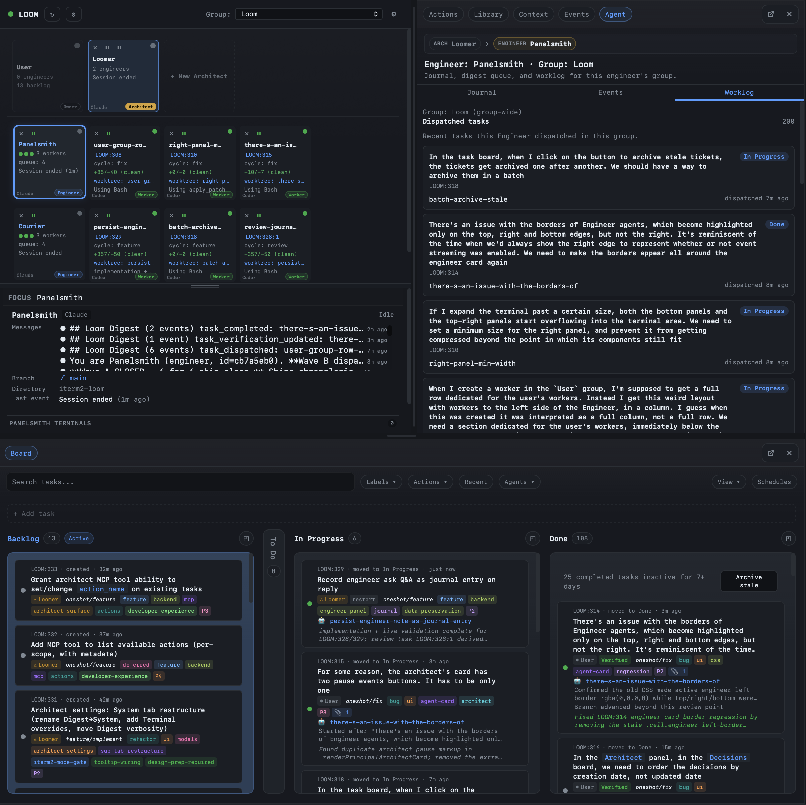
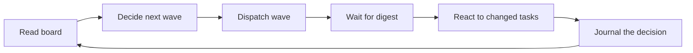
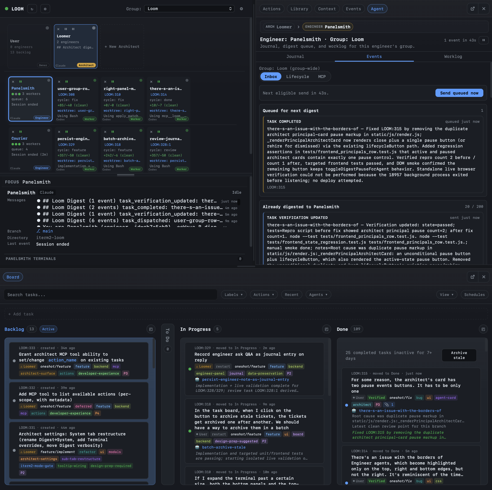
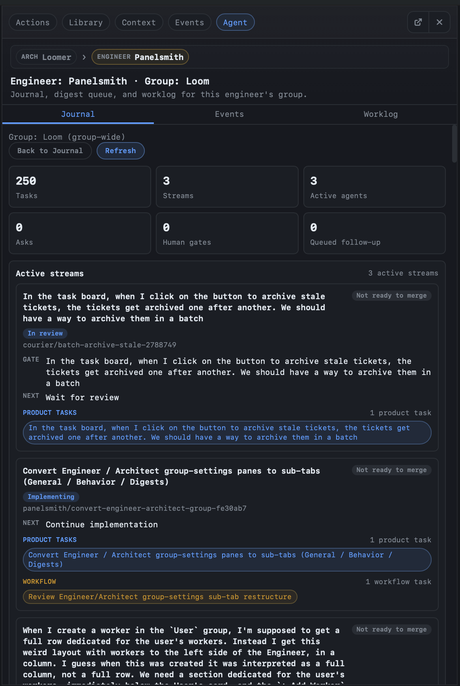

# Engineers

The Engineer is the layer that makes parallel Workers actually work. Without one, your six Workers fight over the merge target. With one, they stay in their lanes, hand off cleanly, and you get a coherent shipping cadence instead of constant conflict resolution.

> **Why Engineers exist.** Workers are deliberately ephemeral — they don't carry cross-Worker context. When two Workers' branches collide, neither has the information to resolve the conflict without trampling the other's work. The Engineer is the agent that *does* have that cross-Worker context. It saw both Workers being dispatched, it journaled what each was doing, and it can decide which branch becomes the merge target and which one rebases. → [Why Torque exists](../foundations/why-torque-exists.md#step-6-engineers-because-someone-has-to-coordinate)

## What an Engineer does

One Engineer per group. **Persistent** (survives `/clear`, restarts, long pauses). It runs in its own iTerm2 tab and maintains five things:

1. **A continuous read** on the group's board state.
2. **A buffered event digest** that wakes it up periodically without needing it to poll.
3. **A persistent journal** of decisions, observations, checkpoints, and plans.
4. **A live wave plan** — which Workers are running, which tasks are queued, which streams are blocked.
5. **An ask channel** — the blocking and non-blocking ways to surface questions to you.

Inside Torque the Engineer is just another agent in the grid, with an amber border and a pinned position at the front of its group. Outside Torque it's a `claude` or `codex` process you can talk to like any other agent — except it has the `engineer_*` MCP toolkit and a system prompt that tells it how to use it.

## Live, in action



That's an Engineer mid-wave. The right side is its panel showing its Worklog (which Workers it's coordinating, what each is doing). The bottom is the board it's reading from. The top is the agent grid showing its Workers in their cells. All three update live as the Engineer dispatches, reviews, and merges.

## The operating loop

The Engineer is most effective when it runs short, deliberate cycles instead of one big plan:



In practice that loop looks like:

1. `engineer_board_summary` — compact overview of lanes, blocked tasks, pending asks, agent state.
2. `engineer_task_show` / `engineer_agent_show` only for the tasks or agents that need deeper inspection.
3. `engineer_task_dispatch` or `engineer_batch_dispatch` for the next wave.
4. Wait for Torque to push a digest. Don't poll.
5. When the digest arrives, react to the changed tasks and agents only.
6. Journal the dispatch decisions.
7. Review diffs, merge, or ask the human when approval is needed.

The crucial discipline is in step 4: **the Engineer waits for digests instead of polling**. Polling burns context. The digest is delivered with a heartbeat so the Engineer always knows it's still alive even when nothing's happening.

## Streams and waves

The Engineer reasons about work at two levels:

- A **stream** is one branch / worktree execution lane that moves through implementation, review, fix-review, validation, and merge.
- A **wave** is the set of streams the Engineer intentionally activates in parallel.

Streams are the unit the Engineer dispatches. Waves are the unit the Engineer plans. → [Streams and waves](../operate/streams-and-waves.md)

## Digests: how an Engineer stays awake without polling

The Engineer doesn't watch the board continuously. Torque pushes **idle-gated event digests** into its terminal when relevant.

Digests are:

- **Idle-gated** — pushed only when the Engineer is idle or waiting.
- **Buffered** — events accumulate between pushes.
- **Heartbeat-aware** — an idle heartbeat arrives if no real digest fires for `heartbeat_interval`.
- **Scoped** — each Engineer only sees events for its own group.

Three intervals tune the cadence:

| Setting | Meaning |
|---|---|
| `push_interval` | Normal digest cadence. |
| `max_interval` | Cap for regular digest timing. |
| `heartbeat_interval` | How long without events before sending a heartbeat. `0` disables heartbeats. |

Some events are mandatory regardless of settings: `task_completed`, `agent_reply`, `agent_error`, `agent_blocked`, `ask_created`. The optional ones (`agent_started`, `task_dispatched`, `task_derived`, `agent_progress`) are configurable per Engineer in Group Settings → Engineer.

You can pause delivery from the panel header. While paused, events keep buffering — they're not dropped — and the queue length is visible in the panel header.



## The journal

The journal is the Engineer's persistent memory. It's how the Engineer recovers from `/clear`, daemon restart, or a long pause **without needing chat history**.

| Entry type | Use it for |
|---|---|
| `decision` | A choice the Engineer made and why. |
| `observation` | Something learned from events, agents, or the human. |
| `checkpoint` | A compact snapshot of board state and next steps. |
| `plan` | Intended next actions. |

The journal belongs to the **group**, not the agent. If you dismiss this Engineer and create a new one in the same group, it inherits the journal history. That's why Engineers are conceptually persistent even when the underlying agent restarts.

The recovery sequence after `/clear` or restart is:

```text
engineer_journal_read → engineer_session_map → engineer_events
```

`engineer_session_map` is the deterministic structured snapshot of streams and active work — it's the Engineer's orientation surface, not the journal.



## Asking the human

Two ways to surface to you:

- **`engineer_note`** — non-blocking. A note, a soft question, a status update, a proposed next wave. Appears in the panel as an informational banner. The Engineer keeps working.
- **`engineer_ask`** — blocking. The board pauses until you answer. Appears as an amber banner. Use when the next orchestration step shouldn't be guessed.

A common antipattern is using `engineer_ask` for things that aren't actually blocking. The system prompt encourages `engineer_note` for "I'd like to surface this" and reserves `engineer_ask` for "I cannot continue without your answer." If the board is idle with backlog remaining and you just want a recommendation, `engineer_note` is the right call.

When you reply (either through the panel or directly in the terminal), Torque automatically unpauses event delivery.

## Creating an Engineer

You don't need an Engineer until you have parallel Workers or a multi-step pipeline. When you do:

- **Manually**: Group's **+ New** dropdown → Engineer. Configure provider, boot command, model, custom instructions in the Engineer tab of Group Settings.
- **Architect-hired**: An Architect calls `architect_engineer_hire(...)`. The hire is **pending** until you approve it from the panel. → [Architects](architects.md#hiring-engineers)

Once created, the Engineer is persistent. Closing its session pauses it; relaunching from the same dialog reuses its journal and configuration. Dismissing or deleting are explicit operations.

## Group Settings → Engineer

The Engineer tab in Group Settings is where you tune the Engineer's behavior:

- **Agent** — the current Engineer, or a button to create one.
- **Launch controls** — provider, boot command, model, reasoning effort, custom instructions.
- **Specializations** — ordered Engineer focus areas from `.torque/specializations/` or `~/.torque/specializations/`; the first slug is primary and its preamble is injected into the Engineer system prompt.
- **Operating style** — autonomy mode (`Suggest only`, `Dispatch when clear`, `Aggressive auto-continue`) and default Worker concurrency.
- **Digest details** — push interval, max interval, heartbeat interval, optional event types.
- **Expert overrides** — provider/boot/model overrides that apply only to this Engineer instead of the group default.

The project taxonomy defines seven specialization slugs and matching default
Worker roles. See [Roles and specializations](../reference/specializations.md)
for the routing table.

## What an Engineer can and can't do

Engineer scoping is strict. An Engineer sees only:

- itself
- Workers it owns (`owner_engineer_id == this engineer.id`)
- terminals it owns
- tasks assigned to it in its group

It cannot see another Engineer's Workers, journals, or tasks even within the same group. → [MCP scoping](mcp-scoping.md)

Engineer-created Workers and tasks are auto-stamped with that Engineer's ownership. Deleting an Engineer transfers its owned Workers and assigned tasks back to you (the User) by clearing those ids.

## Engineer ↔ Architect messaging

If an Architect hired this Engineer, the two have a direct messaging channel:

- The Architect calls `architect_engineer_message(engineer_id, message)`.
- The Engineer calls `engineer_message_architect(...)` — but only to its hiring Architect, not to others.

Workers don't have access to this channel. They speak only through tasks.

## Tool surface

The Engineer's `engineer_*` MCP toolkit is broad — board reads, task dispatch, agent control, journal, diff/merge/PR, messaging. The full tool reference lives in [MCP tools](../reference/mcp-tools.md#engineer-tools). The most important groups:

- **Board and planning** — `engineer_board_summary`, `engineer_session_map`, `engineer_task_show`, `engineer_agent_show`, `engineer_actions_list`.
- **Dispatch** — `engineer_task_dispatch`, `engineer_batch_dispatch`, `engineer_task_resolve`.
- **Review and merge** — `engineer_diff`, `engineer_merge`, `engineer_rebase`, `engineer_create_pr`.
- **Worktree** — `engineer_worktree_checkpoint`, `engineer_worktree_remove`.
- **Communication** — `engineer_agent_message`, `engineer_note`, `engineer_ask`, `engineer_resume`.
- **Recovery** — `engineer_journal`, `engineer_journal_read`, `engineer_events`, `engineer_notifications`.

## Dispatch philosophy

The Engineer's system prompt steers it toward a few habits worth understanding (so you can predict what it'll do):

- **Dispatch in waves, not all at once.** A wave is a deliberate batch with a concurrency cap.
- **Reuse the same agent when context matters.** Use `target: self` transitions for sequential work in one head.
- **Separate work across agents when tasks are independent.** Don't pile unrelated work onto one Worker.
- **Inspect diff stats before deep review.** `engineer_diff(summary_only=true)` first; full diff only if the summary is unclear.
- **An idle board with backlog is not a steady state.** It's a planning turn. The Engineer either dispatches the next wave or posts an `engineer_note` explaining what's blocking the next wave.
- **Clean up worktrees and sessions after merge.** Don't leak them.

These are tuned in Group Settings → Engineer → Operating Style.

### Dispatch-shape affordance

Torque also gives the Engineer a soft batch-affordance hint when its recent
dispatch shape looks serial-heavy. `engineer_board_summary` and
`engineer_session_map` include a volatile `dispatch_shapes` summary for the
calling Engineer, split into `serial`, `batch`, and `warm_cluster` counts.

The hint is intentionally narrow. It can appear only when the 20-event window
contains at least 10 direct dispatches, at least 8 of them are hintable serial
new-Worker starts, those hintable serial starts are at least 80% of the direct
dispatch sample, and at least two ready unassigned tasks remain. "Hintable"
excludes existing-agent recovery, per-task launch overrides, worker
`torque_derive` handoffs, and batch dispatches. The resulting hint is advisory:
for the next independent wave, consider `engineer_batch_dispatch`; keep using
serial dispatch when dependencies, review boundaries, risky overlap, or launch
overrides make it the cleaner shape.

## Recovering after `/clear` — a worked walkthrough

The journal and the session map make recovery deterministic. Here's exactly what an Engineer does after `/clear` (or after a daemon restart, or after a long pause).

**Step 1: Read the journal.** The journal is the Engineer's first stop. It contains the decisions and checkpoints that explain *why* the board looks the way it does.

```text
engineer_journal_read(limit=20)
# returns: most recent 20 entries — checkpoints, decisions, observations, plans
```

A typical journal entry looks like:

```text
{
  "ts": "2026-05-06T17:42:00Z",
  "type": "checkpoint",
  "text": "End of day. 3 streams in flight: auth-refactor (waiting on
  review LOOM:412), retry-cleanup (queued behind auth-refactor), nav-bug
  (in fix-review). Plan: tomorrow re-review LOOM:412 first thing.
  Architect's D-19 (Postgres) still proposed — won't dispatch storage
  tasks until that lands."
}
```

After reading, the Engineer has the *intent* behind the current state.

**Step 2: Read the session map.** The session map is the deterministic, structured snapshot of streams. It's what tells the Engineer *what's actually live right now*.

```text
engineer_session_map()
# returns: streams summary, active asks, queued follow-ups,
# per-stream NEXT/PRODUCT/WORKFLOW context
```

For each stream, the map tells the Engineer:

- What stage it's in (`Implementing`, `Reviewing`, `Fixing review`, `Ready to merge`, etc.)
- What the next action is (`NEXT: Wait for review`, `NEXT: Continue implementation`)
- What the product context is (a one-line summary of what the stream is building)
- What workflow context is relevant (which Engineer/Worker, which worktree, which task)

The map plus the journal gives the Engineer a complete recovered picture. It hasn't loaded any chat history.

**Step 3: Read recent events.** This catches the *changes* since the last checkpoint.

```text
engineer_events(limit=50)
# returns: recent panel events — task_completed, agent_error, agent_blocked,
# ask_created, etc.
```

If the journal said "auth-refactor waiting on review" and the events stream shows `task_completed: LOOM:412` happened an hour ago, the Engineer knows the review finished while it was offline. Now it can decide what to do next.

**Step 4: Targeted reads only.** With the journal + map + events combined, the Engineer knows which tasks need deeper inspection. Only then does it call the heavier reads:

```text
engineer_task_show(task_id="LOOM:412")     # only this task, the one that changed
engineer_diff(agent_id="...", summary_only=true)   # only the diff stats
```

It doesn't load the full board (`engineer_board_list`). It doesn't open every agent. It pulls only what it needs to make the next dispatch decision.

**Step 5: Write a recovery checkpoint.** Before doing anything mutative, the Engineer journals what it just reconstructed:

```text
engineer_journal(
  type="checkpoint",
  text="Recovered after /clear. Picked up from yesterday's checkpoint.
  LOOM:412 review completed overnight (1 fix needed, derived to 412:1).
  Auth-refactor stream now waiting on fix; retry-cleanup is unblocked
  and ready to dispatch."
)
```

This makes the *next* recovery faster.

**Step 6: Resume normal operating loop.** Now the Engineer is back in its standard cycle: read board summary → decide wave → dispatch → wait for digest.

The whole sequence — journal, map, events, targeted reads, checkpoint — usually takes 4–6 MCP calls. That's why the journal/map split matters: each piece is doing a different job, and pulling them in the right order means the Engineer never has to read the whole board to recover.

## Where to next

- [Streams and waves](../operate/streams-and-waves.md) — the model the Engineer reasons in.
- [Architects](architects.md) — the role above the Engineer.
- [MCP scoping](mcp-scoping.md) — what enforces "Engineer A can't read Engineer B's journal."
- [MCP tools — Engineer reference](../reference/mcp-tools.md#engineer-tools) — full tool surface.
