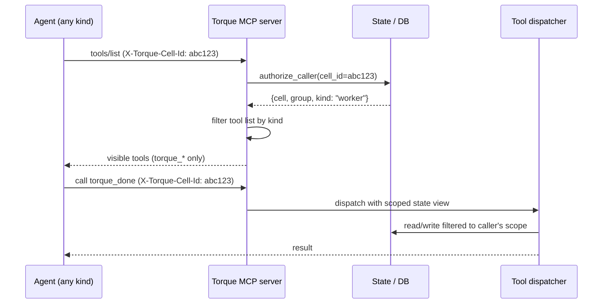

# MCP scoping

Torque's team hierarchy isn't a polite convention. It's a protocol the daemon enforces at the MCP server boundary. A Worker physically cannot list Engineer tools. An Engineer physically cannot read another group's journal. An Architect physically cannot resolve a different Architect's pending hires.

This page explains how that works, why it works that way, and what you can verify if you ever need to convince yourself.

## The tool surfaces, by role

Three prefixed tool surfaces exist:

| Prefix | Tool count | Visible to | Scope of action |
|---|---|---|---|
| `torque_*` | 18 | All authenticated agents | Caller's own state — its tasks, its derivations, its replies. |
| `engineer_*` | ~90 | Engineers only | The Engineer's group only. Engineer in group A cannot read group B. |
| `architect_*` | ~50 | Architects only | The Architect's group, with further per-Architect scoping on decisions, hires, and journal. |

The prefix is the role boundary. A Worker calling `engineer_board_summary` doesn't get a permission denied — it gets `Unknown tool`, because the tool isn't visible to it in the first place.

## How a call gets authenticated

Every MCP request carries an `X-Torque-Cell-Id` HTTP header. That header is the agent's identity badge.

The header is set automatically by the agent's MCP integration:

- **Claude Code** populates it from `${TORQUE_CELL_ID}` in `.mcp.json` (Torque writes that file when it boots the agent).
- **Codex** populates it via `env_http_headers` in `.codex/config.toml`.

When a request hits the daemon, `authorize_caller()` resolves the cell ID to a specific agent in a specific group, identifies the caller's `kind`, and returns either an authorized handle or an error. Without a valid header, the entire `engineer_*` and `architect_*` surfaces refuse to enumerate, with the message "X-Torque-Cell-Id header is required."

## Tool list filtering happens at list time

When an agent's MCP client asks for the available tools, the response is **filtered before it leaves the server**. Hidden tools never appear in the list — there's no way for a Worker to discover the Engineer tools by inspection.

This matters because it means scoping isn't enforced as "see everything, reject some calls." It's enforced as "you only see what you can call." A Worker that's told (in its system prompt) about an `engineer_*` tool will get `Unknown tool` when it tries.

There's one exception, and it's deliberate: `engineer_tool_search` and `architect_tool_search` exist so Engineers and Architects can discover deferred tools that aren't in the initial list. Deferred tools are real tools that ship with `"deferred": true` to keep the initial payload small. The search tool returns their schemas on demand. Workers don't have a `torque_tool_search` because the entire `torque_*` surface fits comfortably in the initial list.

## Caller-aware result filtering

Visibility filtering applies not just to the tool list but to **the data each tool returns**. Two tools with the same name behave differently based on who called them.

| Tool | Worker call | Engineer call | Architect call |
|---|---|---|---|
| `engineer_board_summary` | not visible | only tasks in caller's group, with caller's assigned tasks highlighted | not visible |
| `architect_board_summary` | not visible | not visible | only tasks in caller's group, with `created_by` attribution and caller-involved peer-message counts |
| `engineer_journal_read` | not visible | only this Engineer's journal entries | not visible |
| `architect_journal_read` | not visible | not visible | only this Architect's own journal |
| `architect_decision_list` | not visible | not visible | only this Architect's decisions |
| `architect_engineer_journal_read` | not visible | not visible | only journals of Engineers this Architect hired |
| `architect_peer_inbox` | not visible | not visible | only same-group Architect peer threads involving this Architect |
| `architect_peer_message` | not visible | not visible | only one non-self, non-tombstoned Architect in the same group |

The pattern: every tool builds a **scoped state view** before it does any reading. The scoped view filters by group for the role-prefixed tools, and further by ownership/creation for the per-actor stores like decisions and journals.

You can't escape the scoped view. There's no `include_other_groups: true` parameter. There's no admin override. The scope is the contract.

## What happens when scope is violated

Three failure modes:

1. **Wrong-prefix call.** A Worker calls `engineer_*` or `architect_*`. Returns `-32602` (invalid params) with `Unknown tool: <name>`. The tool was never in the visible list; the error is honest about that.
2. **Cross-group reference.** An Engineer in group A passes a task ID that lives in group B. Returns `not found in scope` from the relevant `_resolve_visible_*` helper. The task exists; it's just not visible to this caller.
3. **Cross-actor reference.** An Architect tries to update another Architect's decision, or read another Architect's journal. Returns the same kind of "not found in scope" — the decision exists, but it's not yours.

There is no debug mode that reveals what's actually there. There's no capability flag you can set on an agent to bypass the scope. The scope is in the resolver, not in the tool implementation, so changing the tool can't accidentally widen visibility.

## How to verify scoping is doing its job

Three observable surfaces let you audit:

- **Daemon log** logs every MCP call with the calling cell ID prefix. Run `tail -f ~/Library/Application\ Support/iTerm2/Scripts/torque/torque/torque.log` and dispatch work — you'll see lines like `mcp_call cell=abc12345 kind=worker tool=torque_done`.
- **`engineer_mcp_calls`** and **`architect_mcp_calls`** return recent MCP call history filtered to the caller's scope. An Engineer calling `engineer_mcp_calls` sees Workers in its group; an Architect sees the same plus its Engineers' calls.
- **`engineer_board_summary` from a different Engineer** is the easiest direct test. Spin up two Engineers in two groups, call `engineer_board_summary` from each, confirm neither sees the other's tasks.

If you ever need to convince yourself the Worker boundary is real, the simplest experiment is: open a Worker's terminal, type `mcp__torque__engineer_board_summary` (or whatever your client's tool-call invocation looks like), and watch it fail with `Unknown tool`.

## Why this matters in practice

The day-to-day reason this scoping matters is **trust**. When you give an Engineer broad authority to dispatch Workers, merge worktrees, and write to journals, you want to know that authority stops at the group boundary. When you give an Architect authority to hire and dismiss Engineers, you want to know it can't accidentally dismiss someone else's Engineer.

The longer-term reason is **modeling**. Once the scope is real, you can reason about what each role *should* do without worrying that a careless prompt change will accidentally cross a boundary. The hierarchy in your head matches the hierarchy the daemon enforces. That's why the docs treat the team model as load-bearing instead of decorative.

## Where to next

- [The team model](team-model.md) — the high-level picture this page enforces.
- [MCP tools reference](../reference/mcp-tools.md) — every tool, by role, with its parameters.
- [Workers](workers.md) — the role with the smallest tool surface.
- [Engineers](engineers.md) — the group-scoped orchestration role.
- [Architects](architects.md) — the planning role with per-actor scoping on decisions and journal.
