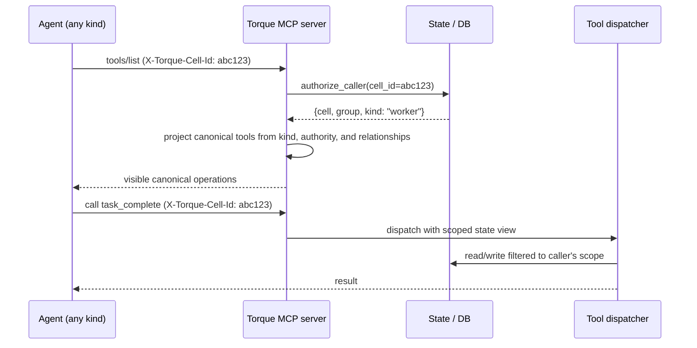

# MCP scoping

Torque's team hierarchy isn't a polite convention. It's a protocol the daemon enforces at the MCP server boundary. A Worker physically cannot list Engineer tools. An Engineer physically cannot read another group's journal. An Architect physically cannot resolve a different Architect's pending hires.

This page explains how that works, why it works that way, and what you can verify if you ever need to convince yourself.

## The tool surfaces, by caller

Torque exposes one canonical vocabulary. Tool names describe operations, not
roles: a Worker and Engineer can both receive `task_verify`, while Engineers
and Architects both use `peer_message`. The authenticated caller determines
the implementation, visible records, and permitted targets.

| Caller | Advertised surface | Scope of action |
|---|---|---|
| Worker | 24 eager tools | The Worker's own task, reports, replies, and shared context. |
| Engineer | At most 30 eager tools plus an authority-filtered deferred catalog | The Engineer's group, owned Workers, assigned tasks, and eligible peers/supervisor. |
| Architect | At most 30 eager tools plus an authority-filtered deferred catalog | The Architect's group, with per-Architect ownership on decisions, hires, journal, and peer threads. |

Historical `torque_*`, `engineer_*`, and `architect_*` names are hidden
compatibility aliases. They are never advertised and cannot cross the caller's
projected catalog.

## How a call gets authenticated

Every MCP request carries an `X-Torque-Cell-Id` HTTP header. That header is the agent's identity badge.

The header is set automatically by the agent's MCP integration:

- **Claude Code** populates it from `${TORQUE_CELL_ID}` in `.mcp.json` (Torque writes that file when it boots the agent).
- **Codex** populates it via `env_http_headers` in `.codex/config.toml`.

When a request hits the daemon, `authorize_caller()` resolves the cell ID to a
specific agent in a specific group, identifies the caller's `kind`, and
returns either an authorized handle or an error. Without a valid header,
operations that act on agent state refuse to execute.

## Tool list filtering happens at list time

When an agent's MCP client asks for the available tools, the response is **filtered before it leaves the server**. Hidden tools never appear in the list — there's no way for a Worker to discover the Engineer tools by inspection.

This means scoping is not implemented as "see everything, reject some calls."
Each caller sees only its eager canonical operations. `tool_search` lets
Engineers and Architects discover only deferred operations already allowed by
their frozen Agent Class authority. Workers need no `tool_search` because
their entire surface is eager.

## Caller-aware result filtering

Visibility filtering applies not just to the tool list but to **the data each tool returns**. Two tools with the same name behave differently based on who called them.

| Canonical tool | Worker call | Engineer call | Architect call |
|---|---|---|---|
| `board_summary` | not visible | group board with caller assignments highlighted | group board with creation attribution and peer-message counts |
| `journal_list` | not visible | only this Engineer's journal | only this Architect's journal |
| `decision_list` | not visible | visible only when an Agent Class grants it | this Architect's decisions or a proposal-safe projection |
| `agent_journal_list` | not visible | not visible | only journals of Engineers this Architect hired |
| `peer_inbox` | not visible | eligible sibling-Engineer threads | same-group Architect threads involving this Architect |
| `peer_message` | not visible | sibling Engineer under the same supervising Architect | non-self, non-tombstoned Architect in the same group |
| `peer_context` | not visible | read-only context attached to an eligible peer thread | not visible |
| `agent_thread_list` / `agent_thread_get` | not visible | not visible | eligible Engineer↔Engineer threads |

The pattern: every operation builds a **scoped state view** before it does any
reading. The view filters by group and then by ownership or relationship for
per-actor stores such as decisions, journals, and message threads.

You can't escape the scoped view. There's no `include_other_groups: true` parameter. There's no admin override. The scope is the contract.

Engineer↔Engineer notify-and-inspect is intentionally separate from generic
Engineer visibility. `agent_is_visible_to_engineer()` still denies peer
Engineers and peer workers. The peer tools use their own resolver requiring the
same group and the same non-empty `hired_by_architect_id`, and the grant is
limited to the referenced task/stream context in that thread. Architect inspect
tools are read-only and are not gated by digest notification settings.

## What happens when scope is violated

Three failure modes:

1. **Unavailable operation.** A caller invokes a canonical operation outside
   its projected catalog, or tries a hidden legacy alias from another role.
   Torque returns `-32602` with `Unknown tool: <name>`.
2. **Cross-group reference.** An Engineer in group A passes a task ID that lives in group B. Returns `not found in scope` from the relevant `_resolve_visible_*` helper. The task exists; it's just not visible to this caller.
3. **Cross-actor reference.** An Architect tries to update another Architect's decision, or read another Architect's journal. Returns the same kind of "not found in scope" — the decision exists, but it's not yours.

There is no debug mode that reveals what's actually there. There's no capability flag you can set on an agent to bypass the scope. The scope is in the resolver, not in the tool implementation, so changing the tool can't accidentally widen visibility.

## How to verify scoping is doing its job

Three observable surfaces let you audit:

- **Daemon log** records each call with the caller ID. Internal compatibility
  handler names may appear there even though agents see canonical names.
- **`telemetry_query`** returns recent MCP call history filtered to the
  caller's scope.
- **`board_summary` from different Engineers** is the easiest direct test:
  create Engineers in different groups and confirm neither sees the other's
  tasks.

To verify the Worker boundary, inspect its `tools/list`: orchestration
operations such as `task_dispatch`, `worktree_merge`, and `engineer_hire` are
absent. Calling one returns `Unknown tool`.

## Why this matters in practice

The day-to-day reason this scoping matters is **trust**. When you give an Engineer broad authority to dispatch Workers, merge worktrees, and write to journals, you want to know that authority stops at the group boundary. When you give an Architect authority to hire and dismiss Engineers, you want to know it can't accidentally dismiss someone else's Engineer.

The longer-term reason is **modeling**. Once the scope is real, you can reason about what each role *should* do without worrying that a careless prompt change will accidentally cross a boundary. The hierarchy in your head matches the hierarchy the daemon enforces. That's why the docs treat the team model as load-bearing instead of decorative.

## Where to next

- [The team model](team-model.md) — the high-level picture this page enforces.
- [MCP tools reference](../reference/mcp-tools.md) — every tool, by role, with its parameters.
- [Workers](workers.md) — the role with the smallest tool surface.
- [Engineers](engineers.md) — the group-scoped orchestration role.
- [Architects](architects.md) — the planning role with per-actor scoping on decisions and journal.
