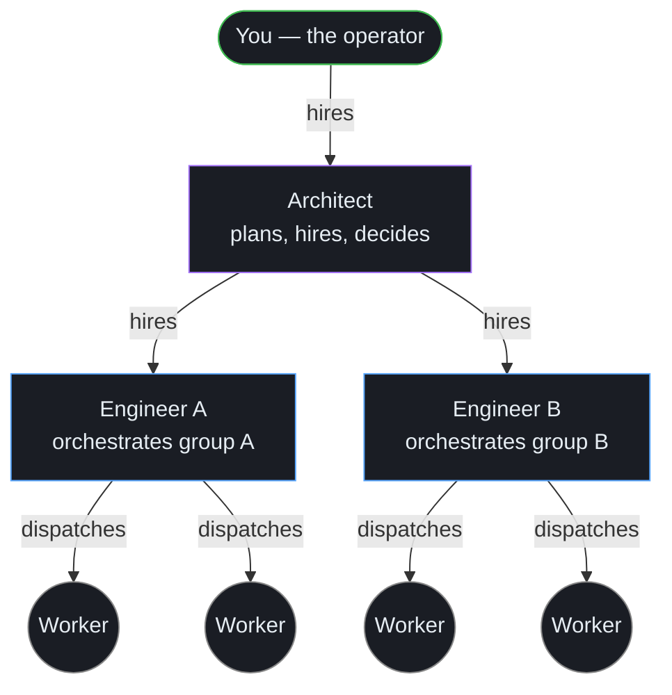

# The team model

Torque is built around a four-layer team. Once you've internalized this picture, the rest of the product clicks into place.

You sit at the top. You hire one (or zero) **Architect** when planning gets heavy. The Architect hires **Engineers** per group. Each Engineer dispatches **Workers** to do the actual code-writing.

Each layer exists because the layer below it needs coordination it can't provide for itself. Each layer has its own MCP toolkit, its own visibility scope, and its own guarantees about what it can and can't see.

For the why behind each layer, [Why Torque exists](../foundations/why-torque-exists.md) walks the chronology. This page is the operational summary.

## How to read the grid

The grid in the Toolbelt panel is the team made visible. Look at it as an org chart:

- **The User column** is the leftmost cell. That's the slot for things you spawn yourself outside of any role hierarchy — a scratch agent, a one-off terminal, your manual probes.
- **The Architect** is the next cell, distinct in its border color. There's at most one per project area, and it's persistent.
- **The Engineers row** sits below the Architect. One Engineer per group. Each is persistent.
- **The Workers row** is the rest. Each Worker belongs to exactly one Engineer, ephemerally. They appear as work happens and disappear when their tasks are merged or canceled.

The visual layout matches the authority gradient: leftmost / topmost = highest authority, lowermost = most ephemeral.

## The four kinds at a glance

| Kind | Who creates it | Persistent? | What it does |
|---|---|---|---|
| **[Worker](workers.md)** | An Engineer (or you) | No — ephemeral | Writes code on a worktree branch, reports through `torque_*` MCP tools, gets closed after merge. |
| **[Engineer](engineers.md)** | An Architect (or you) | Yes | Coordinates a group's Workers. Dispatches in waves, journals decisions, reviews and merges. Uses `engineer_*` MCP tools for its group only. |
| **[Architect](architects.md)** | You — user-only | Yes | Plans cross-group work, hires/dismisses Engineers, maintains a decision log. Uses `architect_*` MCP tools for its group only. |
| **Terminal** | You or an Engineer | Persistent (until closed) | Companion shell session. Not an AI session. → [Sessions](../operate/sessions.md) |

There's no fifth kind. Everything else in Torque (tasks, actions, pipelines, worktrees) is the *work*; agents are the *people*.

## How they coordinate

The team coordinates through three channels, in decreasing order of formality:

1. **Tasks on the board.** Every meaningful piece of work is a task. Architects create tasks for Engineers. Engineers dispatch tasks to Workers. Workers derive follow-up tasks (review, fix, validate) that become the historical thread of the work. → [Tasks and threads](../tasks/threads.md)
2. **Architect ↔ Engineer messaging.** A direct, audited message channel between an Architect and the Engineers they hired. Used for clarifying scope, escalating blockers, and bidirectional Q&A. Workers don't have access to this — they speak only through tasks.
3. **Engineer digests.** The Engineer doesn't poll. Torque pushes idle-gated event digests into its terminal so it stays situationally aware without burning context. → [Engineers](engineers.md)

There is **no Engineer ↔ Engineer messaging** and **no Architect ↔ Architect messaging**. Cross-group coordination always goes through the User. This is by design — it keeps responsibility scoped and prevents back-channel decisions that don't show up in the journal or decision log.

## What each role can and can't see

The tool surfaces are filtered server-side based on the caller's role. The full enforcement story is on its own page; this is the one-line summary:

| Role | Sees `torque_*` | Sees `engineer_*` | Sees `architect_*` | Cross-group? |
|---|---|---|---|---|
| Worker | ✅ | ❌ | ❌ | No |
| Engineer | ✅ | ✅ for **own group only** | ❌ | No |
| Architect | ✅ | ❌ | ✅ for **own decisions only** | No (still scoped to one group) |

A Worker can't list the Engineer toolkit. An Engineer in group A can't read another Engineer's journal. Two Architects can't see each other's decision logs. → [MCP scoping](mcp-scoping.md)

## When to add each layer

You don't need the full hierarchy on day one. The Torque team scales up as your work does:

- **One Worker.** You can run Torque with just a Worker for the first few days. Dispatch tasks, watch them complete. The board is your record-keeping.
- **+ Engineer.** Add an Engineer when you have more than two Workers running at once, or as soon as you start using a multi-step pipeline like `feature/implement → feature/review → feature/fix-review`. The Engineer's job is to keep that loop healthy.
- **+ Architect.** Add an Architect when you're juggling more than one group, or when you notice your Engineer is spending more time planning than orchestrating. The Architect handles cross-cutting plans so Engineers can stay focused on their loop.

You can always add layers later. Engineers and Architects are persistent — once they exist, they accumulate journal/decision context and become more valuable over time.

## Where to next

- [Workers](workers.md) — boot configuration, roles, worktrees, ephemerality.
- [Engineers](engineers.md) — orchestration loop, journal, digests, asks.
- [Architects](architects.md) — planning, hiring, decision log.
- [MCP scoping](mcp-scoping.md) — how the role boundary is enforced.
